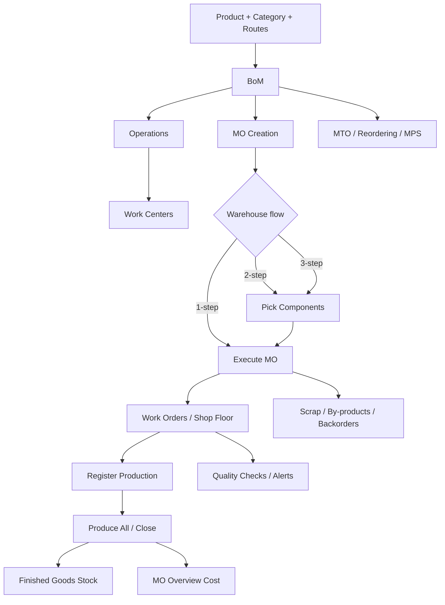
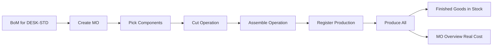

# Odoo Manufacturing for ERP Production Functional Consulting

## Executive summary

Odoo Manufacturing in version 19 is a credible production module for discrete manufacturing where the main needs are bills of materials, routings/work orders, work centers, shop-floor execution, replenishment, traceability, quality, and practical costing visibility at the manufacturing-order level. Its official documentation shows a coherent model built around products, BoMs, operations, work centers, MOs, Shop Floor, replenishment rules, and integrated quality and inventory workflows. citeturn3view0turn5view4turn8view1turn15view2

For a functional consultant, the most important idea is that Odoo separates **product valuation methods** from **manufacturing-order cost analysis**. At the inventory/accounting level, Odoo supports Standard Cost, AVCO, and FIFO. At the MO level, it distinguishes **MO cost** as an estimate from the BoM and work-center setup, and **real cost** as the cost generated by actual consumption, tracked durations, and employee rates. This is excellent for operational control, but it is lighter than the explicit variance-and-settlement frameworks documented by Oracle and SAP. citeturn23view3turn3view2turn4view9turn29view2turn33search1

Compared with Microsoft Dynamics 365 Supply Chain Management, Oracle Fusion Cloud Manufacturing, and SAP S/4HANA Manufacturing / PP, Odoo is easier to grasp and faster to configure, but the official documentation suggests shallower depth in enterprise cost accounting, formal variance management, and large-scale mixed-mode manufacturing governance. Microsoft documents richer production statuses, route structures, and planning support; Oracle documents explicit manufacturing cost events such as component issues, returns, resource charging, completions, scrap, close, and WIP adjustments; SAP documents cost object controlling, target-vs-actual order costing, and order-BOM costing for complex make-to-order scenarios. citeturn27view0turn27view2turn27view3turn27view4turn29view2turn29view1turn33search1turn33search3turn33search4

For **Nateg (ناتج)**, the practical lesson is this: if your goal is to become more than “someone who configures screens,” study Odoo as a **production operating model**. The production consultant’s real job is to define how master data, replenishment, execution, costing, and quality fit together. Odoo is especially strong as a reference model for SMB and mid-market discrete manufacturing implementations because the documentation makes these relationships visible and implementable. citeturn5view4turn8view6turn14view5turn39view0

## Odoo production architecture

Odoo’s production model starts with a straightforward core: a manufactured product, a BoM, optional work orders/operations, work centers, and a warehouse manufacturing flow of one, two, or three steps. The module itself is positioned by Odoo as a tool to schedule, plan, and process manufacturing orders, with real-time shop-floor control and links to maintenance, quality, and IoT/MES concepts. citeturn3view0turn6view1turn6view2turn8view0

The **master data that matters most** is the following. First, the product must be configured as a tracked goods item suitable for stock management and replenishment logic. Second, the BoM defines the product structure and, in Odoo, also becomes the place where operations, variant applicability, consumption rules, routing preferences, lead times, analytic distribution, and by-products are attached. Third, work centers define capacity, working hours, time efficiency, OEE targets, setup/cleanup time, alternative work centers, and hourly cost structure. Fourth, if traceability matters, lots and serial numbers are configured per product. citeturn5view6turn6view0turn6view1turn6view2turn10view0turn10view2turn15view0

The BoM is more than a component list. Odoo documents component lines, variant-specific component applicability, “consumed in operation,” manual or guided consumption behavior, operations, manufacturing readiness, flexible consumption, routing by warehouse, analytic distribution, manufacturing lead time, and days to prepare the MO. This is exactly the kind of configuration surface a production functional consultant must learn to interpret as a business design, not just a technical form. citeturn5view6turn5view7turn5view8turn6view0turn5view10

Work centers are especially important because they connect execution, capacity, KPIs, and cost. Odoo’s official documentation treats them as the place where you define capacity, working hours, alternative work centers, time efficiency, OEE target, setup and cleanup times, hourly cost, allowed employees, and product-specific capacities. In other words, work centers are not only operational resources; they are also planning and costing objects. citeturn8view1turn10view0turn10view2turn10view3turn10view4

For more advanced product structures, Odoo natively supports **multilevel BoMs** and recommends building them from the bottom up. The documentation explicitly recommends replenishment design for subassemblies and notes that for sublevel products, reordering rules are generally more flexible than strict MTO, because they do not hard-link stock to a single top-level demand signal. That recommendation is analytically important: it tells you Odoo’s design bias is toward practical supply flexibility rather than rigid pegging. citeturn9view0turn9view1turn9view2

## Lifecycle and planning

The Odoo MO lifecycle is simple to describe but rich enough to teach core manufacturing logic. You create a manufacturing order from **Manufacturing → Operations → Manufacturing Orders**, select the product and BoM, let components and operations populate automatically, and confirm the MO. That confirmed MO can then be executed directly, or through one of the configured warehouse manufacturing flows. citeturn6view1turn6view2turn40search5

The choice between **one-step, two-step, and three-step manufacturing** is not cosmetic. In one-step manufacturing, Odoo creates the MO but does not separately track stock transfers out of inventory or back into stock; inventory counts still update when components are used and finished products are produced. In two-step manufacturing, a pick-components transfer is created in addition to the MO. In three-step manufacturing, Odoo creates both a pick-components transfer and a store-finished-products transfer. This is a classic functional design decision: the client is deciding how visible and auditable shop-floor movements should be. citeturn6view5turn6view2turn6view3turn8view0

Shop Floor is one of Odoo’s strongest operational features. Odoo describes it as a visual interface for processing MOs and work orders, tracking work time, organizing work center pages, and showing ready-to-start MOs and WOs according to scheduled date and readiness. On the MO cards, statuses move from **Confirmed** to **In Progress** to **To Close**, while work orders show readiness based on components and predecessor completion. This gives consultants a clear operational model of execution state. citeturn15view2turn24view1turn24view2turn16search0

Planning in Odoo is distributed across several mechanisms rather than one monolithic “MRP screen.” Officially, stock can be replenished by **reordering rules**, **MTO**, or **MPS**. Reordering rules maintain stock between min/max levels and generate RFQs or MOs depending on route. MTO creates replenishment on every SO or MO confirmation and must be paired with Buy or Manufacture. MPS adds a forecast-driven planning grid where time range and number of columns can be configured. In practice, this gives Odoo credible make-to-stock and make-to-order support, but with lighter planning semantics than the mixed-mode planning ecosystems described by Microsoft. citeturn8view6turn3view11turn3view10turn3view4turn38search0turn27view0

Work order dependencies, the **Plan** button, and alternative work centers make Odoo’s scheduling model more serious than many people assume. A work order can be blocked by another work order, and once dependencies are configured on the BoM, Odoo can schedule the blocked operation after the predecessor’s expected duration. Planning by work center then shows this schedule visually. If a work center is unavailable and an alternative work center is configured, re-planning can reassign the work order. citeturn8view2turn8view5

For partial execution and traceable exceptions, Odoo supports **backorders**, **split/merge MOs**, and **lot/serial-aware manufacturing**. Backorders are created when produced quantity is lower than planned quantity; serial-controlled multi-unit MOs are split into one-unit MOs when serials are assigned. These are small features in the documentation, but they are major realities in live manufacturing. citeturn24view3turn24view4turn2search14

The following flowchart is the most useful mental model to keep while learning Odoo Manufacturing. It is built directly from the official feature model documented across manufacturing, Shop Floor, replenishment, and workflow pages. citeturn3view0turn6view1turn6view2turn8view0turn15view2turn8view6

## Inventory and costing

Odoo’s costing model has two layers that a consultant must keep separate in his mind. The first is **inventory valuation**, where Odoo supports Standard Cost, AVCO, and FIFO. The second is **manufacturing execution costing**, where Odoo computes MO cost from BoM components and operations, then compares that estimate with real cost based on actual tracked outcomes. Many implementation mistakes happen because teams treat these two layers as if they were the same thing. They are not. citeturn23view3turn3view2turn5view0turn5view1turn5view2

On the MO costing side, Odoo explicitly states that component cost is based on component cost values, work center cost comes from the work center’s per-workcenter and estimated per-employee rates, and real cost can diverge because of different component quantities, longer or shorter work durations, or employee-specific hourly rates. The MO Overview smart button then shows both MO cost and real cost, and after production is finished the MO cost column is updated to match real cost. Product cost is then maintained as an average production cost over completed MOs, while “Compute Price from BoM” only resets the cost to the expected cost temporarily. citeturn5view0turn5view1turn5view2turn4view9

On the valuation side, Odoo’s official inventory valuation guide states that Standard Cost is fixed and manually updated, AVCO is weighted average, and FIFO keeps valuation by incoming layers. This matters enormously for production implementations. If a client says “I want actual production cost,” the correct next question is not “Do you want MO real cost?” but “Do you want actual-like operational visibility, or do you want actual/rolling valuation in inventory and finance?” Those are related but different requirements. citeturn23view0turn23view1turn23view2

Odoo 19 introduced broader inventory-accounting changes that reduce journal-entry volume in some perpetual-accounting scenarios by relying on invoices plus a closing process rather than every stock move, depending on the accounting method. At the same time, official Odoo manufacturing materials and official forum guidance indicate that manufacturing journal entries still depend on proper automated valuation setup and a **Cost of Production** account on the Production Location for WIP-style flows. Because of this combination, manufacturing accountants should validate postings in the exact version, localization, and configuration of the database instead of assuming legacy behavior. citeturn22view3turn22view4turn40search2turn40search4

The accessible official Odoo sources strongly support the following practical interpretation. If the client wants operational manufacturing costing and profitability insight, Odoo is solid. If the client wants rigorous formal variance categories, cost-object settlement logic, and order-by-order cost accounting depth, Oracle and SAP are documented as deeper. Oracle explicitly documents costing for component issues/returns, resource charging/reversals, product completions/returns, scrap, work order close, and WIP adjustments. SAP explicitly documents cost object controlling for production orders and order-BOM costing for complex make-to-order structures. That contrast is not a criticism of Odoo; it is a scoping tool for consultants. citeturn29view2turn33search1turn33search3turn3view2turn4view9

Quality, scrap, and by-products are not add-ons in Odoo’s production logic; they are first-class parts of execution. Odoo Quality can generate checks from quality control points, including checks linked to Manufacturing and even to a specific Work Order Operation. Official check types include Instructions, Pass–Fail, Measure, and Take a Picture. Quality alerts can be initiated from failed checks or directly from Shop Floor work-order cards. Odoo documents scrap during manufacturing as a move to the virtual Scrap location, and by-products as BoM-defined residual outputs that are registered when the MO is completed. citeturn14view0turn14view2turn14view3turn14view5turn14view6turn14view8turn14view4turn3view8turn3view7turn4view7

Traceability is also executed in a production-specific way. Odoo requires lots or serials to be assigned when producing tracked items, and in serial-controlled multi-unit scenarios it splits the MO into one-unit child orders when serial numbers are generated. This is a very important clue for Nateg: serial traceability is not only an inventory feature; it changes the MO model itself. citeturn15view0turn24view4

## Reporting and comparison

Odoo’s reporting and KPI layer is stronger than a surface-level reading might suggest. Official documentation shows MO overview costing, work-center smart-button metrics such as OEE, working-hours-based productivity targets, work-center comparisons by shift, work-order planning by work center, inventory valuation reporting, accounting-side inventory valuation review, and quality-alert tracking. Odoo Academy’s official MRP course also exposes reporting lessons for production analysis, allocation reports, and OEE, which is a good indicator of what Odoo expects users to operationalize. citeturn10view3turn10view1turn8view2turn22view2turn39view0

The release notes add an important usability signal: Odoo 19 introduced a **Gantt view for manufacturing orders**, which improves visibility into current and upcoming MOs. This is not enterprise APS, but it is a meaningful step for production planners in the Odoo ecosystem. citeturn3view13turn40search10

The comparison below is the most decision-useful way to read Odoo in context.

| Dimension | Odoo | Microsoft Dynamics 365 SCM | Oracle Fusion Manufacturing | SAP S/4HANA Manufacturing | ERPNext | Source set |
|---|---|---|---|---|---|---|
| Product structure | BoM with components, operations, variants, by-products | BOM/formulas, co-products/by-products | Work definition combines item structure, operations, materials, resources, outputs | Production order/BOM/routing quantity structure | BOM + Work Order | citeturn5view4turn4view7turn27view1turn29view1turn33search0turn37view0 |
| Routing and operations | Operations on BoM, work orders, dependencies, Shop Floor | Routes, operations, operation relations, route versions, route networks | Operations in work definitions tied to work centers and resources | Routing and work center master data feed order costing | Operations, Job Cards, Workstations, Routing | citeturn5view8turn8view2turn15view2turn27view2turn29view1turn33search2turn37view1 |
| Planning model | Reordering rules, MTO, MPS, multilevel BoM planning | Production lifecycle, master planning, MTS/MTO, route scheduling | Work orders as supplies; standard and alternate work definitions | Strong planning + cost integration; order BOM costing for complex MTO | MRP report, production planning, capacity planning | citeturn8view6turn3view10turn3view11turn9view0turn27view0turn38search1turn29view0turn33search3turn37view2 |
| Costing depth | MO cost vs real cost; inventory methods Standard/AVCO/FIFO; optional WIP setup | BOM calculation groups, costing versions, route-based cost calculation | Explicit work-order cost events including issues, resources, completions, scrap, close, WIP adjustments | Cost object controlling, target vs actual, settlement/variances, order BOM costing | Manufacturing ledger is stock-entry centric, simpler than Oracle/SAP | citeturn3view2turn4view9turn23view3turn27view3turn27view4turn29view2turn33search1turn33search3turn37view3turn37view4 |
| Quality | QCPs, order/operation checks, alerts, Shop Floor quality actions | Quality orders, quality associations, sampling, quarantine | Quality issues, inspections, inline quality in workstation execution | Strong quality ecosystem, though not fully expanded here | Quality inspection against Job Card | citeturn14view0turn14view4turn14view5turn38search2turn38search7turn30search5turn30search18turn37view1 |
| Traceability and exception flows | Lots/serials, backorders, split/merge, scrap, by-products, unbuild | Mature mixed-mode production status and execution support | Serialized manufacturing, co-/by-products, scrap, rework/transform | Mature enterprise traceability and order costing concepts | Job cards, stock entries, scrap, raw-material movement | citeturn15view0turn24view3turn3view8turn3view7turn15view1turn29view0turn29view3turn29view4turn33search4turn37view1turn37view4 |

A clear inference from the official sources is that **Odoo is strongest where the client needs functional coverage with manageable complexity**, while Microsoft, Oracle, and SAP go deeper once planning formalism, cost accounting sophistication, or enterprise governance become the main driver. ERPNext is closer to Odoo in market position, but its documentation exposes manufacturing more explicitly through stock entries, work orders, and job cards, whereas Odoo presents a more integrated and visual operational experience with Shop Floor, OEE, and quality/maintenance ecosystem links. citeturn15view2turn10view3turn27view0turn29view2turn33search1turn37view0turn37view1turn37view4

For company-size fit, the evidence supports the following recommendation. **Small manufacturers** with straightforward discrete manufacturing often get more value from Odoo’s speed and integrated breadth than from a heavier suite. **Mid-market manufacturers** with multilevel assemblies, work-center scheduling, traceability, and practical cost control are still good candidates, especially if finance can live with Odoo’s lighter cost-accounting model. **Upper-mid and enterprise manufacturers** with formal WIP/variance governance, complex MTO costing, advanced process manufacturing, or very strict regulatory control should benchmark Microsoft, Oracle, or SAP more seriously. This is an inference from the documented feature depth, not a single-vendor marketing claim. citeturn9view0turn10view0turn29view2turn33search1turn27view0turn27view2

A brief note on CMiC: the official site positions it primarily as a **construction ERP** focused on subcontractors, job costing, procurement, assets, and project controls. It is therefore not a close comparator for discrete manufacturing module design, and I did not use it as a central reference for the production-model analysis. citeturn35search0

## Implementation guidance for Nateg

If I were implementing production concepts at Nateg, I would lift the following design principles directly from the Odoo study.

First, model the domain around **five production pillars**: Product, BoM, Operation/Route, Resource/Work Center, and Production Order. Do not bury these inside custom forms or ticket logic. Odoo, Oracle, Microsoft, SAP, and ERPNext all document these as first-class production concepts, even if they name them differently. citeturn5view4turn27view1turn27view2turn29view1turn33search0turn37view0turn37view1

Second, make the warehouse-manufacturing flow a conscious configuration choice. Many ERP projects fail because designers assume a single execution model. Odoo’s one-/two-/three-step split is a good design reference for Nateg: some customers only want logical consumption and receipt; others require auditable pick and put-away movements. citeturn6view5turn6view2turn8view0

Third, support both **planning-triggered replenishment** and **demand-triggered replenishment**. Odoo’s reordering rules, MTO, and MPS provide a practical framework for this, and the Microsoft documentation confirms how central MTS/MTO strategy is to manufacturing design. Nateg should expose this as a strategic business setting, not just a scheduler parameter. citeturn8view6turn3view10turn3view11turn3view4turn38search0

Fourth, separate **estimated** from **actual** at both the operation and MO level. Odoo’s MO cost vs real cost concept is one of the best lessons for a consultant: the system should show what should have happened and what actually happened. That single distinction improves implementation quality, training quality, and user trust. citeturn3view2turn4view9

Fifth, make **quality triggers** event-based. Odoo’s QCP design shows that quality must be attachable to a manufacturing event and even to a specific work-order operation. Oracle and Microsoft document similar thinking through inspections and quality orders/issues. Nateg should not force quality to live only as an after-the-fact complaint record. citeturn14view2turn14view5turn27view5turn30search0turn30search5

Sixth, decide early how much accounting depth you want the production module to own. Odoo proves that practical costing and operational finance can go very far, but Oracle and SAP show what “full manufacturing accounting depth” looks like. If Nateg targets SMB and mid-market implementations, do not overbuild SAP-grade costing before mastering operational production truth. If Nateg targets heavily audited manufacturing finance, the design must be much deeper from day one. citeturn3view2turn29view2turn33search1

The most useful client-discovery checklist is therefore the one below.

| Client question | Why it matters in design | Odoo concept that teaches the lesson |
|---|---|---|
| Is production discrete, process, or mixed? | Determines whether simple BoM + operations is enough, or whether outputs/batches/recipes become central | BoMs, by-products, work centers; Oracle work definitions for discrete/process comparison citeturn5view4turn4view7turn29view1 |
| Do you want one-step, two-step, or three-step manufacturing? | Changes inventory visibility and operational control | Warehouse manufacturing steps citeturn6view5turn6view2turn8view0 |
| Are you make-to-stock, make-to-order, or forecast-driven? | Controls how supply is triggered | Reordering rules, MTO, MPS citeturn8view6turn3view10turn3view11turn3view4 |
| Do subassemblies exist? Are they reused across products? | Determines multilevel BoM and planning logic | Multilevel BoMs + recommended subassembly replenishment setup citeturn9view0turn9view2 |
| Is capacity finite and are alternate resources needed? | Affects work-center, planning, and downtime logic | Work centers, dependencies, alternative work centers, time off citeturn10view0turn10view2turn8view5 |
| Do you need manual control over component consumption or flexible tolerance? | Determines execution UX and variance signals | Consumed in operation, manual consumption, flexible consumption citeturn5view6turn5view7turn6view0 |
| Is traceability by lot/serial mandatory? | Can change the MO execution model and splitting behavior | Manufacturing with lots/serials citeturn15view0turn24view4 |
| Are scrap and by-products operationally important or financially material? | Changes BoM, execution, and stock logic | Scrap during manufacturing, by-products citeturn3view8turn3view7 |
| Do you need operational cost insight only, or formal WIP/variance accounting? | Determines whether Odoo-like costing is enough or Oracle/SAP-style depth is needed | MO cost vs real cost; Oracle/SAP cost object references citeturn3view2turn29view2turn33search1 |
| Should quality happen at receipt, operation, completion, or all three? | Determines quality data model and workflow triggers | QCPs, checks, alerts, quality orders/issues citeturn14view2turn14view5turn14view4turn38search2turn30search0 |

## Demo walkthrough

The cleanest demo for an ERP Production Functional Consultant is a **two-step discrete manufacturing scenario** because it shows structure, movement, execution, and costing without unnecessary process complexity. The official Odoo docs support every major step in this walkthrough. citeturn6view2turn6view3turn3view2turn15view2

**Demo master data**

Use a finished good called **DESK-STD**. Create two raw materials: **PANEL** and **LEG**. Put finished goods and raw materials in product categories with inventory tracking enabled. If you want rolling/operational realism, choose **AVCO** or **FIFO** on the category. If you want fixed accounting valuation, choose **Standard Cost**, understanding that this is a different accounting posture. Enable automated/perpetual stock valuation if you want accounting entries to be generated. For WIP-enabled accounting, configure a **Cost of Production** account on the Production Location. citeturn23view3turn20view2turn40search2turn40search4

**Suggested quantities and costs**

Set the BoM for one desk as follows: 1 × PANEL at 40, and 4 × LEG at 10 each, so materials total 80. Add two operations: **Cut** and **Assemble**. Assign them to work centers with hourly costs configured. For the estimate, assume the BoM/work-center setup implies an operation cost of 20, so the estimated MO cost is 100. Then, during execution, let actual time rise slightly so real operation cost becomes 24, making the final real MO cost 104. This numeric pattern reflects Odoo’s documented estimate-versus-real model. citeturn5view0turn5view1turn5view2turn4view9

**Step-by-step configuration**

1. In **Inventory settings**, enable Multi-Step Routes if you want two-step manufacturing.  
2. In **Manufacturing settings**, enable Work Orders. Also enable By-Products, MPS, and Shop Floor-related functionality only if the demo requires them.  
3. In **Inventory → Configuration → Warehouses**, set Manufacture to **Pick components and then manufacture (2 steps)**.  
4. Create work centers with working hours, capacity, hourly cost, and allowed employees as appropriate.  
5. Create the BoM at **Manufacturing → Products → Bills of Materials** with the components above, then add the two operations on the Operations tab.  
6. Optionally mark components as **Consumed in Operation** and define **Flexible Consumption** behavior on the BoM Miscellaneous tab.  
7. If you want quality in the demo, define a QCP on the Assembly operation. citeturn6view2turn6view3turn8view1turn5view8turn5view6turn6view0turn14view2

**Execution walkthrough**

1. Go to **Manufacturing → Operations → Manufacturing Orders → New**.  
2. Choose **DESK-STD**, quantity 1, and confirm. Odoo auto-populates the BoM, components, and work orders.  
3. Because this is two-step manufacturing, use the **Transfers** smart button to open the pick-components transfer and validate it.  
4. Return to the MO and process work orders either from the Work Orders tab or through Shop Floor. Start and finish **Cut**, then **Assemble**.  
5. Register production and click **Produce All** to close the MO and put the finished desk into inventory.  
6. Open the **Overview** smart button to compare MO cost and real cost. citeturn6view1turn6view3turn6view4turn3view5turn4view9

This is the logical transaction flow behind the demo. It is the right level of abstraction for a consultant note or training deck. citeturn6view3turn3view5turn3view2turn40search2turn40search4

**Illustrative journal entries for the demo**

The entries below are **illustrative**, not a guarantee of exact line posting in every Odoo 19 deployment, because Odoo 19 inventory-accounting behavior changed broadly and the official WIP page could not be fully fetched directly. Still, the official WIP snippet and official Odoo forum guidance support the use of a Cost of Production account and WIP-style manufacturing posting when automated valuation is configured correctly. citeturn22view3turn40search2turn40search4

| Stage | Illustrative journal entry | Amount | Why |
|---|---|---:|---|
| Component issue to production | Dr Cost of Production / WIP; Cr Raw Material Stock Valuation | 80 | Moves material value from raw stock to in-process production |
| Absorb operation/labor/overhead | Dr Cost of Production / WIP; Cr Labor/Overhead absorption or clearing | 24 | Capitalizes execution cost so the in-process order carries full actual cost |
| Finished good completion | Dr Finished Goods Stock Valuation; Cr Cost of Production / WIP | 104 | Closes WIP into finished goods at full actual/absorbed cost |

The operational interpretation is simple. After completion, the desk now sits in finished-goods stock at 104 in this demonstration, and the MO Overview should reconcile the estimated-versus-real difference as an execution variance, even if the GL treatment depends on the valuation method chosen on the product category and the accounting setup of the database. citeturn3view2turn4view9turn23view3turn40search4

**Standard Cost versus AVCO/FIFO in the same demo**

If the finished good category uses **Standard Cost**, the inventory valuation posture is fixed by the manually maintained standard price. If the category uses **AVCO** or **FIFO**, the completed production contributes to rolling or layer-based valuation behavior instead. This is why the consultant must discuss valuation policy with finance before promising “actual production costing.” Odoo’s documentation clearly supports this distinction. citeturn23view0turn23view1turn23view2turn3view2

## Learning plan and source guide

The best 30-day learning plan is not “read everything.” It is “learn in the sequence that a production implementation uses it.”

**Days 1–5:** Study the official Odoo Manufacturing overview, product configuration, BoM setup, work orders, work centers, and one-/two-/three-step manufacturing. Build one demo database and recreate the desk example by hand. citeturn3view0turn40search9turn5view4turn5view8turn8view1turn6view1turn6view2turn8view0

**Days 6–10:** Move to Shop Floor, work-order dependencies, alternative work centers, time-off replanning, backorders, split/merge, and lots/serials. The goal here is operational literacy: you should be able to explain not only how the MO is created, but how an operator actually experiences it. citeturn15view2turn8view2turn8view5turn24view3turn2search14turn15view0

**Days 11–15:** Learn replenishment and planning. Cover reordering rules, MTO, MPS, multilevel BoMs, and lead times. Practice deciding when a product should be MTS, MTO, or subassembly-driven with reorder logic. citeturn8view6turn3view11turn3view10turn3view4turn9view0turn5view10

**Days 16–20:** Focus on costing. Read MO cost vs real cost carefully; then review inventory valuation methods and Odoo 19 accounting-method changes. Build two versions of the same demo: one with Standard Cost and one with AVCO or FIFO. Compare the business meaning of the results. citeturn3view2turn4view9turn23view3turn22view3turn22view4

**Days 21–25:** Study quality, scrap, by-products, unbuild, and traceability. Your target is to be able to answer a client when they ask, “Where exactly should the quality check happen?” and “How do we track scrap and reclaim components?” citeturn14view2turn14view5turn14view4turn3view8turn3view7turn15view1turn15view0

**Days 26–30:** Build a consultant pack: one solution design note, one workshop checklist, one demo script, and one comparison note that explains when Odoo is enough and when a client is drifting into Microsoft/Oracle/SAP territory. Use Microsoft, Oracle, SAP, and ERPNext documentation only as contrast material while keeping Odoo as the primary learning target. citeturn27view0turn29view2turn33search1turn37view0

The best official learning resources for Odoo Manufacturing are the **Odoo 19 Manufacturing documentation**, the **MRP – Manufacturing & Shop Floor** course in Odoo Academy, and the official Odoo quality/material-handling pages. The Academy course is particularly useful because it is already sequenced like a learning path, covering BoMs, work centers, alternative work centers, MTO, by-products, scrap orders, Shop Floor, costing methods, MPS, lead times, and reporting/OEE. citeturn3view0turn39view0turn39view2

**Selected official sources used in this study**

**Odoo**
- Manufacturing overview citeturn3view0  
- Bill of materials citeturn5view4turn5view6turn6view0  
- Manufacturing order costs citeturn3view2turn4view9turn5view0turn5view1turn5view2  
- One-step, two-step, and three-step manufacturing citeturn6view1turn6view2turn8view0  
- Replenishment, MTO, reordering rules, MPS citeturn8view6turn3view10turn3view11turn3view4  
- Work centers and work-order dependencies citeturn8view1turn10view0turn8view2  
- Shop Floor overview and time tracking citeturn15view2turn16search0  
- By-products, scrap, backorders, lots/serials, unbuild citeturn3view7turn3view8turn24view3turn15view0turn15view1  
- Inventory valuation cheat sheet and valuation topics citeturn23view3turn22view3turn22view4turn20view2turn20view3  
- Odoo Academy MRP course and Quality Basics citeturn39view0turn39view2  

**Microsoft**
- Production process overview citeturn27view0  
- Bills of materials and formulas citeturn27view1  
- Routes and operations citeturn27view2  
- BOM calculation groups and costing versions citeturn27view3turn27view4  
- Production quality / quality management references citeturn27view5turn38search2turn38search7  

**Oracle**
- Overview of Work Orders citeturn29view0  
- Overview of Work Definitions citeturn29view1  
- Cost Accounting for Manufacturing Work Orders citeturn29view2  
- Scrap accounting and multi-operation co-/by-product references citeturn29view3turn29view4  
- Quality Management references citeturn30search0turn30search5turn30search18  

**SAP**
- Production-order/cost-object controlling references citeturn33search0turn33search1turn33search4  
- Work centers/resources and order-BOM costing references citeturn33search2turn33search3  

**ERPNext**
- Work Order, Job Card, MRP, Material Consumption, Stock Entry citeturn37view0turn37view1turn37view2turn37view3turn37view4  

**CMiC**
- CMiC corporate positioning for construction ERP context citeturn35search0  

**Open questions / limitations**

Two documentation gaps affected this study. First, the official Odoo 19 **work-in-progress costs** page surfaced in official search results, but direct fetch returned a 403, so WIP-specific statements here rely on official search snippets and official Odoo forum guidance rather than a full parsed page. Second, several SAP Help pages were searchable and returned relevant official snippets, but the portal did not expose line-level parsed text in direct open calls, so SAP comparisons rely on official SAP search-result snippets rather than fully opened page bodies. Because of these gaps, WIP posting details and some SAP cost-accounting specifics should be validated in the exact target tenant and release before using them as design commitments. citeturn17view0turn18search0turn19search0turn40search2turn40search4turn32view0turn32view1turn33search0turn33search1turn33search2turn33search3