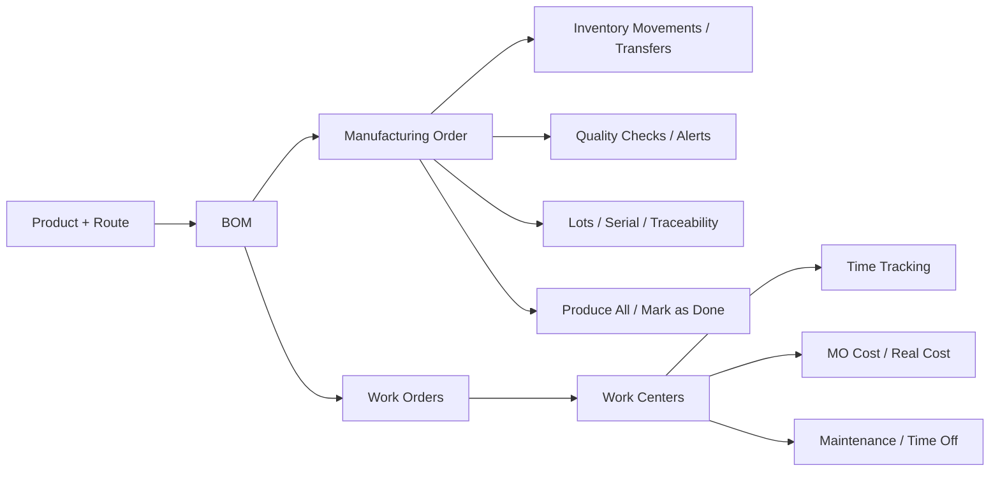
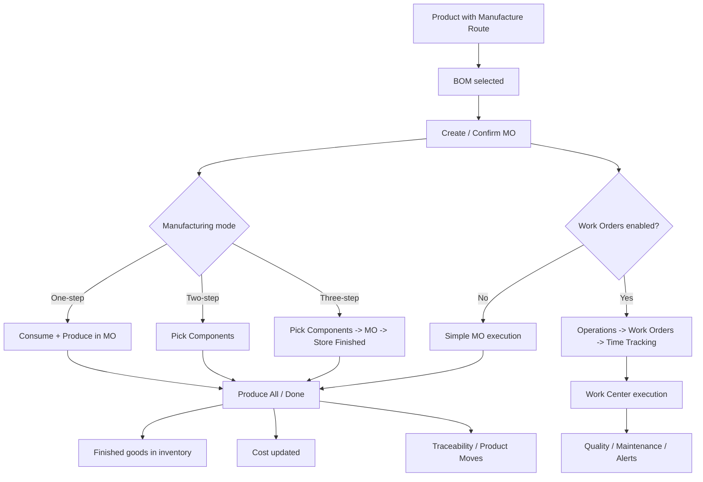
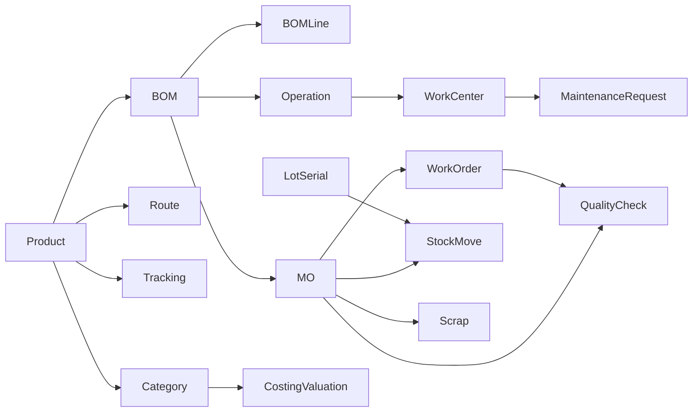

# Odoo Manufacturing

دراسة مرجعية شاملة لإدارة الإنتاج والتصنيع داخل ERP، مبنية أساسًا على توثيق Odoo الرسمي للإصدارين 18 و19، مع الالتزام بأن يكون Odoo هو المرجع الرئيسي الوحيد لهذا الملف. في المساحات التي لم تكن موضحة بشكل كافٍ في التوثيق الرسمي الذي أمكن الوصول إليه، تم التنبيه صراحة إلى أن الأمر **يحتاج تحققًا إضافيًا من مصدر Odoo رسمي أو من تجربة عملية على النظام**. citeturn3view0turn22search0

## الإطار المرجعي وفلسفة Odoo في التصنيع

Odoo Manufacturing، بحسب التوثيق الرسمي، هو تطبيق يساعد المصنّعين على **جدولة** أوامر التصنيع و**تخطيطها** و**تنفيذها**، مع واجهة Shop Floor لمتابعة أوامر العمل لحظيًا على أرض المصنع، وإتاحة تفعيل إجراءات جودة وصيانة وتغذية راجعة من نفس بيئة التشغيل. هذا وحده كافٍ لنفي فكرة أن Odoo “مجرد نظام بسيط للإنتاج”؛ فهو عملي وبسيط في الواجهة، لكنه متداخل مع المخزون، التتبع، الجودة، الصيانة، التقارير، والتكلفة. citeturn3view0turn22search0turn21view3

فلسفة Odoo في التصنيع تقوم على مبدأين متوازنين: **البدء البسيط** و**التصعيد التدريجي للتعقيد عند الحاجة**. يمكن تشغيل التصنيع في Odoo على مستوى **أمر تصنيع بسيط** دون تتبع تحويلات مخزنية منفصلة في one-step manufacturing، ثم التدرج إلى two-step وthree-step لإظهار picking للمكونات وتخزين المنتج النهائي، ثم التوسع إلى Work Orders وWork Centers وShop Floor وOEE وQuality وMaintenance وSubcontracting حسب نضج العملية الصناعية. بهذا المعنى، Odoo ليس “خفيفًا” بقدر ما هو **مهيكل طبقيًا**: نفس المنصة تخدم مصنعًا بسيطًا ومصنعًا يحتاج تشغيلًا متوسط التعقيد. citeturn17view0turn17view1turn17view2turn21view6turn20view8

موقع Odoo Manufacturing داخل المنظومة أوسع من تطبيق مستقل. المخزون في Odoo يُبنى على warehouses وlocations وroutes، والـ routes تتحكم في حركة المنتجات بين المواقع عبر push/pull rules، بينما تحدد warehouses السياق الفيزيائي العام، وتحدد locations المواضع التفصيلية داخل المستودع. لذلك فإن التصنيع في Odoo ليس منطقًا منعزلًا؛ بل هو طبقة تشغيل تعتمد على البنية المخزنية نفسها. أي خطأ في warehouse/location/route أو في تعريف المنتج ووحدة القياس ينعكس مباشرة على أمر التصنيع، التوفر، التتبع، وربما التقييم المالي للمخزون. citeturn9view3turn9view4turn37view0turn37view2turn37view5

سبب أهمية Odoo كمرجع عملي لفهم ERP متوسط التعقيد أنه يقدم نموذجًا واضحًا ومشروحًا لتكامل: **المنتج + الـBOM + أمر التصنيع + حركة المخزون + مركز العمل + الزمن + الجودة + الصيانة + التكلفة**. هذا هو الحد الأدنى الذي يجب أن يفهمه أي مشروع ERP محلي يريد بناء تصنيع جاد. أما التعامل مع Odoo باعتباره “نظامًا بسيطًا” فهو خيار ضعيف تحليليًا؛ لأن التوثيق نفسه يثبت وجود سيناريوهات متعددة المستويات، إمكانات subcontracting، تتبع lot/serial، by-products، OEE، وتقارير تحليل إنتاج. citeturn18view8turn25view1turn17view4turn17view5turn39view3

بالنسبة لاستخدام Odoo كمرجع لتطوير أو تقييم ERP محلي مثل **ناتج**، القيمة الحقيقية ليست في نسخ الشاشات، بل في فهم **القواعد التشغيلية** التي صاغها Odoo: ما الذي يجب تعريفه قبل التصنيع، متى ينشأ الاحتياج للمادة، متى يظهر أمر العمل، كيف يرتبط الزمن بالتكلفة، كيف تنتقل الجودة من نقطة فحص إلى alert، وكيف تؤثر الصيانة في الجدولة والطاقة. هذا هو المستوى المؤسسي المطلوب، لا مجرد بناء “شاشة BOM” و“شاشة أمر تصنيع”. citeturn18view4turn20view0turn29view0turn31view8turn33view0

الجدول التالي يلخص سيناريوهات التصنيع الرئيسية في Odoo بطريقة عملية:

| السيناريو | ما الذي يفعله Odoo | متى يناسب | الأثر التشغيلي | المرجع الرسمي |
|---|---|---|---|---|
| أمر تصنيع بسيط | ينشئ MO فقط دون تتبع تحويلات مستقلة لخروج المكونات أو دخول المنتج النهائي | مصنع بسيط أو تشغيل سريع | تحديث كميات المخزون موجود، لكن دون مسار تحويلات مستقل | citeturn17view0 |
| تصنيع على خطوتين | ينشئ MO + pick components transfer | عندما تريد فصل التقاط المواد عن التنفيذ | يحسن الرقابة على صرف المكونات | citeturn17view1 |
| تصنيع على ثلاث خطوات | ينشئ pick components + MO + store finished products transfer | عند الحاجة إلى تتبع مخزني أدق قبل/أثناء/بعد التصنيع | أوضح سيناريو رقابي على التدفق المادي | citeturn17view2 |
| تصنيع مع Work Orders | يجزئ التنفيذ إلى أوامر عمل مرتبطة بالعمليات | إذا كان التصنيع يمر عبر مراحل تشغيلية واضحة | يضيف تتبع تقدم وزمن لكل عملية | citeturn21view0turn21view1turn21view3 |
| تصنيع مع Work Centers | يربط كل عملية بمركز عمل له طاقة وكفاءة وكلفة ساعة | إذا كانت الموارد الإنتاجية مهمة في الجدولة والتكلفة | يضيف capacity, efficiency, cost/hour, OEE | citeturn20view0turn20view1turn20view4turn20view8 |
| Multi-level BOM | يبني subassemblies ويستخدم reordering rules أو MTO للطبقات السفلية | منتجات متعددة المستويات أو تجميعات معقدة | يرفع النضج التخطيطي بشكل واضح | citeturn18view8 |
| Kit | BOM من نوع Kit بدل Manufacture | منتجات تباع كحزمة أو لتنظيم BOM معقدة | يظهر كمنتج واحد تجاريًا ومكونات في التسليم | citeturn19view2turn19view4 |
| Subcontracting | BOM من نوع Subcontracting + routes خاصة | عندما يتم التصنيع لدى طرف خارجي | يضيف PO/Resupply/Dropship ومنطق تقييم خاص | citeturn25view0turn25view1turn25view3 |
| Lots / Serial | يفرض تعيين lot/SN للمنتجات المتتبعة قبل إتمام الإنتاج | صناعات تتطلب traceability | يمنع إغلاق الإنتاج دون تعيين التتبع | citeturn17view5turn28view3 |
| Quality Checks | ينشئ checks تلقائيًا عبر QCPs أو يدويًا | إذا كان القبول/الرفض جزءًا من العملية | يربط الجودة بالأمر أو العملية أو Shop Floor | citeturn29view0turn29view3turn29view6 |
| Maintenance | يربط المعدات ومراكز العمل بالصيانة ووقت التوقف | إذا كان توقف المورد الإنتاجي يؤثر على الجدولة | يعالج block workcenter وalternative work center | citeturn31view8turn31view6turn33view0 |
| Make to Order / Replenishment | يدعم تفعيل MTO أو reordering rules للطبقات السفلية | عند التصنيع على الطلب أو إعادة التزويد | يؤثر مباشرة على procurement planning | citeturn18view8turn9view4 |

روابط Odoo الرسمية المستخدمة في هذا القسم: Manufacturing overview citeturn3view0turn22search0؛ Inventory management وRoutes citeturn9view3turn9view4turn37view0turn37view2turn37view5؛ one-step/two-step/three-step manufacturing citeturn17view0turn17view1turn17view2؛ Shop Floor overview citeturn21view3؛ Work centers وOEE citeturn20view0turn20view8؛ Multilevel BoMs وKits وSubcontracting citeturn18view8turn19view4turn25view0turn25view3

## البيانات الأساسية وبنية Odoo Manufacturing

القاعدة العملية في Odoo واضحة: **لا يوجد تصنيع جيد فوق master data ضعيفة**. المنتج، نوعه، تتبعه، routes، وحدات القياس، الـBOM، مراكز العمل، العمليات، والمواقع المخزنية ليست “إعدادات تقنية”؛ بل هي تعريفات تشغيلية تتحكم في سلوك النظام بالكامل. التوثيق الرسمي يربط المنتج بالمسارات اللوجستية، ويربط Work Orders بعمليات الـBOM، ويربط Work Centers بالزمن والكلفة والطاقة، ويربط lot/serial بالتتبع والإقفال، ويربط Product Categories بالتقييم والتكلفة. citeturn36view0turn36view1turn36view4turn18view4turn20view0turn14search1

أهم نقطة هنا أن Odoo لا يفصل “التصنيع” عن “المخزون”. المنتج من نوع Goods يفتح تبويب Inventory ويظهر routes، وتتبع المخزون، والـ smart buttons المرتبطة بالعمليات المخزنية. وكذلك warehouse وlocation وroute ليست فقط كيانات مستودعية؛ بل هي جزء من تصميم عملية الإنتاج نفسها، لأن المواد والمنتجات النهائية تتحرك داخل هذا الإطار. citeturn36view0turn36view1turn37view0turn37view2turn37view5

**مصفوفة البيانات الأساسية ذات الأولوية العالية**

| العنصر | تعريفه في Odoo | لماذا مهم | علاقته بالإنتاج | علاقته بالمخزون | علاقته بالتكلفة | المخاطر إذا كان خاطئًا | المرجع الرسمي |
|---|---|---|---|---|---|---|---|
| Products | Odoo يعامل goods والخدمات كـ products، مع اختيار Product Type بعناية | هو نقطة البداية لكل BOM وMO | المنتج النهائي والمكونات كلاهما products | التتبع، on hand، forecast، routes | تكلفة المنتج والمكون تظهر على product/category | تعريف خاطئ يعطل مسارات التصنيع أو التقييم | citeturn36view0turn36view1 |
| Product Type | Goods مقابل Service | يحدد ما إذا كان المنتج يدخل العمليات المخزنية | التصنيع يخص Goods فعليًا | Goods تفتح التتبع والـInventory tab | يؤثر في valuation والتعامل كمخزون | اعتبار عنصر مصنع كخدمة خطأ جسيم | citeturn36view0 |
| Track Inventory | By Quantity / By Lots / By Unique Serial Number | يحدد مستوى التحكم | مطلوب للمواد أو المنتجات التي تحتاج traceability | يحدد كيف تُمسك الكميات والدفعات | يدعم valuation والتتبع | غياب التتبع في صناعة تحتاجه مخاطرة عالية | citeturn36view1turn17view5turn28view3 |
| Product Variants | خصائص مثل الحجم/اللون لمنتج واحد | مهم إذا كانت BOM تختلف حسب variant | يمكن تخصيص مكونات/عمليات/by-products حسب variant | يساعد في تجنب مضاعفة تعريف المنتجات | قد يغير المكونات والكلفة المتوقعة | إهماله يؤدي إلى BOM عامة غير دقيقة | citeturn36view7turn36view8turn18view7 |
| Components | المنتجات الداخلة في تصنيع المنتج | تمثل الاستهلاك الفعلي | تظهر داخل BOM وMO | تؤثر على الحجز/الصرف/النقص | تشكل الجزء الأكبر من كلفة الأمر غالبًا | مكون خاطئ = صرف خاطئ + تكلفة خاطئة | citeturn18view3turn24view2 |
| Finished Products | المنتج الناتج من الـBOM أو الـMO | هو مخرج العملية | يدخل المخزون عند Produce All / Done | يتأثر بالتخزين والتتبع | تتحدث كلفته مع MOs المكتملة | منتج نهائي غير معرف جيدًا يفسد التقارير والتقييم | citeturn21view0turn23view1 |
| Units of Measure | Odoo يسمح بـ UoM متعددة للمنتج الواحد | أساسي للتحويل والشراء والبيع والإنتاج | كمية الـBOM والعمليات تعتمد عليه | وحدة المخزون الداخلية تظهر على المنتج | تكلفة الوحدة تصبح مضللة إذا كانت UoM خاطئة | أخطاء ضخمة في الصرف والإنتاج والتكلفة | citeturn36view4turn36view5 |
| Product Categories | تصنيف المنتج الذي يحمل costing/valuation settings | مهم للتقييم المحاسبي والتكلفة | يضبط تقييم أصناف الإنتاج ومكوناته | routes يمكن أن تنطبق أيضًا على category | Costing Method وInventory Valuation على category | فئة خاطئة = تقييم خاطئ وحسابات خاطئة | citeturn14search1turn37view5 |
| Warehouses | مساحة فعلية لتخزين المواد والمنتجات | تحدد نطاق العمل اللوجستي | التصنيع يمكن تعريفه one/two/three steps لكل warehouse | بين warehouses يمكن إنشاء stock moves | إعدادات التدفق تؤثر على طبقات التقييم | warehouse configuration خاطئة تربك التدفق كله | citeturn37view0 |
| Locations | موقع محدد داخل warehouse | أساس أي رقابة مكانية فعلية | pre-production / production / scrap / storage منطقها مكاني | كل move يتم بين locations | يؤثر على traceability وSVL ضمنيًا | location type خاطئ يضلل الحركات والتقارير | citeturn37view2turn37view4turn21view4 |
| Routes | قواعد حركة بين locations عبر push/pull | قلب الأتمتة اللوجستية | تحدد كيف تُجلب المكونات أو تورد المنتجات | تطبق على product/category وغيرها | تؤثر على زمن التوفر والعمليات وليس على الكلفة مباشرة | route خاطئة = shortages أو moves غير منطقية | citeturn37view5turn22search6 |
| Bills of Materials | وصف مكونات وعمليات تصنيع منتج | المرجع الأساسي للأمر | تحدد what/how of manufacturing | تحدد المكونات المطلوبة وحالة readiness | تحدد الكلفة المتوقعة عبر المكونات والعمليات | BOM خاطئة هي أخطر سبب فشل | citeturn18view0turn18view6turn24view2 |
| Operations | خطوات العمل داخل الـBOM | تحول BOM من قائمة مواد إلى process | تنشئ Work Orders عند التفعيل | ترتبط بالصرف المرحلي في بعض السيناريوهات | duration + work center = cost | عملية ناقصة أو غير مرتبة = تقدم وهمي وكلفة مضللة | citeturn18view4turn23view2 |
| Work Centers | مواقع تنفيذ أوامر العمل | تمثل الطاقة والسرعة والكلفة | تنفذ العمليات الفعلية | تؤثر على planning والاختناقات | Cost/hour وefficiency وOEE | مركز عمل غير مضبوط يفسد الجدولة والكلفة | citeturn20view0turn20view1turn20view2turn20view4 |
| Lots / Serial Numbers | تعريف وتتبع batch أو وحدة فريدة | مهم للامتثال والتتبع والتحقيق | قد يصبح إلزاميًا لإتمام الإنتاج | يظهر في receipt/delivery/traceability | يمكن ربط valuation بالlot/SN | عدم استخدامه عند الحاجة مخاطرة تشغيلية وتنظيمية | citeturn17view5turn28view0turn28view3turn34view5 |
| Responsible users | لا يظهر في الصفحات التي أمكن الوصول إليها كـ master object مستقل للتصنيع؛ تظهر أدوار موزعة مثل Allowed Employees في Work Center، وResponsible في Quality Alert، وTechnician في Maintenance | مهم للحوكمة | يحدد من يشغّل ومن يعتمد ومن يعالج | لا يغير المخزون بنفسه لكن يغير الانضباط | يؤثر على موثوقية البيانات الزمنية والجودة | إذا كان غير واضح تضيع المساءلة | citeturn20view1turn29view8turn31view7 |

**ملاحظة حاسمة:** إذا كان العميل يريد تصنيعًا فعليًا، فإن خيار “تعريف المنتجات فقط ثم البدء” خيار ضعيف جدًا. الحد الأدنى المقبول عمليًا في Odoo هو: **Product Type صحيح + Track Inventory عند الحاجة + UoM صحيحة + Route صحيحة + BOM دقيقة + Locations واضحة**. بدون ذلك، سيعمل النظام شكليًا لكنه ينتج بيانات تشغيلية مضللة. citeturn36view0turn36view1turn36view4turn37view2turn18view0

روابط Odoo الرسمية المستخدمة في هذا القسم: Product type وUnits of measure وProduct variants citeturn36view0turn36view1turn36view4turn36view7turn36view8؛ Warehouses وLocations وRoutes citeturn37view0turn37view2turn37view5؛ Manufacturing product configuration وBoMs for variants citeturn9view0turn9view1turn9view2turn18view7؛ Work centers citeturn20view0turn20view1turn20view2؛ Lot numbers وValuation by lots/serial numbers citeturn28view0turn28view3turn34view5

## من BOM إلى أمر التصنيع ثم الإقفال

الـBOM في Odoo هو المرجع المركزي الذي يحدد ماذا سنصنع، من ماذا، وبأي عمليات. التوثيق الرسمي يوضح أن إنشاء BOM يبدأ باختيار **BoM Type = Manufacture this Product**، ثم إضافة المكونات، وإذا لزم الأمر إضافة العمليات. كما يوضح أن تبويب Miscellaneous يحتوي على إعدادات إضافية لتخصيص procurement واحتساب الكلفة وتعريف كيفية استهلاك المكونات. لذلك فالـBOM ليس مجرد قائمة مواد؛ إنه **العقد التشغيلي** الذي يربط المنتج بالمكونات والعمليات والتكلفة. citeturn18view0turn18view3turn18view4turn18view6

في Odoo توجد ثلاثة أنواع عملية يجب التمييز بينها داخل هذا الملف: **Manufacture this Product** للتصنيع الداخلي، **Kit** للحزمة، و**Subcontracting** للتصنيع لدى طرف خارجي. كذلك يدعم Odoo by-products على الـBOM، ويدعم تخصيص المكونات والعمليات والـby-products حسب variants، ويدعم multilevel BoMs على شكل subassemblies مع تخطيط replenishment مناسب. هذه ليست تفاصيل ثانوية؛ هي التي تميز نموذج تصنيع مؤسسي عن نموذج تجميعي ضعيف. citeturn19view4turn25view1turn18view5turn18view7turn18view8

**تصنيف BOM في Odoo من منظور تنفيذي**

| النوع | الاستخدام | ماذا يعني عمليًا | الأثر | المرجع الرسمي |
|---|---|---|---|---|
| Manufacture this Product | تصنيع داخلي | المنتج ينتج عبر MO | مكونات + عمليات + كلفة تصنيع | citeturn18view0turn24view2 |
| Kit | حزمة أو أداة تنظيم | المنتج التجاري قد يظهر كعنصر واحد بينما التسليم على مستوى المكونات | لا يشبه MO الداخلي مباشرة | citeturn19view4turn19view2 |
| Subcontracting | تصنيع خارجي | المنتج يصنع لدى subcontractor وفق BOM خاص | يربط PO/Routes/valuation خارجي | citeturn25view1turn25view3 |

أمر التصنيع في Odoo هو كيان التنفيذ. في المسارات الرسمية التي أمكن الوصول إليها، يظهر أن المستخدم يمكنه إنشاء MO جديد باختيار المنتج والكمية ثم الضغط على Confirm، وأن النظام بعد ذلك يتصرف وفق بنية التشغيل المختارة: one-step أو two-step أو three-step، ومع أو بدون Work Orders. وفي التصنيع الذي يتضمن Work Orders، يبدأ المستخدم العملية من تبويب Work Orders على الـMO، ويضغط Start ليبدأ المؤقت، ثم Done لكل أمر عمل، ثم Produce All/Close Production لإدخال المنتج للمخزون وإغلاق الأمر. citeturn17view3turn21view0turn21view1

**سير التنفيذ المفاهيمي داخل Odoo**

**مراحل أمر التصنيع وما يترتب عليها**

| المرحلة | ماذا يحدث | من يستخدمها | الأثر المخزني | الأثر على التكلفة | المخاطر |
|---|---|---|---|---|---|
| Create / Confirm | اختيار المنتج والكمية وتأكيد الأمر | مخطط الإنتاج / مسؤول الورشة | يبدأ منطق الاحتياج للمكونات والتصرفات التابعة | تتحدد الكلفة المتوقعة من الـBOM | أمر بلا BOM دقيقة ينتج خطة خاطئة | citeturn17view3turn24view2 |
| Availability / component readiness | Odoo يربط الإتاحة بحالة المكونات والـroutes والتحويلات، ويمكن تعريف readiness على مستوى الـBOM | التخطيط والمخزون | في two/three-step تظهر حركات pick components، وفي التأخير يظهر Late Availability | التأخير قد لا يغير الكلفة مباشرة لكنه يضرب الخطة | **زر Check Availability نفسه يحتاج تحققًا إضافيًا من مصدر Odoo رسمي أو من تجربة عملية على النظام** | citeturn17view1turn17view2turn18view3turn39view0turn22search6 |
| Start Work | يبدأ أمر العمل ويبدأ التايمر | المشغل / العامل | لا يحدث إدخال نهائي بعد | يبدأ الفرق بين MO Cost وReal Cost | زمن غير دقيق = تكلفة فعلية غير موثوقة | citeturn21view0turn20view9 |
| Pause / resume | يمكن إيقاف المؤقت في Shop Floor | المشغل | لا يغير المخزون مباشرة | يغير الزمن المسجل | إساءة الاستخدام تخفي الاختناقات | citeturn21view2 |
| Done لكل Work Order | إنهاء عملية مفردة | المشغل / قائد الخط | تقدم تشغيلي على مستوى العملية | يثبّت جزءًا من الزمن الفعلي | إنهاء شكلي دون تنفيذ فعلي يضلل النظام | citeturn21view1turn20view7 |
| Register Production | تسجيل عدد الوحدات المنتجة على بطاقة العمل | المشغل | يهيئ إدخال الكمية المنتجة | يرتبط بكلفة الوحدة النهائية | إدخال كمية خاطئة يضرب المخزون والتكلفة | citeturn21view0 |
| Produce All / Mark as Done | إغلاق MO وإدخال الناتج إلى المخزون | مسؤول الإنتاج | يسجل المنتج النهائي، ويحدّث كميات الـby-products أيضًا إن وجدت | يجعل MO Cost يطابق Real Cost بعد الإكمال | الإقفال قبل التتبع/الجودة/الكمية الصحيحة يخلق تشوهًا دائمًا | citeturn21view0turn23view1turn17view4 |
| Backorder | تقسيم الأمر عند إنتاج جزء فقط | التخطيط / الورشة | الجزء المنجز يغلق، والباقي يظل مفتوحًا بأمر لاحق | يسمح بإقفال جزئي منضبط | البدء بلا سياسة backorder يؤدي إلى أوامر معلقة أو إقفالات خاطئة | citeturn17view3 |

**الاستهلاك المادي للمكونات**

التوثيق الذي أمكن الوصول إليه يوضح أن Odoo يحتسب كلفة الأمر من **كمية المكونات** و**كلفة العمليات**. كما يوضح أن الكلفة الفعلية قد تختلف عن الكلفة المتوقعة إذا تم استخدام **كمية مكونات أكبر** من المحددة على الـBOM أو إذا استغرقت العمليات زمنًا أطول أو اختلفت كلفة العامل الفعلية. هذا مهم جدًا عمليًا، لأنه يعني أن Odoo لا ينظر إلى BOM كخطة جامدة فقط؛ بل يسمح بانحراف استهلاك/زمن ينعكس على Real Cost. citeturn23view0turn23view1turn24view3

أما التفصيل الدقيق جدًا للفرق بين **planned consumption** و**actual consumption** ككيانين منفصلين على مستوى الشاشات، فلم يكن موضحًا بما يكفي في الصفحات الرسمية التي أمكن الوصول إليها هنا. لكن المؤكد من التوثيق أن اختلاف استهلاك المكونات عن المدرج في الـBOM ينعكس على الكلفة الفعلية، وأن الـBOM نفسها تحتوي إعدادات تحدد readiness وكيفية استهلاك المكونات على مستوى Miscellaneous. **يحتاج تحقق إضافي من مصدر Odoo رسمي أو من تجربة عملية على النظام** إذا كان المطلوب توصيفًا تفصيليًا لحقول الاستهلاك الفعلي لكل عملية/أمر. citeturn18view6turn23view1

العلاقة بين أمر التصنيع وحركات المخزون في Odoo علاقة مباشرة وليست جانبية. في التصنيع على خطوتين وثلاث خطوات، ينشأ pick components transfer، وفي التصنيع على ثلاث خطوات ينشأ كذلك store finished products transfer. كما أن قواعد الـroutes والـpull rules يمكن أن تولّد product moves لتلبية حاجة ناشئة من MO يحتاج مكونًا معينًا. وعند استخدام by-products، يظهر Product Moves smart button لعرض حركة المكونات والمنتج والـby-products من وإلى المواقع ذات الصلة، بما فيها virtual production location. citeturn17view1turn17view2turn22search6turn17view4

**أسئلة تحليل العميل الخاصة بالـBOM**

| السؤال | لماذا هو مهم | ما الذي يكشفه |
|---|---|---|
| هل الـBOM ثابتة أم تختلف حسب variant أو المقاس أو اللون؟ | لأن Odoo يدعم تطبيق المكونات على variants محددة | الحاجة إلى variant-aware BOM بدل BOM واحدة عامة |
| هل المنتج النهائي ينتج داخليًا أم Kit أم Subcontracting؟ | لأن نوع الـBOM يغير دورة التنفيذ بالكامل | مسار تشغيل مختلف جذريًا | 
| هل توجد عمليات تشغيلية فعلية أم يكفي MO بسيط؟ | لتحديد الحاجة إلى Work Orders | مستوى النضج التشغيلي المطلوب |
| هل هناك by-products أو residual outputs؟ | لأن Odoo يدعم by-products على الـBOM | ضرورة تتبع مخرجات إضافية وعدم اعتبارها scrap فقط |
| هل توجد subassemblies؟ | لتحديد الحاجة إلى multilevel BoM | عمق التخطيط ومستوى إعادة التزويد |
| هل تحتاج أول عملية أن تبدأ قبل توفر كل المكونات؟ | لأن الـBOM تدعم readiness based on first operation or all components | سياسة بدء الإنتاج تحت نقص المواد |
| هل وحدة شراء المكون تختلف عن وحدة استهلاكه؟ | لأن UoM conversion قد يسبب أخطاء جسيمة | الحاجة إلى ضبط UoM categories بعناية |
| هل استهلاك المادة فعليًا قد يختلف عن القياسي؟ | لأن هذا ينعكس على Real Cost | ضرورة ضبط variance/monitoring |
| هل الصرف يتم دفعة واحدة أم مرحليًا مع العمليات؟ | يحدد طريقة تصميم التنفيذ والمراقبة | درجة تفصيل shop floor المطلوبة |
| هل العميل يريد traceability على مستوى lot/serial؟ | لأن التتبع يغير الإقفال والقبول | مستوى الامتثال المطلوب |

روابط Odoo الرسمية المستخدمة في هذا القسم: Bill of materials وManufacturing product configuration citeturn18view0turn18view3turn18view4turn18view5turn18view6turn9view0turn9view2؛ one/two/three-step manufacturing وManufacturing backorders citeturn17view0turn17view1turn17view2turn17view3turn21view0turn21view1؛ Shop Floor time tracking وdependencies citeturn20view9turn20view7؛ Kits وProduct variants وMultilevel BoMs وBy-products citeturn19view4turn18view7turn18view8turn17view4

## التتبع والجودة والهالك والصيانة والتعهيد الخارجي

الـLots والـSerial Numbers في Odoo ليست إضافة تجميلية؛ بل آلية ضبط ومساءلة. التوثيق الرسمي يعرّف lot numbers باعتبارها وسيلة لتعريف وتتبع دفعات من المنتجات المستلمة أو المخزنة أو المشحونة أو المصنّعة داخليًا، ويؤكد أن المصنّعين يستخدمونها لتسهيل **end-to-end traceability** عبر دورة الحياة. كما يؤكد أنه عند تصنيع منتجات متتبعة بالـlots أو serials، فإن Odoo **يشترط** تعيين lot/SN قبل إتمام التصنيع. citeturn28view0turn17view5

الأثر العملي لهذا في الصناعات الغذائية والدوائية والكيماوية واضح جدًا: إن كنت تحتاج ربط المكون الخام بالدفعة المنتجة، أو تحتاج استدعاء traceability report عند مشكلة جودة أو recall، فعدم استخدام lot/serial ليس مجرد ضعف إعداد؛ بل **مخاطرة تشغيلية وتنظيمية**. هذا استنتاج تحليلي مباشر من منطق التتبع end-to-end الذي يشرحه Odoo، ومن كون النظام يوفّر traceability report على مستوى lot/serial stock moves. citeturn28view3

Odoo Quality يربط الجودة بالإنتاج والمخزون معًا. Quality Control Points تُستخدم لإنشاء Quality Checks تلقائيًا على فترات أو ظروف محددة، ويمكن ربطها بعمليات معينة مثل manufacturing أو delivery، وبمنتجات أو فئات منتجات محددة. وإذا كانت نقطة الضبط مرتبطة بعملية Work Order محددة، فإن الشيك يظهر ويُنفذ من Shop Floor. أما Quality Alerts فهي سجل رسمي للمشكلة ويمكن إنشاؤها من أمر تصنيع أو أمر مخزني أو Work Order أو من تطبيق Quality مباشرة. كذلك تسمح Failure Locations بتحويل المنتجات الراسبة إلى مواقع فشل مخصصة عندما تُضبط QCP بهذه الطريقة. citeturn29view0turn29view1turn29view3turn29view6turn29view9turn30search0turn30search2turn30search5

عمليًا، هذا يعني أن فحص الجودة في Odoo لا يقتصر على “بعد الإنتاج”. يمكن، بحسب تصميم QCP والعملية المراد ربطها، وضع الفحص **قبل الإنتاج** على حركة استلام أو تجهيز مواد، أو **أثناء الإنتاج** على Work Order داخل Shop Floor، أو **بعد الإنتاج** على أمر التصنيع/الحركة النهائية. هذه قراءة تطبيقية من التوثيق الرسمي الذي يربط checks بالعمليات المخزنية والتصنيعية وبـShop Floor، وليست قاعدة زمنية جامدة داخل وثيقة واحدة. citeturn29view0turn29view3turn30search0turn30search3

في موضوع الـScrap، يوضح Odoo أن العناصر المسجلة كهالك تُزال من المخزون الفعلي وتُنقل إلى **Virtual Locations/Scrap**، وأن scrap يمكن تنفيذه من Manufacturing app أو Shop Floor، مع فرق مهم: من Shop Floor يمكن scrap للمكونات فقط، بينما من Manufacturing app يمكن scrap للمكونات في Draft/Confirmed، والمنتجات النهائية عندما يكون الـMO في Done. كما توجد خانة **Replenish Scrapped Quantities** لإنشاء picking تعويضي للمكونات المسروقة/المهدرة في warehouses التي تعمل بتصنيع على خطوتين أو ثلاث. citeturn21view4

أما الـBy-products فهي شيء مختلف عن scrap. Odoo يصفها بأنها residual products تنتج مع المنتج الرئيسي، ويمكن تعريفها في تبويب By-products داخل الـBOM بعد تفعيل الميزة، وتسجيل الكمية وربطها بعملية معينة إن لزم. وعند إكمال الـMO وتحديده Done، يسجل Odoo كمية الـby-products في المخزون ويظهرها ضمن Product Moves. لذلك، الخلط بين scrap وby-product خطأ تحليلي وتشغيلي: الأول خسارة، والثاني مخرج نظامي مقصود أو متوقع. أما التفريق بين **الهالك الطبيعي** و**الهالك غير الطبيعي** فهو مفهوم تحليلي مفيد للمستشار، لكنه ليس تصنيفًا ورد بهذا الاسم في التوثيق الرسمي الذي تم الوصول إليه. citeturn17view4turn21view4

في الصيانة، يوضح Odoo أن Maintenance تُستخدم لإبقاء المعدات ومراكز العمل في حالة تشغيل مناسبة، مع دعم الصيانة **الوقائية** و**التصحيحية** عبر Maintenance Requests. يمكن ربط request بمركز عمل، ويمكن من خلال Maintenance Calendar تحديد Work Center وBlock Workcenter ومنع تخطيط Work Orders عليه أثناء فترة الصيانة. كما أن Work center time off يسمح بجعل المركز غير متاح لفترة معينة وإعادة توجيه أوامر العمل إلى alternative work center عند التخطيط. كذلك يمكن ربط equipment نفسها بمركز عمل. citeturn31view0turn31view6turn31view7turn31view8turn31view3turn33view0turn33view3

هذا الربط مهم جدًا لأي ERP محلي: الصيانة ليست وظيفة مستقلة عن التصنيع. إذا كان توقف مركز العمل لا يمنع الجدولة أو لا يعيد التخطيط أو لا يظهر أثره على الطاقة، فالنظام ناقص وظيفيًا حتى لو كانت شاشة الصيانة موجودة. Odoo يثبت إمكانية هذا الربط عمليًا. citeturn31view6turn33view0

في التعاقد الخارجي Subcontracting، يوضح Odoo أن تفعيل الميزة يضيف نوع BOM باسم **Subcontracting**، ويضيف مسارين للمنتجات والمكونات هما **Resupply Subcontractor on Order** و**Dropship Subcontractor on Order**. في الأول ترسل الشركة المتعاقدة المكونات من مستودعها إلى المقاول، وفي الثاني تُشترى المكونات من المورد وتُشحن مباشرة إلى المقاول. كما يعرّف Odoo تقييم المنتج المتعاقد عليه بالمعادلة: **P = C + M + S + D + x**؛ أي تكلفة المكونات + أجر المقاول + الشحنات + dropshipping إن وجد + التكاليف الأخرى. citeturn25view0turn25view1turn25view2turn25view3turn27view5turn27view6turn27view7

الجدول التالي يلخص الفرق العملي بين التصنيع الداخلي والتعهيد الخارجي:

| البعد | تصنيع داخلي | Subcontracting | ملاحظة عملية |
|---|---|---|---|
| من ينفذ العملية | Work Centers داخل الشركة | Subcontractor خارج الشركة | يغير منطق التنفيذ بالكامل |
| المرجع الرئيسي | BOM + Operations + Work Centers | BOM نوع Subcontracting + PO + routes | كلاهما يعتمد على BOM لكن المسار مختلف |
| المكونات | تُصرف داخليًا | تُرسل للمقاول أو تُشحن إليه مباشرة | يجب ضبط route بشكل صحيح |
| المنتج النهائي | يدخل المخزون عند Done/Receipt من المسار الداخلي | يعود على Receipt أو يُdropship للعميل | يؤثر على الرقابة والـlead time |
| التكلفة | مكونات + مراكز عمل + عمالة | C + M + S + D + x | شفافية التعاقد الخارجي أساسية |
| المخاطر الرئيسية | طاقة/زمن/جودة | ضياع مواد، غموض أجر الخدمة، ضعف traceability | هنا يجب أن يكون المستشار صارمًا |

**تنبيه مهم:** التوثيق الذي أمكن الوصول إليه يشرح بوضوح workflows الإرسال والاستلام والتقييم، لكنه لا يقدم في الصفحات التي تم الاعتماد عليها هنا شرحًا كافيًا ومباشرًا بالصياغة نفسها لموضوع “مراقبة مخزون المواد لدى المقاول” كلوحة مستقلة أو نموذج تقريري مفصل. **يحتاج تحقق إضافي من مصدر Odoo رسمي أو من تجربة عملية على النظام** إذا كان المطلوب توصيفًا دقيقًا لهذا الجانب على مستوى الشاشة/التقرير. citeturn27view4turn27view5turn25view3

روابط Odoo الرسمية المستخدمة في هذا القسم: Lot numbers وManufacture with lots and serial numbers وValuation by lots/serial numbers citeturn28view0turn28view3turn17view5turn34view5؛ Quality control points وQuality checks وQuality alerts وFailure locations citeturn29view0turn29view3turn29view6turn29view9turn30search0turn30search2turn30search5؛ Scrap during manufacturing وBy-products citeturn21view4turn17view4؛ Maintenance requests وMaintenance calendar وWork center time off وAdd new equipment citeturn31view0turn31view6turn31view8turn31view3turn33view0؛ Subcontracting وResupply/Dropship workflows citeturn25view0turn25view1turn25view3turn27view5turn27view6turn27view7

## التكلفة والعلاقة المالية والتقارير والرقابة

من أقوى ما يقدمه Odoo في التصنيع المتوسط التعقيد أنه يشرح بوضوح منطق **Manufacturing Order Costs**. التوثيق الرسمي يميز بين **MO Cost** بوصفها التكلفة التقديرية، و**Real Cost** بوصفها التكلفة الفعلية، ويؤكد أن Odoo يحسب تكلفة الـMO بناءً على تكوين الـBOM: **تكلفة المكونات وكمياتها + تكلفة العمليات المدرجة + كلفة تشغيل مراكز العمل + التكلفة المرتبطة بالعاملين على العمليات**. كما يوضح أن تكلفة المكونات تحسب تلقائيًا من **average purchase cost across POs**، وأن كلفة مركز العمل تضبط في work center عبر per workcenter وper employee، بينما الكلفة الفعلية للعامل تُؤخذ من Hourly Cost في سجل الموظف. citeturn24view2turn24view0turn23view2turn23view3

هذا التصميم مهم لأنه يوضح ثلاثة أمور عملية. أولًا: إذا لم تضبط work centers والعمليات على الـBOM، فلن تكون تكلفة التشغيل حقيقية. ثانيًا: إذا لم تُسجَّل الأزمنة الفعلية بدقة، ستظل Real Cost مضللة حتى لو كان product costing مضبوطًا. ثالثًا: إذا كان المشغلون الفعليون تختلف تكلفتهم عن per employee الافتراضية على work center، فستظهر الفروقات بوضوح بين MO Cost وReal Cost أثناء التنفيذ. هذا نموذج كافٍ جدًا لمصنع متوسط النضج، لكنه ليس بعمق أنظمة الكلفة الصناعية الثقيلة جدًا. citeturn23view0turn23view1turn23view2turn20view9

**مثال رقمي مبسط من منطق Odoo الرسمي**

يقدم توثيق Odoo مثالًا لمنتج putting green بتكلفة BOM كالتالي: مكون أخضر felt بقيمة 20 دولارًا + rubber pad بقيمة 30 دولارًا = **50 دولارًا مواد**، وأربع عمليات على Work Center بكلفة تشغيل 30 دولارًا/ساعة، بزمن إجمالي 30 دقيقة تقريبًا موزعًا إلى 7 و5 و15 و3 دقائق، فتكون كلفة العمليات **15 دولارًا**، وبالتالي الكلفة التقديرية الكلية للـMO = **65 دولارًا**. وإذا استغرقت العمليات عشر دقائق إضافية ليصبح الزمن الكلي 40 دقيقة، ترتفع **Real Cost إلى 70 دولارًا**. وبعد إكمال التصنيع، تتطابق MO Cost مع Real Cost، ويُحدث المنتج نفسه متوسط التكلفة إلى **67.50 دولارًا** باعتبارها متوسط 65 و70. citeturn24view2turn23view1

هذا المثال مهم جدًا لأنه يترجم فلسفة Odoo في الكلفة إلى معادلة تنفيذية بسيطة:

**تكلفة الأمر = مواد + تشغيل + عمالة/زمن فعلي**  
**تكلفة الوحدة = تكلفة الأمر ÷ الكمية المنجزة**  
**تكلفة المنتج اللاحقة = متوسط تاريخي محدث حسب MOs المكتملة**

وهذا يعني أن الـBOM ليست فقط أداة تخطيط، بل **أداة cost model** أيضًا. وإذا كانت الـBOM ناقصة، أو الـwork center rate خاطئة، أو الـduration غير واقعي، فالتكلفة ستخرج “رسمية” من النظام لكنها غير صحيحة عمليًا. citeturn24view2turn23view2turn23view4

بالنسبة للهالك والزيادة في الاستهلاك، التوثيق الرسمي يبين أن Real Cost تنحرف عندما تستخدم كمية مكونات تختلف عن المحدد في الـMO/BoM أو عندما تطول مدة العملية أو تختلف كلفة العامل الفعلية. كما يضيف التوثيق الخاص بالscrap أن المواد المسجلة كهالك تنقل إلى Virtual Locations/Scrap ويمكن حتى إنشاء replenishment لها في بعض السيناريوهات. لذلك، scrap غير المسجل أو الزيادة غير المنضبطة في الاستهلاك ليست مشكلة تشغيلية فقط؛ بل **تشويه مباشر للتكلفة**. citeturn23view1turn21view4

في التعاقد الخارجي، Odoo لا يكتفي بإظهار workflow؛ بل يطرح معادلة تقييم صريحة للمنتج المتعاقد عليه: **P = C + M + S + D + x**. هذه نقطة ممتازة مرجعيًا لأي ERP محلي، لأنها تمنع النظر إلى subcontracting كمجرد “شراء منتج نهائي” وتفرض فهمًا أوسع للمكونات وأجر الخدمة والشحن والتكاليف الأخرى. citeturn25view3

على المستوى المالي/المحاسبي، توثيق Odoo الخاص بـInventory Valuation يوضح أن **automatic inventory valuation** ينشئ قيودًا محاسبية فورية/real-time journal entries كلما دخل المخزون إلى المستودع أو خرج منه، وأن كل stock move layer جديد يولد journal entry عند استخدام automatic accounting. كما أن Product Category هي المكان الذي يضبط منه Inventory Valuation وCosting Method مثل Standard Price وAVCO وFIFO. ويعرض Stock Valuation dashboard القيمة الحالية للمخزون ويتيح تتبع التقييم حسب التاريخ. citeturn34view0turn34view1turn34view2turn34view3turn34view4turn14search1

لكن يجب أن نكون دقيقين هنا: التوثيق الذي أمكن الوصول إليه يشرح التقييم المحاسبي للمخزون بوضوح، **ولا يشرح بما يكفي داخل نفس الحزمة التي اعتمدناها هنا قيد WIP محاسبي تفصيلي خاص بالتصنيع داخل Odoo 18.0**. توجد في توثيق Odoo 19 إشارة رسمية إلى صفحة **Work-in-progress costs**، وهو ما يدل على وجود معالجة لهذا الجانب في الجيل الأحدث من التوثيق، لكن حدودها، وتفاصيلها، وكيفية تطبيقها على بيئة العميل الفعلية **تحتاج تحققًا إضافيًا من مصدر Odoo رسمي أو من تجربة عملية على النظام** قبل بناء تصميم محاسبي نهائي. citeturn1search7turn34view0

**أهم التقارير والمخرجات الرقابية في Odoo Manufacturing**

| التقرير أو المخرج | من يستخدمه | ماذا يكشف | القرار الذي يساعد عليه | المرجع الرسمي |
|---|---|---|---|---|
| MO Overview | مدير الإنتاج / المالية الصناعية | MO Cost مقابل Real Cost وتفصيل المكونات والعمليات | هل الانحراف سببه مادة أم زمن أم عامل؟ | citeturn23view1turn23view5 |
| Production Analysis | إدارة العمليات / الإدارة التنفيذية | تكاليف، مدد تصنيع، إحصاءات حسب المنتج أو الفترة | مقارنة منتجات، كشف المنتجات مرتفعة الكلفة، مراجعة اتجاهات الأداء | citeturn39view3turn39view5 |
| Delays | التخطيط / المتابعة | Delayed Productions وLate وLate Availability | هل المشكلة في بدء الإنتاج أم نهاية الموعد أم توفر المكونات؟ | citeturn39view0 |
| Allocation Report | التخطيط والمخزون | لمن سيخصص الناتج أو الـcomponent المفتوح | إعادة تخصيص الناتج أو ربطه بطلبات وتراكيب مفتوحة | citeturn39view1turn39view2 |
| OEE / Work Center performance | مدير الورشة | وقت الإنتاجية، الكفاءة، الطاقة | كشف الاختناقات وسوء استغلال المراكز | citeturn20view8turn21view6 |
| Planning by Workcenter | التخطيط | work orders scheduled وminutes per hour | موازنة الأحمال وإعادة التخطيط | citeturn21view6 |
| Work order duration | مشرف التشغيل | Real Duration لكل أمر عمل | تقييم الأزمنة القياسية والفعلية | citeturn20view9turn30search6 |
| Quality Checks / Alerts | الجودة والإنتاج | نتائج الفحص والأسباب والتنبيهات | قبول/رفض، root cause، إجراءات تصحيحية | citeturn29view3turn29view6turn29view8 |
| Maintenance Requests / Calendar | الصيانة والإنتاج | الطلبات المفتوحة، blocking، calendar load | إيقاف الموارد وإعادة الجدولة ومنع الأعطال | citeturn31view7turn31view8 |
| Traceability report | الجودة / الامتثال / خدمة العملاء | lifecycle كامل للدفعة أو الرقم التسلسلي | تحقيقات الجودة، recall، إثبات المصدر والمصير | citeturn28view3 |
| Stock Valuation dashboard | المالية والمخزون | قيمة المخزون وحركات التقييم | مطابقة الأثر المالي للمخزون مع التشغيل | citeturn34view3turn34view4turn14search4 |
| Scrap orders | المخزون والإنتاج | الكميات المسجلة كهالك | خفض الهدر والتحقق من أسباب الفاقد | citeturn21view4 |

**المخاطر الرئيسية وأسباب الفشل**

| الخطر | الأثر | الوقاية العملية |
|---|---|---|
| BOM غير دقيقة | صرف مواد خاطئ، تكلفة خاطئة، إنتاج غير قابل للتنفيذ | مراجعة BOM bottom-up، واختبار MO فعلي قبل Go-Live |
| UoM غير صحيحة | تضخيم أو تقليل الكميات والتكلفة | توحيد UoM categories واختبار purchase vs production units |
| Product Category خاطئة | تقييم مالي غير صحيح | اعتماد سياسة category-governance قبل التشغيل |
| عدم توفر المكونات | تأخير، Late Availability، أو توقف العمل | تفعيل replenishment مناسب، ومراقبة availability |
| عدم تفعيل Work Orders عند الحاجة | فقدان التقدم والزمن والجودة المرحلية | تفعيلها إذا كانت العملية تمر بمراحل تشغيل فعلية |
| Work Centers غير مضبوطة | طاقة وهمية، جدولة خاطئة، OEE مضلل | ضبط capacity, efficiency, cost/hour, alt work centers |
| زمن تشغيل غير دقيق | Real Cost غير موثوقة | تتبع أزمنة فعلي عبر Shop Floor |
| استخدام Lots/Serial عند الحاجة بشكل ناقص | فقدان traceability وعدم القدرة على recall | جعل التتبع إلزاميًا في المنتجات الحساسة |
| Quality غير مفعلة | قبول منتج غير مطابق دون evidence | تصميم QCPs وfailure locations وalerts |
| Scrap غير مسجل | مخزون وهمي وتكلفة غير صحيحة | إلزام تسجيل الهالك من النظام لا من Excel |
| Subcontracting غير مضبوط | ضياع مواد وغموض في التكلفة والـlead time | ضبط BOM type والroutes والPO/receipt discipline |
| الاعتماد على Excel خارج النظام | انهيار الموثوقية الرقابية | إغلاق الثغرات الوظيفية وربط التقارير بالسلوك اليومي |

الفقرة المقارنة المطلوبة، وباختصار شديد فقط: تحليليًا، Odoo يقدم نموذجًا **أبسط وأكثر مباشرة في التشغيل اليومي وتجربة المستخدم**، بينما تميل الأنظمة الأكبر مثل SAP وDynamics إلى عمق أعلى في WIP والتسويات والمحاسبة الصناعية ودورة الإنتاج؛ لكن هذه الدراسة **لم تعتمد** على مصادر تلك الأنظمة التزامًا بنطاق الطلب.

روابط Odoo الرسمية المستخدمة في هذا القسم: Manufacturing order costs citeturn24view2turn24view0turn23view2turn23view3turn23view1؛ Automatic inventory valuation وUsing inventory valuation وValuation by lots/serial numbers citeturn34view0turn34view1turn34view2turn34view3turn34view4turn34view5؛ Delays وAllocation reports وProduction analysis وOEE citeturn39view0turn39view1turn39view2turn39view3turn20view8؛ Scrap and traceability and maintenance outputs citeturn21view4turn28view3turn31view7turn31view8

## أسئلة التحليل والتطبيق والتصميم الوظيفي إلى التقني

إذا كان الهدف لاحقًا استخراج ملفات تدريبية، فهذه الدراسة يجب أن تتحول تنفيذيًا إلى **أسئلة اكتشاف** و**Checklist تطبيق** و**Functional-to-Technical Design**. النقطة الجوهرية هنا: أي مشروع Odoo Manufacturing يفشل عادة **قبل** التنفيذ، عندما يذهب الفريق إلى التكوين دون أن يحسم طبيعة الإنتاج والـBOM والتتبع والسياسة المخزنية والتكلفة. التوثيق الرسمي يثبت أن هذه العناصر مترابطة، وبالتالي يجب تحليلها مترابطة أيضًا. citeturn18view0turn20view0turn17view5turn24view2

**أسئلة اكتشاف العميل العملية**

| المجال | السؤال | لماذا مهم |
|---|---|---|
| طبيعة الإنتاج | هل الإنتاج تجميعي بسيط، تشغيلي متعدد المراحل، أم خليط؟ | لتحديد الحاجة إلى Work Orders وWork Centers |
| المنتجات | هل المنتج النهائي له variants أو مقاسات أو ألوان تؤثر على المكونات؟ | لتحديد variant-specific BOM |
| BOM | هل توجد BOM واحدة أم عدة BOMs للمنتج نفسه؟ | لتحديد نوعية التخصيص والحوكمة |
| BOM | هل توجد by-products أو residual outputs؟ | حتى لا تُسجل كـscrap خطأ |
| الأوامر | هل تنتجون كامل الكمية دفعة واحدة أم يقبل العمل جزئيًا؟ | لتصميم backorders والسيطرة على partial completion |
| العمليات | هل كل عملية تحتاج مركز عمل محددًا؟ | لتصميم operations وwork centers |
| Work Centers | هل لديكم طاقة إنتاجية فعلية، ورديات، بدائل للمراكز، أزمنة setup/cleanup؟ | لأن الكلفة والجدولة تعتمدان عليها |
| المخزون | هل صرف المواد يتم قبل التصنيع أم أثناءه أم على مراحل؟ | لتحديد one/two/three-step وسياسة الاستهلاك |
| التوفر | هل يسمح بالبدء عند توفر مكونات العملية الأولى فقط أم يجب اكتمال الجميع؟ | لتحديد manufacturing readiness |
| Lots/Serial | هل تحتاجون تتبع batch أو serial على المواد الخام أو المنتج النهائي؟ | للتشغيل المنضبط والامتثال |
| Quality | متى يكون الفحص: قبل، أثناء، بعد؟ ومن يملك حق القبول/الرفض؟ | لتصميم QCPs وalerts |
| Scrap | هل يوجد هالك طبيعي متوقع أم هالك استثنائي فقط؟ وكيف تريدون مراقبته؟ | حتى لا يختلط الفاقد الطبيعي بالخطأ التشغيلي |
| Maintenance | هل توقف مركز العمل يمنع الجدولة؟ وهل لديكم صيانة وقائية؟ | لربط الصيانة بالتخطيط |
| Subcontracting | هل ترسلون المواد للمقاول أم يشتريها هو/المورد له؟ | لتحديد Resupply vs Dropship |
| Costing | هل تريدون تكلفة معيارية فقط أم تتبع تكلفة فعلية حسب الزمن والاستهلاك؟ | لتحديد عمق cost capture |
| Reports | من يتخذ القرار اليومي: مدير مصنع، مخطط، جودة، مالية؟ وما التقارير التي يعتمد عليها؟ | لتثبيت أولويات التقارير بدل بناء تقارير كثيرة بلا استخدام |

**Checklist تطبيق Odoo Manufacturing**

| مرحلة الجاهزية | شرط النجاح |
|---|---|
| Product readiness | كل المنتجات المعنية مصنفة Goods، ومعها route الصحيح وTrack Inventory عند الحاجة |
| BOM readiness | كل BOMs مجربة على كميات واقعية، مع UoM صحيحة وبدائل variants إن وجدت |
| Warehouse / Locations readiness | المواقع الأساسية محددة: stock, production, scrap, failure, transit عند الحاجة |
| Work Centers readiness | capacity, efficiency, setup/cleanup, cost/hour, alternative centers مضبوطة |
| Operations readiness | العمليات مرتبة وربطها بمراكز العمل وDurations القياسية موجود |
| Manufacturing Order test | إنشاء MO وتأكيده وتشغيله على سيناريو فعلي واحد على الأقل |
| Component availability | اختبار نقص مكونات وحالة Late Availability أو readiness policy |
| Produce / Mark as Done | التحقق من أثر الإقفال على المنتج النهائي وكلفة الـMO |
| Lots/Serial test | اختبار منتج tracked ومنع الإقفال قبل التعيين |
| Quality test | اختبار QCP على MO/WO وإنشاء alert وفشل وتحويل failure location |
| Scrap test | اختبار scrap للمكون والمنتج النهائي وأثره على المخزون |
| Maintenance test | إنشاء maintenance request وربطها بـwork center وblock workcenter |
| Subcontracting test | اختبار PO + resupply أو dropship + receipt + valuation logic |
| Costing test | مقارنة MO Cost وReal Cost مع فرق زمن/استهلاك فعلي |
| Reports | التحقق من Production Analysis وMO Overview وTraceability وValuation وDelays |
| UAT | تنفيذ دورة طرفية بطرفية من master data حتى التقارير |
| Go-Live | منع أي تشغيل حي قبل نجاح UAT على سيناريوهات العميل الأساسية |

**الترجمة من الوظيفي إلى التقني**

الكيانات الأساسية التي يجب أن يفهمها المبرمج أو محلل النظام عند ترجمة منطق Odoo هي: **Product, Product Category, UoM, Warehouse, Location, Route, BOM, BOM Line, Operation, Work Center, Manufacturing Order, Work Order, Stock Move/Transfer, Lot/Serial, Quality Check, Quality Alert, Scrap, Maintenance Request, Purchase Order في حالة subcontracting**. العلاقات الجوهرية كالتالي: المنتج يملك route وcategory وtracking؛ الـBOM تخص منتجًا أو variant؛ الـBOM تحتوي components وoperations؛ الـoperations ترتبط بـwork centers؛ الـMO يختار BOM ويولد work orders/handoffs/moves؛ والـquality والصيانة والتتبع تتعلق بالأمر أو العملية أو المورد. هذا هو الهيكل الذهني الصحيح قبل أي تصميم قاعدة بيانات أو API layer. citeturn36view0turn37view5turn18view4turn20view0turn29view0turn31view8turn25view1

**Workflow مفاهيمي لحالة أمر التصنيع**

| الحدث | القاعدة التجارية | ماذا يجب أن يحدث تقنيًا |
|---|---|---|
| Confirm MO | يجب وجود Product/BOM صالحين | ربط الأمر بالـBOM وتوليد الاحتياج والخطوات التابعة |
| Check / availability logic | يعتمد على المكونات والـroutes وmanufacturing mode | فحص stocks/transfers/readiness؛ **تفصيل سلوك الزر يحتاج تحققًا إضافيًا** |
| Consume components | يجب احترام UoM والتتبع عند الحاجة | تحديث moves/quantities وربما traceability |
| Start Work Order | يجب أن تكون العملية Ready | بدء time tracking |
| Done Work Order | يجب إنهاء العملية أو step | تسجيل الزمن والتقدم |
| Quality Check | إذا فشلت check قد ينشأ alert أو failure location | ربط النتيجة بالأمر/العملية |
| Scrap | ينتج move إلى Virtual Locations/Scrap | تقليل الكمية وإبقاء الأثر ظاهرًا |
| Mark as Done | لا يُغلق tracked product دون lot/SN إذا كان مطلوبًا | إدخال الناتج للمخزون، تحديث cost/reconciliation logic |

**Business Rules أساسية لا يجب التنازل عنها في أي ERP محلي مستوحى من Odoo**

| القاعدة | لماذا هي أساسية |
|---|---|
| لا تصنيع بلا منتج مهيأ بمسار Manufacture أو setup مكافئ | لمنع أوامر عشوائية بلا سياق |
| لا أمر تصنيع بلا BOM صالحة | لأن BOM هي أصل التنفيذ والكلفة |
| إذا فُعلت Work Orders فلا بد من Operations واضحة | وإلا صار التفعيل شكليًا |
| إذا وُجدت Operations فلا بد من Work Centers منطقية | وإلا ضاع scheduling/costing |
| tracked products لا تُغلق دون lot/SN | لحماية traceability |
| الجودة على Work Orders يجب أن ترتبط بـQCPs | لأن ذلك هو المنطق الموثق في Odoo |
| scrap يجب أن يبقى visible كحدث مستقل | لأنه يؤثر على الكمية والرقابة |
| maintenance التي blocking work center يجب أن تؤثر على planning | وإلا فالصيانة غير مؤثرة تشغيليًا |

بالنسبة إلى **ناتج**، ما الذي ينبغي تبنيه كحد أدنى؟ الحد الأدنى الصلب هو: **منتج صحيح + BOM صحيحة + أمر تصنيع واضح + صرف/استلام مخزني منضبط + إقفال رسمي + تتبع lot/serial عند الحاجة + تكلفة تعتمد على مواد وأزمنة + تقارير تشغيلية أساسية**. ما الذي يمكن تأجيله؟ OEE المتقدم، valuation by lot/serial، Shop Floor الموسع، وبعض سيناريوهات subcontracting المتقدمة. ما الذي لا يجب نسخه حرفيًا من Odoo؟ أي تعقيد لا يخدم شريحة العملاء المستهدفة، خصوصًا إذا كان سيزيد عدد الخطوات اليومية دون مردود رقابي واضح. وما الفجوات التي يجب اختبارها لاحقًا في ناتج؟ **partial production، multi-level planning، cost rollup، subcontractor material visibility، quality gating داخل العملية، وWIP accounting**. هذه هي النقاط التي تحدد ما إذا كان ناتج مجرد “تصنيع داخل ERP” أم منظومة تصنيع حقيقية. citeturn18view8turn25view1turn24view2turn29view0turn31view6

**الملخص التنفيذي**

| المحور | الخلاصة التنفيذية |
|---|---|
| أهم ما يميز Odoo Manufacturing | أنه يوازن بشكل ممتاز بين البساطة التشغيلية والتكامل الحقيقي مع المخزون والجودة والصيانة والتكلفة |
| أهم درس في BOM | الـBOM ليست قائمة مواد فقط؛ هي تعريف العملية والتكلفة والانطلاق الصحيح للأمر |
| أهم درس في Manufacturing Orders | الـMO في Odoo هو نقطة التقاء التخطيط بالمخزون والتنفيذ والكلفة وليس مجرد أمر داخلي |
| أهم درس في Work Orders وWork Centers | لا تُفعّلها إلا عندما تكون العملية فعلاً متعددة الخطوات وتحتاج وقتًا وطاقة وكلفة قابلة للقياس |
| أهم درس في Quality وMaintenance | الجودة والصيانة يجب أن تعيشا داخل العملية لا خارجها |
| أهم درس في Costing | تكلفة التصنيع الجيدة تحتاج مواد دقيقة وأزمنة فعلية ومراكز عمل مضبوطة |
| أهم درس لتطوير ERP محلي متوسط الحجم | ابدأ بمنطق مترابط ومنضبط، لا بمجموعة شاشات منفصلة؛ Odoo مفيد لأنه يثبت هذا الربط بشكل عملي |

**أسئلة مفتوحة وحدود التحقق**

بعض التفاصيل الدقيقة لم تكن موضحة بما يكفي في الصفحات الرسمية التي أمكن الوصول إليها خلال هذا البحث، ولذلك يجب التعامل معها بحزم منهجي لا بالتخمين:  
سلوك **زر Check Availability** كوظيفة موثقة تفصيلية داخل صفحات التصنيع التي تم الوصول إليها هنا **يحتاج تحققًا إضافيًا من مصدر Odoo رسمي أو من تجربة عملية على النظام**.  
تفاصيل **WIP accounting** داخل Odoo 18.0 في نفس الحزمة التوثيقية المعتمدة هنا **تحتاج تحققًا إضافيًا**، رغم وجود إشارة رسمية في توثيق 19 إلى صفحة Work-in-progress costs.  
صياغة **مراقبة مخزون المواد لدى المقاول** كلوحة أو تقرير مستقل في سيناريو Subcontracting **تحتاج تحققًا إضافيًا** إذا كانت مطلوبة في التصميم المستهدف. citeturn39view0turn1search7turn27view4

روابط Odoo الرسمية المستخدمة في هذا القسم: Manufacturing product configuration وBOMs وWork Centers وShop Floor time tracking citeturn9view0turn9view2turn18view0turn18view4turn20view0turn20view9؛ Quality وMaintenance وSubcontracting وMultilevel BoMs citeturn29view0turn29view3turn31view8turn31view6turn25view1turn18view8؛ Manufacturing order costs وInventory valuation وWIP reference in Odoo 19 docs citeturn24view2turn23view1turn34view0turn34view2turn1search7