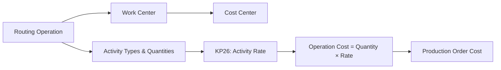
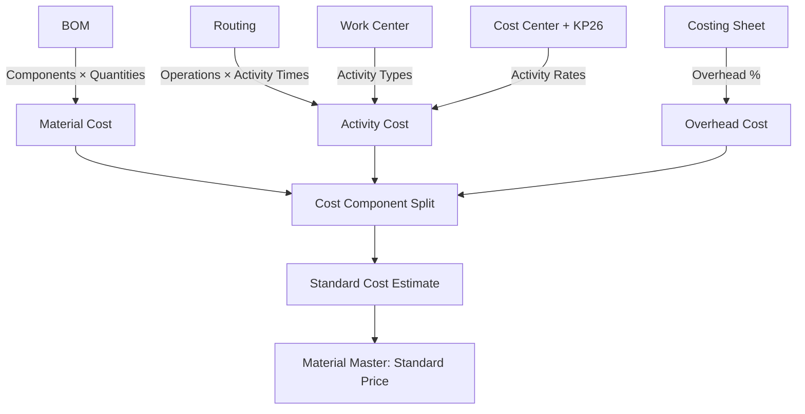
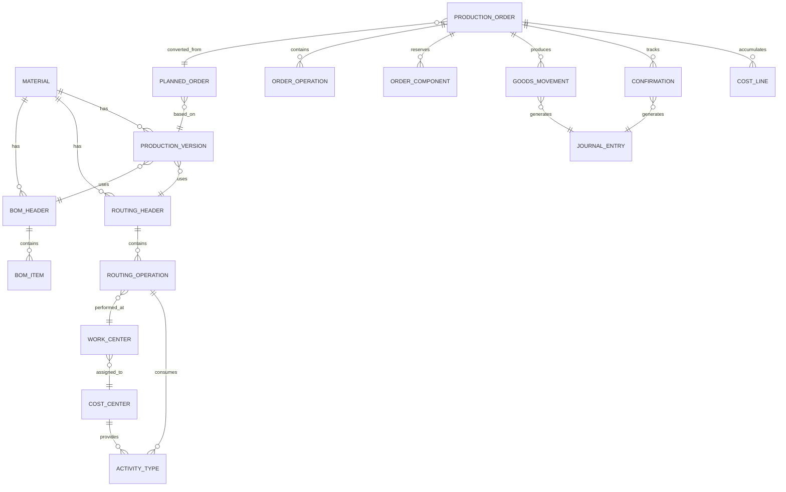
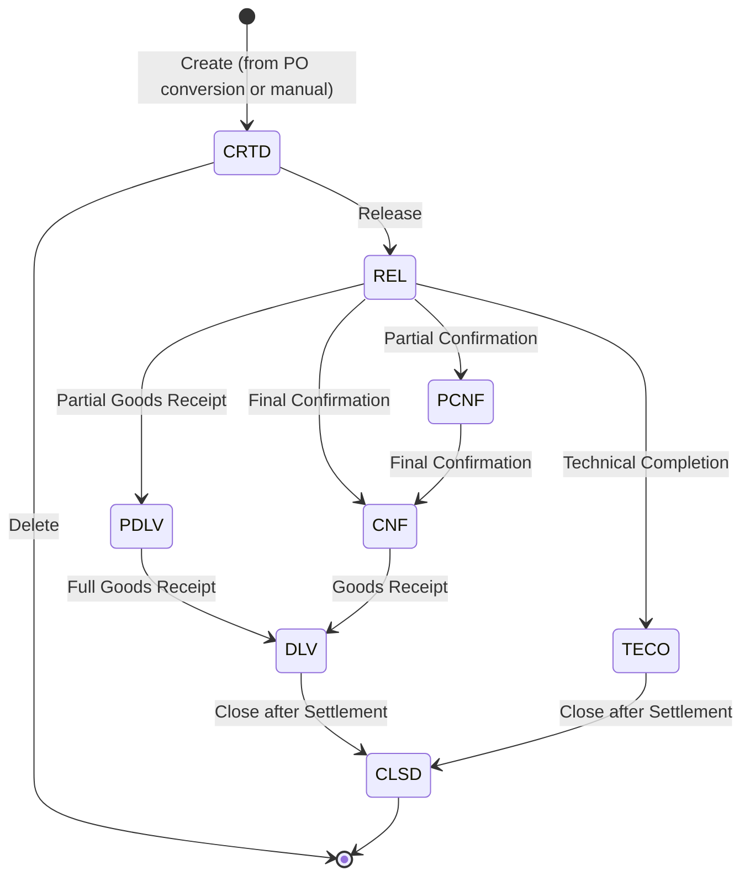

# SAP S/4HANA Manufacturing / PP
## دراسة مرجعية شاملة لإدارة الإنتاج والتصنيع داخل ERP

> **طبيعة الوثيقة:** مرجع تحليلي طويل مبني بالكامل على المصادر الرسمية لـ SAP (SAP Help Portal، SAP Learning، وSAP Community Blogs المنشورة من فِرَق SAP الرسمية). الهدف ليس ترجمة الوثائق بل تحليلها لاستخراج درس عملي قابل للتطبيق في تصميم وتطوير قسم إنتاج داخل ERP محلي مثل "ناتج". الوثيقة مكتوبة من زاوية المستشار الوظيفي وعالِم البيانات الذي سيُحوّل لاحقًا هذه المادة إلى عشرة ملفات تدريبية متخصصة.

> **تنبيه على الإصدارات:** SAP S/4HANA يأتي في إصدارين رئيسيين: **On-Premise / Private Cloud** و **Public Cloud Edition**. هناك سلوكيات مشتركة (الفلسفة، الـ Master Data، دورة الأمر، WIP/Variance/Settlement)، وهناك سلوكيات تختلف (مثل Event-Based Production Cost Posting الذي هو افتراضي في Cloud واختياري في On-Premise مع UPA). كل قسم يُشير إلى الإصدار المعني عند الحاجة.

---

## 1. مقدمة

### 1.1 ما هو SAP S/4HANA Manufacturing / PP؟

Production Planning (PP) هو الوحدة الأساسية في SAP S/4HANA المسؤولة عن **مواءمة الطلب مع الطاقة التصنيعية** (Aligning demand with manufacturing capacity). تشمل قدراته الرئيسية:
- تخطيط احتياجات المواد (MRP)
- تخطيط الطاقة (Capacity Planning)
- جدولة الإنتاج (Production Scheduling)
- تنفيذ الإنتاج (Production / Process Orders)
- التصنيع المتكرر (Repetitive Manufacturing)
- نظام السحب Kanban
- التكامل مع التكلفة (Product Cost Controlling) والمخزون (Inventory) والجودة (QM)

SAP لا تتعامل مع PP باعتباره وحدة مستقلة، بل باعتباره **مفصلاً مركزيًا** يجمع MM (المخزون والمشتريات)، SD (المبيعات)، QM (الجودة)، CO (التحكم في التكاليف)، وFI (المالية) في عملية إنتاج موحدة من البداية للنهاية.

### 1.2 موقع PP داخل SAP S/4HANA

| البُعد | التكامل |
|--------|---------|
| Material Master | يُغذّي PP بكل بيانات الصنف (MRP views، Costing views، Work Scheduling view، Accounting views) |
| MM (Inventory) | يستقبل ويرسل حركات الصرف (GI) والاستلام (GR) مع Production/Process Order |
| SD (Sales) | في Make-to-Order يربط أمر العميل بأمر الإنتاج عبر Sales Order Stock |
| CO (Controlling) | يستقبل من PP بيانات الكميات والوقت (Quantity Structure) ويُسعّرها (Activity Types، Overhead، Cost Component Split) |
| FI (Financial Accounting) | يستقبل القيود تلقائيًا عبر Universal Journal عند GI/GR/Confirmation/Settlement |
| QM | يُولِّد Inspection Lots عند Release أو GR من Production Order |
| EWM / WM | في الإصدارات الحديثة يدعم Synchronous Goods Receipt & Backflush |
| PP/DS | تخطيط تفصيلي للموارد المحدودة بناءً على Heuristics |

### 1.3 لماذا الإنتاج في SAP منظومة، لا حدثًا؟

عند فحص الوثائق الرسمية يتبيّن أن SAP يُلزم بالمرور عبر **سلسلة أحداث** قبل أن يُغلق دورة الإنتاج، وكل حلقة تستدعي ما قبلها:

هذه السلسلة تعني عمليًا أنه **لا يمكن تجاوز خطوة**: لا تنفيذ بدون أمر، لا أمر بدون Planned Order أو يدوي، لا Planned Order بدون MRP، لا MRP بدون Material Master وBOM وRouting وProduction Version. هذه هي القيمة المنهجية في SAP.

### 1.4 لماذا لا يُنسخ SAP حرفيًا في ERP محلي؟

- SAP بُني لمؤسسات ذات تعقيد عالٍ (متعدد المصانع، متعدد العملات، متعدد الـ Valuation Methods، Parallel Accounting).
- بعض المفاهيم (مثل Costing Variant، Valuation Variant، Costing Type، Cost Component Structure، Settlement Profile) تتطلب فريقًا متخصصًا للإعداد والصيانة، وقد تُربك العميل المتوسط.
- ينبغي استخدام SAP **كمرجع نضج (Maturity Reference)**: نأخذ المفهوم (مثل: فصل التخطيط عن التنفيذ، فصل WIP محاسبيًا، استخدام Production Version لربط BOM وRouting) ونُطبّقه بأبسط صورة تخدم العميل المحلي.

**روابط القسم:**
- https://learning.sap.com/products/supply-chain-management/planning-manufacturing-execution
- https://learning.sap.com/learning-journeys/exploring-production-planning-in-sap-s-4hana
- https://help.sap.com/docs/SAP_S4HANA_ON-PREMISE/21aead0c98bd4755abdacd91c99e3393/e6ee57fae5f6421b99eae394b28ef345.html

---

## 2. فلسفة SAP في إدارة الإنتاج

### 2.1 الفصل بين التخطيط والتنفيذ

في SAP، **Planned Order** (طلب مخطط) كائن تخطيطي قابل للتعديل، الحذف، إعادة الجدولة. وبمجرد **التحويل (Conversion)** يتحول إلى **Production Order** أو **Process Order** أو **Purchase Requisition/Order**، فيخرج من نطاق التخطيط ويدخل نطاق التنفيذ. نصّ SAP الرسمي: *"Planned orders can be converted into production orders, process orders, or purchase requisitions. Purchase requisitions, planned orders, and scheduling agreement scheduling lines are still planning elements that can be changed, rescheduled, or deleted at any time. After the conversion of planned orders or purchase requisitions, production orders, process orders, and purchase orders will be created and will not be changed during further planning runs."*

> **الدرس:** فصل التخطيط عن التنفيذ ليس ترفًا، بل ضمان عدم تلاعب MRP بأوامر يجري تنفيذها على أرض المصنع.

### 2.2 الفصل بين بيانات المنتج وبيانات التصنيع

- **Material Master**: يصف الصنف نفسه (الوصف، وحدة القياس، التحكم بالسعر، MRP Type، Lot Size، Strategy Group).
- **BOM**: يصف **مكوّنات** المنتج (ماذا يدخل فيه).
- **Routing**: يصف **خطوات** تصنيع المنتج (كيف يُصنع وأين وبأي موارد).
- **Production Version**: يربط **BOM محدد + Routing محدد + قطاع كميات** لتصنيع المنتج بطريقة قابلة للتدقيق.

> **الدرس:** هذا الفصل يسمح بتغيير المكوّنات دون لمس الخطوات، وتغيير الخطوات دون لمس المكوّنات، وامتلاك أكثر من طريقة لتصنيع نفس المنتج (Alternative BOMs، Alternative Routings، عدة Production Versions).

### 2.3 الفصل بين أنواع التنفيذ

SAP يُقدّم **4 نماذج تنفيذ** يختار العميل أحدها (أو يجمع بينها):

| النموذج | متى يُستخدم |
|---------|--------------|
| **Production Order** (Discrete) | إنتاج وحدات قابلة للعدّ، تحتاج تتبعًا تفصيليًا لكل أمر |
| **Process Order** (Process) | صناعة كيميائية/غذائية/دوائية بدُفعات مستمرة، تستخدم Master Recipe بدلاً من Routing |
| **Repetitive Manufacturing** | إنتاج متكرر بكميات كبيرة من منتج موحد على خط إنتاج، يَستخدم Product Cost Collector وPeriod-based Costing |
| **Kanban** | تجديد بالطلب (Pull) للمواد المنخفضة القيمة عالية التداول، بلا أمر إنتاج تقليدي |

### 2.4 الفصل بين الحدث الفيزيائي والحدث المحاسبي

كل حدث في الإنتاج يُولّد **وثيقة (Document)** في الموديول العملياتي، وبالتزامن **قيدًا في Universal Journal** (الأستاذ الموحد في S/4HANA):
- صرف المواد ← Material Document + قيد مالي + قيد مديوني في CO على أمر الإنتاج.
- التأكيد ← Confirmation Document + احتساب Activity × Rate وتحميله على الأمر.
- استلام المنتج التام ← Material Document + تخفيض WIP + زيادة Finished Goods Inventory.
- التسوية ← قيد ينقل WIP أو الانحرافات إلى الميزانية / P&L.

> **الدرس الأهم في الفلسفة:** SAP لا يفصل بين العمليات والمحاسبة بل يدمجهما في حدث واحد. هذا الدمج هو ما يجعل تكلفة الأمر دقيقة، WIP محسوبًا تلقائيًا، والانحرافات قابلة للاستخراج بضغطة زر.

**روابط القسم:**
- https://learning.sap.com/courses/exploring-production-planning-in-sap-s-4hana/understanding-mrp-in-sap-s-4hana
- https://learning.sap.com/learning-journeys/explore-fashion-functions-and-business-processes-in-sap-s-4hana-for-fashion-and-vertical-business/explaining-material-requirements-planning-mrp-_f68383c8-cf65-4afb-862a-6e15718009fd

---

## 3. أنواع التصنيع في SAP

### 3.1 Discrete Manufacturing

- إنتاج منفصل بوحدات قابلة للعدّ (سيارة، دراجة، جهاز إلكتروني).
- يَستخدم **Production Order** المرتبط بـ **BOM + Routing + Work Centers**.
- كل أمر له هويته الخاصة، يمكن تتبع تكلفته الفعلية مقابل المُخطط (Product Cost by Order).
- التنفيذ عادة لأمر واحد بكمية محددة.

### 3.2 Process Manufacturing

- إنتاج بدفعات (Batch) لمواد قابلة للقياس بالحجم/الوزن (دهانات، أدوية، طعام، كيماويات).
- يَستخدم **Process Order** مع **Master Recipe** (وليس Routing) و**Resources** (وليس Work Centers).
- Master Recipe يتكوّن من **Operations** و**Phases** و**Material List**. Phase هي وحدة العمل المفصّلة داخل Operation.
- يدعم Co-products وBy-products بطبيعته.
- يدعم Batch Management دائمًا.

### 3.3 Repetitive Manufacturing (REM)

- إنتاج متكرر بمعدلات يومية ثابتة على خط واحد (Mass Production).
- لا يَستخدم Production Order التقليدي بل **Run Schedule Quantities** و**Planned Orders**.
- التكلفة لا تُجمع لكل أمر بل لكل **فترة** على كيان يُسمى **Product Cost Collector (PCC)**.
- يَستخدم بشكل مكثف **Backflush** (صرف تلقائي عند التأكيد) و**Auto Goods Receipt**.

### 3.4 Kanban

- نظام **Pull** لتجديد المواد بناءً على استهلاكها الفعلي.
- مبني على **Control Cycle** بين Production Supply Area (PSA) وMission Supplier.
- لا يَستخدم أوامر إنتاج بمفهومها التقليدي.
- يُلائم المواد عالية التداول منخفضة القيمة.

### 3.5 Make-to-Stock / Make-to-Order / Engineer-to-Order

هذه **استراتيجيات تخطيط** (Planning Strategies) تتقاطع مع الأنواع السابقة:

| الاستراتيجية | الوصف |
|--------------|-------|
| **Make-to-Stock (MTS)** | الإنتاج بناءً على التنبؤ، البيع من المخزون. أبسط الأنماط. |
| **Make-to-Order (MTO)** — Strategy 20 | إنتاج بعد أمر بيع. كل أمر بيع له stock segment منفصل (Sales Order Stock). |
| **Planning Without Final Assembly** | Sub-assemblies تُنتَج للتخزين، التجميع النهائي بعد أمر البيع. |
| **Assemble-to-Order (ATO)** | Configurable Material مع Variant Configuration. |
| **Engineer-to-Order (ETO)** | كل أمر فريد، يحتاج تصميمًا. عادةً يُربط بـ Project System (PS) ويُدار كمشروع. |

### 3.6 جدول مقارنة بين الأنواع

| البعد | Discrete | Process | Repetitive | Kanban |
|-------|----------|---------|------------|--------|
| **كائن التنفيذ** | Production Order | Process Order | Run Schedule Quantity / PCC | Control Cycle |
| **بيانات التصنيع** | BOM + Routing | BOM + Master Recipe | BOM + Rate Routing | بدون |
| **مركز العمل** | Work Center | Resource | Production Line | Production Supply Area |
| **تكلفة على** | الأمر | الأمر | Period (PCC) | المادة |
| **WIP** | على الأمر | على الأمر | على PCC | لا يوجد عادةً |
| **Confirmation** | يدوي / مرحلي / Final | على Phase | Backflush | تغيير حالة الحاوية |
| **Variance** | تُحسب على الأمر | تُحسب على الأمر | تُحسب على PCC | لا يوجد |
| **مناسب لـ** | منتجات متنوعة بكميات متغيرة | كيماويات/غذاء/أدوية | منتج موحد بكميات كبيرة | مواد كمية مساعدة منخفضة القيمة |

**روابط القسم:**
- https://learning.sap.com/learning-journeys/configuring-sap-s-4hana-cloud-public-edition-for-manufacturing-execution/outlining-repetitive-manufacturing
- https://learning.sap.com/learning-journeys/configuring-sap-s-4hana-cloud-public-edition-for-manufacturing-execution/outlining-kanban
- https://learning.sap.com/courses/implementing-sap-s-4hana-cloud-public-edition-manufacturing/explaining-make-to-order-mto-production
- https://learning.sap.com/courses/implementing-sap-s-4hana-cloud-public-edition-manufacturing/introducing-process-orders_e99155ed-9db9-44d6-b2db-36ae4caae7cd

---

## 4. Master Data في SAP Production

### 4.1 Material Master

**Material Master** هو المركز العصبي. يُقسَّم إلى Views، كل واحد له بيانات لمجال:

| View | البيانات المهمة للإنتاج والتكلفة |
|------|------------------------------------|
| **Basic Data 1 & 2** | Description، Base UoM، Material Type، Product Hierarchy، Material Status (يمنع التداول إذا وُضع غير صالح) |
| **MRP 1** | MRP Type (PD، VB، ND...)، MRP Controller، Lot Size، Reorder Point، Minimum/Maximum/Fixed Lot Size |
| **MRP 2** | Procurement Type (E داخلي، F خارجي، X مختلط)، Production Storage Location، In-house production time، Safety Stock، Special Procurement |
| **MRP 3** | Strategy Group (10 MTS، 20 MTO، 40 Planning with final assembly...)، Consumption Mode، Period Indicator |
| **MRP 4** | BOM Selection، Production Version، Individual/Collective Requirements، Repetitive Manufacturing flag، Default Supply Area، Backflush |
| **Work Scheduling** | Production Scheduler، Production Scheduling Profile (يحدد Auto Release/Auto GR)، Underdelivery/Overdelivery Tolerance |
| **Quality Management** | Inspection Types المفعلة، Post to Inspection Stock indicator |
| **Accounting 1 & 2** | Valuation Class، Price Control (S=Standard، V=Moving Average)، Standard Price، Moving Average Price |
| **Costing 1 & 2** | Costing Lot Size، Costing Method، With Quantity Structure flag، Costing Variant، Cost Component Structure، Standard Cost (Current/Future/Previous) |

**أهميته:** أي حقل خاطئ في Material Master يُعطّل العمليات لاحقًا. مثلًا:
- MRP Type خاطئ → MRP لا يولّد Planned Orders صحيحة.
- Procurement Type خاطئ → الصنف يُشترى بدلاً من أن يُصنع.
- Valuation Class خاطئ → القيود المالية تذهب لحسابات GL خاطئة.
- Price Control = V لمنتج تام مع Standard Costing → مخالفة لمنطق Cost Object Controlling.

### 4.2 Plant

- وحدة تنظيمية تمثل مصنعًا أو موقع توزيع، تابعة لشركة (Company Code).
- معظم بيانات Material Master و BOM و Routing تُحفظ على مستوى Plant.
- يحدد التقويم، المخزون، تدفقات الإنتاج. لا يمكن إنتاج بدون Plant.

### 4.3 Storage Location

- تقسيم مادي للمخزون داخل Plant (مستودع المواد الخام، مستودع WIP، مستودع المنتج التام).
- في BOM يمكن تحديد Issue Storage Location لكل مكوّن، وفي Material Master MRP 2 يُحدد Production Storage Location.

### 4.4 Work Center

نصّ SAP الرسمي: *"A work center is a physical location at which operations are carried out."* يُخزّن:
- **Basic Data**: الوصف، Usage (009 = صالح لكل أنواع Task Lists)، Standard Value Key (يحدد أي 6 أنشطة قابلة للقياس).
- **Default Values**: قيم افتراضية تُنسخ للعمليات (Setup, Machine, Labor times).
- **Capacities**: السعة المتاحة، التقويم، أيام العمل، النوبات.
- **Scheduling**: صيغ حساب المدة (مثل SAP002 لزمن الآلة).
- **Costing (Cost Center Assignment)**: الـ Cost Center الذي يستقبل تكلفة الأنشطة + Activity Types + الصيغ الحسابية + تاريخ السريان.

**الربط الحاسم بين Work Center و Controlling:**
- *Work Center يُسنَد إلى Cost Center واحد لكل فترة*.
- في Work Center تُعرَّف حتى 6 Activity Types (مثل Setup, Machine Hours, Labor Hours).
- في **KP26** تُسعَّر Activity Types لكل Cost Center.
- في Routing تُسجَّل **الكميات/المدد** لكل Activity Type.
- النظام يضرب (الكمية × السعر) ليُولّد التكلفة في Cost Object.

### 4.5 BOM (Bill of Material)

يُغطَّى في القسم 5 بتفصيل.

### 4.6 Routing

يُغطَّى في القسم 6 بتفصيل.

### 4.7 Production Version

يُغطَّى في القسم 7 بتفصيل.

### 4.8 Master Recipe (لـ Process Manufacturing)

- بديل Routing في الصناعات العمليّاتية.
- يحتوي **Operations** يَنفّذها Resource واحد، وكل Operation تحتوي **Phases** تفصيلية.
- *"A phase is a self-contained work step that describes one part of the production process in detail."*
- في كل Operation تُعرَّف **Material List** (المواد المطلوبة)، مرتبطة بـ BOM عبر Production Version.

### 4.9 Resource (في Process Manufacturing)

- المكافئ في الصناعات العمليّاتية للـ Work Center.
- يَدعم Primary Resource (الأساسي للعملية) و Secondary Resources (المساعدة).
- مربوط بـ Cost Center و Activity Types.

### 4.10 Cost Center

- وحدة جمع للتكاليف غير المباشرة (طاقة، صيانة، إدارة...).
- يستقبل التكاليف ويُحوّلها للمنتج عبر Activity Allocation أو Overhead Costing Sheet.

### 4.11 Activity Type

- *"The activity type classifies the activities that one or several cost centers perform within a company."*
- مثل: ساعات الآلة، ساعات العمالة، ساعات الـ Setup.
- يُسعَّر في KP26 لكل ثنائية (Cost Center × Activity Type).
- يَستخدم Secondary Cost Element عند التحويل الداخلي.

### 4.12 Production Supply Area (PSA)

- منطقة على الأرض في المصنع تُغذَّى بالمواد من المستودع المركزي.
- ضرورية لـ Kanban وللتنبيه عند نفاد المخزون.
- شخص مسؤول يُسنَد للـ PSA يَتولى مراقبتها.

### 4.13 Batch

- *"A batch is defined as a subset of the total quantity of a material held in stock."*
- يُدير الكمية الفرعية المتجانسة الخصائص.
- ضروري في الصناعات المنظمة (دوائية، غذائية، كيماوية).
- يُتيح **Where-Used List** للتتبع من المواد للمنتج (Batch Genealogy).

### 4.14 Serial Number

- لكل وحدة مادية، يَستخدم في المعدات الثقيلة، الإلكترونيات، السيارات.
- يَدعم Serial-tracked Production Orders (تتبع كل وحدة منتجة).

### 4.15 ملخص جدول لمخاطر تعريف Master Data خطأ

| الكيان | الخطأ الشائع | الأثر |
|--------|--------------|-------|
| Material Master | MRP Type أو Strategy Group خاطئ | MRP يُولّد توصيات خاطئة |
| Material Master | Valuation Class خاطئ | الحسابات تذهب لـ GL خاطئة |
| Material Master | Price Control غير مناسب | تقييم المخزون يخالف منهج CO |
| BOM | كميات خاطئة أو Validity Date غير منطقي | صرف خاطئ، تكلفة خاطئة |
| Routing | Activity Type غير معرَّف في Cost Center | فشل تكلفة الأمر |
| Work Center | Cost Center غير مرتبط | تكلفة الأنشطة لا تُحمَّل |
| Production Version | غير معرَّفة أو منتهية | فشل MRP، فشل إنشاء الأمر |
| Cost Center | Activity Rate غير مُحدَّث في KP26 | تكلفة الأمر بصفر |

**روابط القسم:**
- https://learning.sap.com/courses/exploring-basic-data-for-manufacturing-and-product-management-in-sap-s-4hana/creating-work-centers
- https://learning.sap.com/courses/product-cost-planning-in-sap-s-4hana/integrating-material-master-records-and-product-cost-planning
- https://learning.sap.com/learning-journeys/exploring-business-processes-in-sap-s4-hana-process-shopfloor-control/analyzing-master-data-for-process-manufacturing_b61c23a8-2f74-423b-9448-7f0c2b861d48
- https://help.sap.com/docs/SAP_S4HANA_ON-PREMISE/5e23dc8fe9be4fd496f8ab556667ea05/61c8d8530439414de10000000a174cb4.html
- https://help.sap.com/docs/SAP_S4HANA_CLOUD/4032610758dc437089f0c28320eec93f/c8072e27231d435c8b3ae01e000f1441.html

---

## 5. BOM في SAP

### 5.1 ما هو BOM

نصّ SAP: *"A bill of material (BOM) is a complete, formally structured list of the components that make up a product or assembly. The list contains a description and object number for each component, together with the quantity and unit of measure. The BOM contains essential basic data, or master data, for integrated materials management and shop floor control."*

### 5.2 بنية BOM: Header & Items

**BOM Header** يحتوي بيانات تنطبق على كل البطاقة:
- **Base Quantity**: الكمية الأساس التي تُنسَب لها كميات المكوّنات (مثلاً 1000 وحدة).
- **BOM Status**: تحت التطوير، Released، غير صالح.
- **BOM Usage**: لأي مجال صالح (1=Production، 5=Sales، 6=Costing فقط، 7=Universal...).
- **Plant**: عند تعريف BOM خاصة بمصنع أو Group BOM بدون مصنع.
- **Validity Period**: تاريخ السريان للـ Header (Valid From، Valid To).
- **Alternative BOM Number**: رقم تسلسلي للبدائل.

**BOM Items** تحتوي بيانات لكل مكوّن:
- **Item Number**: التسلسل (0010، 0020...).
- **Component Material**: رقم الصنف المكوّن.
- **Quantity**: الكمية لكل Base Quantity.
- **UoM**: وحدة قياس المكون.
- **Item Category**: L (Stock)، N (Non-stock)، D (Document)، T (Text)، K (Class)، R (Variable)، I (Inspection)...
- **Issue Storage Location**: من أين يُصرَف.
- **Backflush indicator**: هل يُصرَف تلقائيًا مع التأكيد؟
- **Component Scrap %**: نسبة فاقد في المكون (تَزيد الكمية المطلوبة).
- **Operation Assignment**: عند أي عملية يُستخدَم (في Routing).
- **Validity Period** للـ Item.

### 5.3 Multi-Level BOM

- BOM في SAP أحادية المستوى (Single-level) تلقائيًا.
- إذا كان أحد المكوّنات بدوره مادة نصف مصنّعة لها BOM، فالنظام يقوم بـ **BOM Explosion** (تفكيك متعدد المستويات).
- مفيد لتحليل التكلفة (Costed Multilevel BOM) ولـ MRP الذي يستكشف كل المستويات.

### 5.4 Alternative BOMs

نصّ SAP: *"There may be several alternative BOMs for a product, which are used for different manufacturing processes, lot sizes, or validity areas."*
- تُستخدم لتمثيل: طرق إنتاج بديلة، مواد بديلة، تغييرات هندسية مع validity.
- يُحدَّد أيها يُستخدَم عبر **Production Version**.
- يمكن تَحديد BOM Selection Method في MRP 4 view (1 = حسب Lot Size، 2 = حسب Explosion Date، 3 = حسب Production Version...).

### 5.5 Validity Dates و Change Master

- كل BOM Header و Item له Valid From وValid To (الافتراضي 31.12.9999).
- التغيير عبر **Change Master Record** يَحفظ Audit Trail كاملاً ويُتيح تغييرات مستقبلية بتاريخ سريان محدد.
- *Change Master* قد يضبط هل التغيير يُفعَّل لـ Costing فقط أم Production فقط أم كليهما (Release Key).

### 5.6 Component Quantities و Scrap

- **Component Quantity** نسبية إلى Base Quantity (مثلاً: 5 كغ لكل 100 وحدة منتج).
- **Component Scrap %**: عند 10%، النظام يحسب الكمية المطلوبة 1.1 ضعف النظرية.
- **Assembly Scrap %** (في Material Master): فاقد على مستوى الصنف الأم.
- **Operation Scrap** (في Routing): فاقد في عملية معيّنة.

### 5.7 Phantom Items

- مكوّن من نوع Item Category L مع Special Procurement = 50 (Phantom).
- عند Explosion، النظام يُفجِّر مكوّنات الـ Phantom بدلًا من المُجمَّع، ولا يُنشئ أمر إنتاج للـ Phantom.
- مفيد لتمثيل **Sub-Assemblies منطقية فقط** بدون تخزين فعلي.

### 5.8 Co-Products و By-Products

نصّ SAP: *"When manufacturing co-products, you can create a BOM for a process material or for the co-product that in general initiates production. You assign all other co-products to the BOM as BOM items with negative quantities and set the Co-product indicator for them."*
- **Co-product**: منتج رئيسي يَتولّد من نفس الـ Process مع المنتج الأصلي. يُدار بكمية سالبة في BOM ومؤشر Co-product مفعَّل.
- **By-product**: منتج جانبي بقيمة منخفضة، يُمَثَّل بكمية سالبة بدون مؤشر Co-product.
- يَستلزم تَوزيع التكلفة (Apportionment Structure) في Material Master للـ Co-products.

### 5.9 علاقة BOM بـ MRP

- MRP يستخدم Active BOM ليُفجِّر متطلبات المكوّنات من Planned Order للمنتج الأم.
- BOM المختار يَعتمد على **BOM Selection Method** في Material Master و على **Production Version**.

### 5.10 علاقة BOM بـ Product Costing

- في Standard Cost Estimate، Cost Rollup يَعتمد على BOM لاستكشاف هيكل المكوّنات وتسعير كل مستوى.
- إذا كانت BOM خاطئة، **Standard Cost كله خاطئ**، وهذا يَتسرّب لـ:
  - تقييم المخزون.
  - تكلفة المبيعات.
  - WIP Calculation.
  - Variance Calculation.

### 5.11 أسئلة تحليل العميل لـ BOM

- هل مكوّنات منتجاتكم ثابتة أم متغيرة بحسب الدفعة؟
- هل يوجد مواد بديلة (Substitutes)؟ كيف يتم اختيار البديل؟
- هل توجد Sub-Assemblies تحتاج BOM منفصلة؟
- هل توجد مكوّنات Phantom (مَجموعات منطقية فقط)؟
- هل توجد Co-products أو By-products؟
- هل نسبة الفاقد على المكوّنات (Component Scrap) قابلة للتقدير؟
- هل تحتاجون Validity Dates للتغييرات الهندسية؟
- هل تحتاجون Audit Trail (Change Master)؟
- هل تحتاجون أكثر من BOM لنفس المنتج (Alternatives)؟
- هل المكوّنات تحت Batch Management؟

**روابط القسم:**
- https://learning.sap.com/learning-journeys/exploring-basic-data-for-manufacturing-and-product-management-in-sap-s-4hana/managing-boms
- https://learning.sap.com/learning-journeys/applying-sap-s-4hana-product-engineering/working-with-material-boms-in-the-design-phase

---

## 6. Routing / Work Centers / Operations

### 6.1 ما هو Routing

Routing هو **خطوات تصنيع المنتج**، تتكون من:
- **Header**: المنتج، Plant، Validity Period، Group/Counter، Usage.
- **Operations**: قائمة الخطوات الإنتاجية بتسلسل.
- **Component Allocation**: ربط مكوّنات BOM بالعمليات المعنية.

### 6.2 Operation

كل Operation تحتوي:
- **Operation Number** (0010، 0020...).
- **Work Center**: المركز المسؤول.
- **Control Key**: يحدد سلوك العملية (هل تُسعَّر؟ هل تتطلب Confirmation؟ هل تُجدوَل؟ هل خارجية؟).
- **Standard Values**: حتى 6 قيم (Setup، Machine، Labor، Steam، Electricity...) — تأخذ معناها من Standard Value Key في Work Center.
- **Activity Types**: تُتَوارث من Work Center أو تُحدَّد يدويًا.
- **Base Quantity** للعملية، **Operation Quantity**.
- **Setup Time**: زمن التهيئة (مستقل عن الكمية).
- **Machine Time / Labor Time / Processing Time**: زمن التشغيل (يَتناسب مع الكمية).
- **Queue/Wait/Move Time** (Interoperation Times): زمن الانتظار قبل العملية، الانتظار بعدها، الانتقال إلى العملية التالية.
- **Operation Scrap %** (اختياري).
- **Component Assignment**: المكوّنات المستخدمة في العملية.

### 6.3 الربط بين Routing و Work Center و Cost Center

نصّ SAP: *"To calculate production costs, the routing is used to determine work centers, which are assigned to one specific cost center. For each operation, the routing must specify where the work is to be performed (work center), what production activities will be performed, and the duration of those activities."*

### 6.4 Standard Values وصيغ الحساب

- في Work Center تُعرَّف صيغة لكل Activity Type (مثل SAP002 = (Operation Quantity × Machine Time) / Base Quantity).
- النظام يُطبّق الصيغة على البيانات في Routing لاستخراج الكميات الفعلية، ثم يضربها في Activity Rate.

### 6.5 Setup / Machine / Labor Time

- **Setup Time**: قبل بدء الإنتاج (تهيئة الآلة، تحميل أداة، إعداد القالب). مستقل عن الكمية.
- **Machine Time**: زمن تشغيل الآلة، نسبي للكمية.
- **Labor Time**: زمن العامل، قد يَختلف عن Machine Time (مثلاً عامل واحد يُشغّل آلتين).

### 6.6 Queue / Wait / Move Times

- **Queue Time**: انتظار العملية أن تبدأ.
- **Wait Time**: انتظار بعد إكمال العملية.
- **Move Time**: نقل المنتج إلى Work Center التالي.
- تُستخدم لجدولة دقيقة، لكنها غالبًا لا تُسعَّر (إلا إذا فُعِّل في Control Key).

### 6.7 العلاقة بين Routing والجدولة

- النظام يَستخدم Operation Times + Work Center Capacity + Calendar ليَحسب Earliest/Latest Start/End Dates لكل عملية.
- Lead Time Scheduling يَخرج بـ Earliest/Latest Start Date للأمر كله.

### 6.8 العلاقة بين Routing والتكلفة

- في **Standard Cost Estimate**: النظام يَقرأ كل Operation، يَستخرج Activity Quantities، يَضربها في Activity Rate، يُجمّعها كـ Production Cost في Cost Component Split.
- في **Production Order Actual Cost**: النظام يَستقبل Confirmation فيه Time/Quantity الفعلية ويَضربها في Rate (نفس الـ Rate المُخطَّط أو Actual حسب الإعداد) ليُحَمَّل على الأمر.

### 6.9 Routing vs Master Recipe

| البُعد | Routing (Discrete) | Master Recipe (Process) |
|--------|--------------------|--------------------------|
| الكائن الأساسي | Operation | Operation + Phases |
| المكوّن التنفيذي | Work Center | Resource (Primary/Secondary) |
| تسجيل الأنشطة | على Operation | على Phase |
| العلاقات بين الخطوات | تسلسل خطي/متشعب | Phase Relationships (شبكة) |
| Interoperation Times | مدعومة | غير مدعومة (Buffer Times بدلاً) |
| Component Allocation | على Operation | على Phase |

**روابط القسم:**
- https://learning.sap.com/learning-journeys/introducing-product-cost-planning-and-production-accounting-in-sap-s-hana/comprehending-work-centers-and-cost-structures
- https://learning.sap.com/courses/product-cost-planning-in-sap-s-4hana/defining-the-quantity-structure
- https://learning.sap.com/courses/exploring-basic-data-for-manufacturing-and-product-management-in-sap-s-4hana/creating-work-centers

---

## 7. Production Version

### 7.1 ما هو Production Version؟

نصّ SAP: *"Production versions are mandatory. They define a unique combination of routing, BOM, and lot size. A production version determines which alternative BOM is used together with which task list/master recipe to produce a material or create a master production schedule."*

ببساطة: Production Version = **عقد تصنيع محدد** يحتوي:
- BOM Alternative محدد.
- Routing / Master Recipe / Rate Routing محدد.
- Lot Size Range (من إلى).
- Validity Period (Valid From / Valid To).
- Production Line (في Repetitive Manufacturing).

### 7.2 لماذا يربط BOM و Routing؟

في الواقع التصنيعي، قد تكون لديك:
- 3 طرق لتركيب نفس المنتج (3 BOMs).
- 2 خطين إنتاج بإجراءات مختلفة (2 Routings).

= 6 احتمالات. بدون Production Version، MRP لا يَعرف أيها يَختار. الـ Production Version يَحسم: "للكمية 0-500 على خط الإنتاج A، نَستخدم BOM 01 مع Routing 1؛ وللكمية 500-5000 على خط B، BOM 02 مع Routing 2".

### 7.3 متى يُستخدم Production Version؟

- في كل أمر إنتاج/إنتاج عملياتي.
- في Repetitive Manufacturing (إلزامي).
- في Cost Estimate (لتحديد أي BOM و Routing يُكلَّفان).
- في MRP (BOM Explosion).

### 7.4 لماذا هو **إلزامي** في SAP S/4HANA؟

نصّ SAP: في S/4HANA، Production Versions أصبحت إلزامية لـ MRP وإنشاء الأمر. هذا تَطبيق منهجي لمبدأ **عدم السماح بأي غموض** في طريقة الإنتاج. كل أمر يجب أن يَستند إلى Production Version محددة قابلة للتدقيق.

### 7.5 أين تُحفَظ؟

- في Material Master، MRP 4 view و Costing 1 view.
- يمكن إنشاؤها من شاشة C223 أو من Fiori.

### 7.6 ماذا يحدث إذا غاب هذا المفهوم في ERP محلي؟

- يَفقد النظام القدرة على تتبع: **أي بطاقة مكوّنات استُخدمت لإنتاج هذا الأمر بالضبط؟**
- يَفقد القدرة على ضبط: متى يَستخدم النظام BOM بديلة أو خط إنتاج بديل.
- يَفقد القابلية للـ Audit في الصناعات المنظمة (دوائية، غذائية، عسكرية).
- يَفقد إمكانية حساب Cost Estimate دقيقة عند وجود بدائل.

> **الدرس الجوهري:** Production Version هو **العقد** بين Engineering وProduction وCosting. غيابه يَعني أن العميل يَتنازل عن واحدة من أعظم سيطرات SAP الصامتة.

**روابط القسم:**
- https://learning.sap.com/learning-journeys/introducing-product-cost-planning-and-production-accounting-in-sap-s-hana/comprehending-work-centers-and-cost-structures
- https://learning.sap.com/courses/product-cost-planning-in-sap-s-4hana/defining-the-quantity-structure

---

## 8. MRP و Planned Orders

### 8.1 ما هو MRP؟

**Material Requirements Planning**: عملية حسابية تَقرأ:
- **الطلب**: Sales Orders، Planned Independent Requirements (PIR)، Reservations، Dependent Requirements من BOM Explosion، Forecasts.
- **العرض**: المخزون الحالي، Open Purchase Orders، Open Planned Orders، Open Production Orders، Stock Transfers.

ثم يَقرّر:
- هل توجد نقص؟
- ماذا يَلزم لتغطيته (شراء، إنتاج، نقل)؟
- متى؟

### 8.2 MRP Types

في Material Master MRP 1 view، تُحدَّد **MRP Type**:
- **PD** (Deterministic MRP): الافتراضي للأصناف عالية القيمة (A parts).
- **VB** (Reorder Point): تجديد عند الوصول لحد أدنى. للأصناف منخفضة القيمة.
- **VV** (Forecast-based): مبني على التنبؤ.
- **ND** (No Planning): الصنف لا يُخطَّط.
- **R1، R2...** (Time-phased): مبني على تواريخ ثابتة.

### 8.3 MRP Live vs Classic MRP

في S/4HANA، **MRP Live** هو المعيار:
- يَعمل مباشرة على HANA Database.
- أداء سريع جدًا.
- لا يَحتاج تجميع بيانات وسيطة.
- يُولّد Planned Orders للإنتاج الداخلي، و Purchase Requisitions / Schedule Lines للخارجي.

### 8.4 Planned Order

نصّ SAP: *"A planned order is merely a planning object that is deleted from the database after the conversion or the backflush, so there is no archiving object for planned orders."*

- كائن مؤقت يَحمل: Material، MRP Area، Quantity، Basic Start Date، Basic End Date، Production Version (لـ BOM Explosion).
- قابل للتعديل، الحذف، إعادة الجدولة في أي وقت قبل التحويل.
- يَحمل **Firming Indicator**: إذا فُعِّل، MRP لا يَعدّله/يَحذفه في الجولات اللاحقة.

### 8.5 Stock/Requirements List (MD04)

- الأداة التفاعلية الرئيسية للـ MRP Controller.
- تَعرض: مخزون حالي، طلبات/أوامر مفتوحة، فجوات الكمية والتاريخ.
- ديناميكية: تتحدّث فور تغيّر بيانات.

### 8.6 تحويل Planned Order

عند الموافقة على Planned Order، يُحوَّل إلى:
- **Production Order** (CO40 لفرد، CO41 لمجموعة).
- **Process Order**.
- **Purchase Requisition** (للأصناف المشتراة في Classic MRP).
- **Run Schedule Quantity** (في Repetitive Manufacturing).

نصّ SAP الحاسم: *"Purchase requisitions, planned orders, and scheduling agreement scheduling lines are still planning elements that can be changed, rescheduled, or deleted at any time. After the conversion of planned orders or purchase requisitions, production orders, process orders, and purchase orders will be created and will not be changed during further planning runs."*

### 8.7 الفرق بين التخطيط والتنفيذ

| البُعد | التخطيط | التنفيذ |
|--------|---------|---------|
| الكائن | Planned Order | Production Order |
| القابلية للتعديل | عالية | محدودة (بعد الـ Release) |
| تَعديل من MRP | نعم | لا |
| تَسجيل التكلفة | تقديري | فعلي يَتجمّع |
| الحجز الفعلي | تقديري | يُولّد Reservations في Inventory |

### 8.8 أثر MRP على المشتريات والإنتاج والمخزون

- **المشتريات**: تَصدر Purchase Requisitions يَحوّلها الشراء إلى PO.
- **الإنتاج**: تَصدر Planned Orders تتحول إلى Production/Process Orders.
- **المخزون**: تَضمن مستوى الأمان (Safety Stock) ولا تَسمح بنفاد المخزون قبل وصول العرض.

### 8.9 سيناريوهات تخطيط شائعة

- **Strategy 10 (Net Requirements Planning)**: للـ MTS الكلاسيكي. الـ PIR تَستهلكها أوامر البيع.
- **Strategy 20 (MTO)**: كل أمر بيع يُنتج له stock segment منفصل، MRP يُولّد Planned Order مستقلًا لكل أمر.
- **Strategy 40 (Planning with Final Assembly)**: التخطيط على المنتج النهائي، لكن أوامر البيع يمكن أن تَستبدل PIR.
- **Strategy 50 (Planning Without Final Assembly)**: Sub-assemblies تُنتَج للتنبؤ، التجميع النهائي بعد أمر البيع.

**روابط القسم:**
- https://learning.sap.com/courses/exploring-production-planning-in-sap-s-4hana/understanding-mrp-in-sap-s-4hana
- https://learning.sap.com/courses/exploring-business-processes-in-sap-s-4hana-production-planning/outlining-material-requirements-planning-with-mrp-live
- https://learning.sap.com/courses/business-processes-in-sap-s-4hana-sourcing-procurement/running-materials-requirements-planning
- https://learning.sap.com/learning-journeys/implement-sap-s-4hana-cloud-public-edition-for-manufacturing/evaluating-the-results-of-material-requirement-planning_a895329a-f218-4b96-bb4e-63d5576e3b52

---

## 9. Production Order Lifecycle

### 9.1 ما هو Production Order؟

من وثيقة SAP الرسمية: *"A production order contains information on the quantity of production, dates, BOM, routing, and sectional information."* أي أنه **النسخة التنفيذية** من Planned Order، يَحمل كل ما يَلزم لتشغيل الإنتاج، ويَجمع التكلفة الفعلية ضد التكلفة المُخطَّطة.

### 9.2 الحالات النظامية (System Statuses)

نصّ SAP: *"System statuses are predefined by SAP and cannot be changed. However, SAP's system status concept can be supplemented by user statuses to record additional information in the order or fine-tune whether a business process can be executed."*

| الحالة | الرمز | الوصف |
|--------|-------|-------|
| **CRTD** | Created | الأمر مُنشأ، قابل للتعديل، لا تَنفيذ ممكن |
| **REL** | Released | جاهز للتنفيذ، Goods Issue/Confirmation/GR ممكنة |
| **PCNF** | Partially Confirmed | تأكيد جزئي (بعض الكميات نَفذت) |
| **CNF** | Confirmed | تأكيد نهائي |
| **PDLV** | Partially Delivered | استلام جزئي |
| **DLV** | Delivered | استلام نهائي للكمية |
| **TECO** | Technically Completed | إغلاق فني، يَحرر الحجوزات ويَلغي الكميات المتبقية |
| **CLSD** | Closed | إغلاق نهائي، لا تَعديلات، لا تَسوية لاحقة |

ملاحظة: قبل REL لا يَسمح النظام بالطباعة، Goods Issue، Confirmation، أو Goods Receipt.

### 9.3 المراحل التفصيلية

#### 9.3.1 Create Production Order
- يُنشأ من:
  - تحويل Planned Order.
  - يدويًا (CO01).
  - من أمر بيع (مباشرة في MTO).
- يَنسخ النظام BOM و Routing بناءً على Production Version.
- تُحفَظ بيانات مستقلة عن BOM/Routing الأصليتين (Snapshot)، فلا يَتأثر الأمر بتغييرات لاحقة.

نصّ SAP الحاسم: *"The system transfers BOM and Routing when the manufacturing order is created."* — هذه الـ Snapshot هي ما يَجعل الأمر مُستقلًا.

#### 9.3.2 Release (REL)
- يَتحول الأمر من حالة Planning إلى حالة Execution.
- يُتيح الـ Inspection Lot الإلزامي (إذا فُعّل Inspection Type 03 في QM view).
- يُجدول الأمر بدقة (Lead Time Scheduling).
- يُولّد Reservations في Inventory للمكوّنات.
- يُتيح Print Shop Papers (أوراق الورشة).

#### 9.3.3 Material Staging / Reservation
- المواد تُجَهَّز للأمر:
  - عبر Pull List (نقل من المستودع المركزي للمستودع الإنتاجي).
  - عبر Kanban.
  - عبر EWM (في الإصدارات الحديثة).
- الـ Reservations تَضمن عدم استخدام نفس المخزون لأمر آخر.

#### 9.3.4 Goods Issue (GI)
- صرف المواد للأمر بـ **Movement Type 261** (الافتراضي).
- إما يدويًا (MIGO أو Pick List) أو تلقائيًا عبر **Backflush**.
- يُخفّض المخزون ويَزيد قيمة WIP.

#### 9.3.5 Confirmation
- تَسجيل ما حدث في الورشة: الوقت، الكمية، الهالك، السبب.
- على مستوى:
  - **Operation Confirmation** (CO11N): لكل عملية.
  - **Order Header Confirmation** (CO15): للأمر ككل.
  - **Time Ticket**: نوع مبسط.
  - **Milestone Confirmation**: تأكيد عند نقطة معيّنة يَفترض إكمال كل ما قبلها.
  - **Progress Confirmation**: تأكيد نسبي.
- قد تُفعِّل Backflush تلقائيًا (Goods Issue للمكوّنات) و Auto Goods Receipt للمنتج النهائي.

#### 9.3.6 Goods Receipt (GR)
- استلام المنتج التام بـ **Movement Type 101**.
- يُخفّض WIP ويَزيد قيمة Finished Goods Inventory.
- يُولّد Inspection Lot من نوع 04 (إذا فُعِّل في QM view).
- في حالة Auto GR، يَتم تلقائيًا مع آخر تأكيد.

#### 9.3.7 Technical Completion (TECO)
- يَنهي الأمر فنيًا قبل اكتمال الكميات.
- يُلغي Reservations المتبقية ويُلغي الحاجة للمواد المتبقية.
- يُتيح Settlement.
- لا يَستوعب حركات إضافية.

#### 9.3.8 Close (CLSD)
- إغلاق محاسبي نهائي.
- لا يَسمح بأي حركة لاحقة.
- لا يَسمح بـ Re-settlement.

#### 9.3.9 Settlement
يُغطَّى في القسم 22 بالتفصيل.

### 9.4 جدول الأدوار والمسؤوليات

| المرحلة | المسؤول | الأدوار في SAP |
|---------|---------|----------------|
| Create / Convert | Production Planner / MRP Controller | تخطيط |
| Release | Production Supervisor | تشغيل |
| Material Staging | Warehouse / Logistics | لوجستيات |
| GI / Pick List | Warehouse Clerk | لوجستيات |
| Confirmation | Production Operator / Supervisor | تشغيل |
| GR | Warehouse Clerk / Auto | لوجستيات |
| Quality Inspection | Quality Engineer / Technician | الجودة |
| TECO | Production Supervisor | تشغيل |
| Settlement | Cost Accountant | Controlling |
| Close | Cost Accountant | Controlling |

### 9.5 الأثر المخزني والتكلفي لكل مرحلة

| المرحلة | الأثر المخزني | الأثر التكلفي |
|---------|----------------|----------------|
| Create | حجز افتراضي للمكوّنات | تَوقُّع تكلفة (Planned Cost) |
| Release | حجز Reservations | تَجَدّد Planned Cost |
| GI | تَخفيض المواد، زيادة WIP | تَحميل المواد على الأمر |
| Confirmation | لا أثر مباشر، لكن مع Backflush يَتم GI، ومع Auto GR يَتم GR | تَحميل Activity × Rate |
| GR | تَخفيض WIP، زيادة Finished Goods | اعتمدت Standard Cost؛ النظام يَخصم من الأمر بقيمة Standard × Quantity |
| TECO | تَحرير Reservations | يُتيح حساب Variance |
| Settlement | لا أثر مباشر | نقل WIP/Variance لـ FI/COPA |

### 9.6 المخاطر الشائعة في كل مرحلة

| المرحلة | المخاطر |
|---------|---------|
| Create | Production Version خاطئة → BOM/Routing خاطئ |
| Release | عدم توفر المواد → فشل الإنتاج |
| GI | Backflush فعال على مواد لا تَكفي → COGI Errors |
| Confirmation | Confirmation خاطئ يُحَمّل تكلفة خاطئة، يَصعب إلغاؤه |
| GR | Auto GR قبل اكتمال الجودة → استلام منتج غير سليم |
| TECO | TECO قبل الإغلاق المحاسبي يُلغي بيانات قد تَلزم |
| Settlement | إغفال Settlement → WIP يَبقى على الأمر بدون انعكاس مالي |

**روابط القسم:**
- https://help.sap.com/docs/SAP_S4HANA_ON-PREMISE/7b24a64d9d0941bda1afa753263d9e39/ecf66b54166b033de10000000a441470.html
- https://help.sap.com/docs/SAP_S4HANA_ON-PREMISE/5e23dc8fe9be4fd496f8ab556667ea05/b4c9d8530439414de10000000a174cb4.html
- https://learning.sap.com/learning-journeys/configuring-sap-s-4hana-cloud-public-edition-for-manufacturing-execution/configuring-status-profiles-for-production-orders
- https://learning.sap.com/courses/implementing-sap-s-4hana-cloud-public-edition-manufacturing/executing-production-orders_eebd35c8-b7ed-4f36-bd4a-fb527dfa1322

---

## 10. Process Orders

### 10.1 الفرق الأساسي عن Production Order

| البُعد | Production Order | Process Order |
|--------|------------------|---------------|
| الصناعة | منفصلة Discrete | عملياتية Process |
| بيانات التصنيع | Routing | Master Recipe |
| المركز التشغيلي | Work Center | Resource |
| وحدة التنفيذ | Operation | Operation + Phases |
| Material List | Component Allocation على Operation | Material List على Phase |
| المنتج | منتجات متعددة | غالبًا منتج رئيسي + Co/By-products |
| Batch | اختياري | شبه إلزامي |
| Recipe Management | لا | نعم (PI Sheets، Process Instructions) |

### 10.2 Master Recipe

نصّ SAP: *"The master recipe contains operations and phases. Operations consolidate several phases and are each executed on a primary resource. A phase is a self-contained work step that describes one part of the production process in detail. It uses the primary resource of the overall operation."*

**هيكل Master Recipe:**
- **Header**: المنتج، Plant، Validity.
- **Operations**: المراحل الكبرى. كل Operation على Primary Resource.
- **Phases**: التفصيل داخل Operation. كل Phase تَستخدم نفس Primary Resource + ربما Secondary Resources.
- **Relationships**: شبكة العلاقات بين الـ Phases (start-to-start، finish-to-start، إلخ).
- **Material List**: المكوّنات المربوطة بـ Phase معينة.

### 10.3 Phases

- **Phase** هي وحدة العمل الفعلية.
- التأكيد (Confirmation) يَتم على **Phase** لا على Operation.
- Standard Values (Setup, Charge, Heat, Hold...) تُعرَّف على Phase.

### 10.4 Resources

- المكافئ للـ Work Center في Process Industry.
- **Primary Resource**: المُلزم لكل Operation.
- **Secondary Resources**: مساعدة (مثل: عامل، تبريد، خزان مساعد).
- مربوطة بـ Cost Center و Activity Types.

### 10.5 Batch Management

- Process Manufacturing يُلائم Batch Management بطبيعته.
- كل Process Order تُنتج Batch ذات خصائص متجانسة (تركيب كيميائي، PH، اللون...).
- يَدعم **Batch Determination**: اختيار Batch المناسبة من المخزون بناءً على معايير (FIFO، Best Before...).
- **Batch Where-Used List**: التتبع من المواد للمنتج.

### 10.6 Co-Products / By-Products

- في Process، الـ Apportionment Structure في Material Master يُحدد كيف تُوزَّع تكلفة الـ Process على Co-products.
- By-product بقيمة منخفضة يُخفّض تكلفة المنتج الأساسي.

### 10.7 Quality Integration

- Process Order يَدعم Inspection Lots من نوع 03 (في الإنتاج) ونوع 04 (عند GR).
- شائع جدًا في الأدوية والأغذية.

### 10.8 Process Instructions و PI Sheets

- **Process Instructions**: تَعليمات تَنفيذية مفصّلة تُربط بكل Phase.
- **PI Sheet** (Process Instruction Sheet): شاشة تَنفيذية للعامل تُجمع البيانات من الورشة (يدوي أو تَلقائي عبر MII/MES).
- **Control Recipe**: المخرَج المُرسَل من Process Order إلى نظام التحكم (DCS) في المصنع.

### 10.9 الأثر على التكلفة والمخزون

- نفس فلسفة Production Order: GI → WIP، Confirmation → Activity Cost، GR → خصم WIP وزيادة المخزون.
- إضافة Co/By-products يُعقّد الأمر: لكل منتج Cost Object منفصل وفق نسب الـ Apportionment.

**روابط القسم:**
- https://learning.sap.com/courses/implementing-sap-s-4hana-cloud-public-edition-manufacturing/introducing-process-orders_e99155ed-9db9-44d6-b2db-36ae4caae7cd
- https://learning.sap.com/learning-journeys/exploring-business-processes-in-sap-s4-hana-process-shopfloor-control/analyzing-master-data-for-process-manufacturing_b61c23a8-2f74-423b-9448-7f0c2b861d48
- https://learning.sap.com/courses/cost-object-controlling-in-sap-s-4hana/using-process-orders
- https://learning.sap.com/courses/implementing-sap-s-4hana-cloud-public-edition-manufacturing/executing-process-orders_c2f14074-f81f-4d6f-b7a9-d401c46bba60

---

## 11. Repetitive Manufacturing (REM)

### 11.1 ما هو Repetitive Manufacturing؟

نصّ SAP: *"The repetitive manufacturing (REM) process can go through various steps from the creation of the requirements to the goods receipt confirmations of the produced quantities. In a first step, based on the requirements (planned orders with order type Run Schedule Quantity (PE)) are created as a result of material requirements planning."*

ببساطة: إنتاج متكرر للسلعة نفسها بمعدّل ثابت يومي، لا أحد يُريد إنشاء "أمر إنتاج" لكل دفعة.

### 11.2 متى يُستخدم؟

- إنتاج بكميات كبيرة لمنتج موحد.
- خط إنتاج مخصص (Production Line).
- نطاق محدود من تنوع المنتجات.
- أمثلة: قطع غيار سيارات، علب مشروبات، مكونات إلكترونية.

### 11.3 لماذا لا يَكون "Order-by-Order"؟

- في Discrete، كل أمر له ID مستقل وWIP مستقل وVariance مستقل.
- في REM، الـ Order نفسه عبء؛ يَكفي تتبع **الفترة** والمنتج.

### 11.4 Product Cost Collector (PCC)

نصّ SAP: *"The product cost collector is similar to the internal order in Management Accounting. It is used jointly by controlling and production. Quantity data for consumption, activities, and production is entered in production. In Controlling, this data is linked to the cost estimates to calculate target/actual variances."*

- كائن **محاسبي** يَتجمَّع عليه كل تكلفة المنتج لفترة (شهر/أسبوع).
- يَستخدم Order Type YBMR.
- تَعتمد عليه:
  - Period-based WIP Calculation.
  - Period-based Variance Calculation.
  - Settlement.
- صلاحيته قد تَمتد لعدة سنوات مالية.

### 11.5 Backflush الإلزامي

- المواد كلها تُصرَف تلقائيًا (Backflush) عند تَسجيل GR.
- الموارد تُحَمَّل تلقائيًا عند تأكيد الإكمال.
- لا توجد عمليات صرف منفصلة.

### 11.6 Reporting Points (نقاط الإبلاغ)

- محطات في Routing تُسجَّل كَنقاط تَوقف لقياس WIP.
- في خط إنتاج طويل، تُحدد Reporting Points لقياس الإنتاج الجاري.
- يَتم Backflush المواد عند المرور بكل Reporting Point.

### 11.7 Period-Based Costing

- في نهاية الشهر، PCC يَستقبل تقييم WIP، يَستقبل Variances، يُسوَّى.
- يَختلف عن Product Cost by Order حيث الـ WIP لكل أمر.

### 11.8 كيف يَختلف عن Production Order؟

| البُعد | REM | Discrete Production Order |
|--------|-----|---------------------------|
| كائن التنفيذ | Run Schedule Quantity | Production Order |
| تَجميع التكلفة | PCC (دائم) | كل Order (مؤقت) |
| WIP | Period-based on PCC | Order-based |
| Variance | Period-based on PCC | Order-based |
| Confirmation | غالبًا Backflush تلقائي | يدوي شائع |
| Auto GR | شائع جدًا | اختياري |

**روابط القسم:**
- https://learning.sap.com/learning-journeys/configuring-sap-s-4hana-cloud-public-edition-for-manufacturing-execution/outlining-repetitive-manufacturing
- https://learning.sap.com/courses/configuring-sap-s-4hana-cloud-public-edition-manufacturing-execution/configuring-repetitive-manufacturing
- https://help.sap.com/docs/SAP_S4HANA_ON-PREMISE/5e23dc8fe9be4fd496f8ab556667ea05/67b31453e0023047e10000000a44538d.html
- https://learning.sap.com/learning-journeys/evaluating-production-accounting-in-make-to-stock-scenarios-in-sap-s-4hana/getting-into-product-cost-collectors-target-costs-work-in-process-and-variances-from-a-functional-perspective

---

## 12. Kanban

### 12.1 ما هو Kanban في SAP؟

نصّ SAP: *"Kanban is a method for effective consumption-based control of material replenishment in production. Material components that have a regular consumption are kept in small quantities in containers that circulate between the work centers or production lines and a replenishment source, such as a warehouse. Replenishment of a material component is triggered when a container in production becomes empty."*

### 12.2 Pull Replenishment

- النظام **يَتفاعل مع الاستهلاك الفعلي**، لا مع التنبؤ.
- عندما تَفرغ حاوية: تَتحول حالتها إلى **Empty** → النظام يُولّد طلب تجديد → الحاوية تَعود ممتلئة → الحالة تَعود **Full**.

### 12.3 Production Supply Area (PSA)

- المنطقة في الإنتاج التي تَستهلك المادة.
- لها **شخص مسؤول** يُتابع توافر المواد.
- مرتبطة بـ Storage Location في النظام.

### 12.4 Control Cycle

نصّ SAP: *"To control the relationship between supply and demand source, you define a control cycle. The control cycle defines: ... One of the following replenishment strategies: In-house production, external procurement, or stock transfer."*

**Control Cycle يُعرّف:**
- المادة.
- PSA المعنية.
- عدد الحاويات (Kanbans).
- كمية كل حاوية.
- Lifecycle Status.
- **Replenishment Strategy**:
  - In-house production (Planned Order أو Production Order يَنشأ آليًا).
  - External procurement (Purchase Order أو Scheduling Agreement).
  - Stock transfer (نقل من مستودع آخر).

### 12.5 Container Status

- **Full**: مَتاحة للاستخدام.
- **In Process**: قَيد التجديد.
- **Empty**: تَفعّلت إشارة التجديد.
- **Wait**: انتظار.

### 12.6 لماذا هو مختلف عن Production Order؟

| البُعد | Production Order | Kanban |
|--------|------------------|--------|
| المحرّك | MRP أو طلب البيع | استهلاك فعلي |
| Master Data Required | BOM، Routing، Production Version | Control Cycle، PSA |
| Lead Time Approach | تخطيط أمامي | تجديد سحبي |
| الكميات | متغيرة | ثابتة (حجم حاوية) |
| التنفيذ | بأمر يَتنفذ ويُغلق | حلقة مغلقة دائمة |

**روابط القسم:**
- https://learning.sap.com/learning-journeys/configuring-sap-s-4hana-cloud-public-edition-for-manufacturing-execution/outlining-kanban
- https://learning.sap.com/courses/configuring-sap-s-4hana-cloud-public-edition-manufacturing-execution/configuring-replenishment-strategies
- https://learning.sap.com/courses/describing-sap-for-automotive-supply-chain-and-manufacturing/sap-kanban

---

## 13. Goods Issue / Material Consumption

### 13.1 صرف المواد للإنتاج

GI = إخراج المكون من Storage Location وتَحميل قيمته على Production/Process Order. الحركة المخزنية الأساسية:

| Movement Type | الغرض |
|--------------|-------|
| **261** | صرف للأمر (المعتاد) |
| **262** | إرجاع من الأمر |
| **531** | استلام By-product |
| **101** | استلام من الإنتاج (GR) |
| **102** | إلغاء استلام |

### 13.2 الصرف اليدوي (Manual Issue)

- شاشة MIGO أو Pick List.
- اختيار: الأمر، المكوّن، Quantity، Storage Location، Batch (إن وجد).
- النظام يَقرأ Reservation ويَقترح القيم.

### 13.3 Backflush (الصرف التلقائي)

نصّ SAP: *"To automatically post the goods issue for a component together with the order or operation confirmation, the backflush indicator must be set for the respective component."*

**الـ Backflush يُفعَّل بأحد ثلاث طرق:**
1. **Material Master MRP 2 view**: حقل Backflush = "always backflush".
2. **Routing Operation**: مؤشر Backflush على المكوّن.
3. **Work Center**: Basic Data tab، مؤشر Backflush.

- الـ Backflush مفيد في:
  - Repetitive Manufacturing (تقريبًا إلزامي).
  - مكوّنات منخفضة القيمة لا تَستحق صرفًا يدويًا.
  - بيئات عالية الإنتاجية.

### 13.4 Reservation

- بمجرد Release الأمر، النظام يُولّد Reservations لكل مكوّن.
- الـ Reservation تَحجز الكمية في Storage Location المحدد.
- تَمنع استخدام نفس المخزون لأمر آخر.

### 13.5 Staging

- نقل المواد من المستودع المركزي إلى Storage Location قريب من Production (PSA).
- يَتم عبر:
  - Pull List (يدوي / مجمَّع).
  - Kanban.
  - EWM.

### 13.6 الأثر المخزني والتكلفي

- GI يُخفّض رصيد Storage Location المصدر.
- GI يُولّد قيدًا ماليًا: مدين WIP (Cost Element المربوط بـ Valuation Class)، دائن Inventory.
- GI يُحَمَّل بـ Standard Price أو Moving Average حسب Price Control في Material Master.

### 13.7 الحالات الاستثنائية

#### 13.7.1 صرف زائد
- الكمية المصروفة > الكمية المطلوبة في BOM.
- يُولّد **Input Quantity Variance** عند حساب Variance.

#### 13.7.2 صرف ناقص
- الكمية المصروفة < الكمية المطلوبة.
- إذا كان الأمر مكتملًا، يُولّد Variance أيضًا.

#### 13.7.3 مواد بديلة
- صرف Substitute بدل المُحدد في BOM.
- يَتطلب تَعديل المكوّنات في الأمر يدويًا أو عبر Order Change.

#### 13.7.4 مرتجع مواد (Material Return)
- Movement Type 262: إعادة جزء من المواد المصروفة.
- يَزيد المخزون، يُنقّص قيمة WIP.

#### 13.7.5 Batch / Serial
- المواد ذات Batch/Serial Control تَطلب إدخال الرقم عند الصرف.

#### 13.7.6 COGI / CO1P Errors
- إذا فَشل Backflush (نقص مخزون، Batch غير محدد، Storage Location خاطئ...) النظام يُسجّل خطأ في:
  - **COGI** (Failed Material Movements).
  - **CO1P** (Pending Cost Postings).
- يَجب مراجعة هذه الأخطاء دوريًا وتَصحيحها.

### 13.8 الأثر على WIP

- مع كل GI، قيمة WIP تَزيد على الأمر.
- WIP يَنزل تدريجيًا مع GR للمنتج التام.

**روابط القسم:**
- https://learning.sap.com/courses/implementing-sap-s-4hana-cloud-public-edition-manufacturing/executing-production-orders_eebd35c8-b7ed-4f36-bd4a-fb527dfa1322
- https://learning.sap.com/courses/implementing-sap-s-4hana-cloud-public-edition-manufacturing/executing-process-orders_c2f14074-f81f-4d6f-b7a9-d401c46bba60

---

## 14. Confirmation

### 14.1 ما هو Confirmation؟

تَسجيل في النظام لما حدث في الورشة: كميات أُكملت، وقت استُهلك، مواد صُرفت، أنشطة استُخدمت، هالك، أسباب.

### 14.2 الأنواع

| النوع | الوصف |
|-------|-------|
| **Operation Confirmation** (CO11N) | على مستوى عملية واحدة |
| **Order Header Confirmation** (CO15) | على مستوى الأمر كله |
| **Time Ticket** | تَسجيل وقت العامل |
| **Milestone Confirmation** | عند نقطة معينة، يُفترض إكمال كل العمليات السابقة آليًا |
| **Progress Confirmation** | تَسجيل نسبة إنجاز |

### 14.3 Partial vs Final Confirmation

- **Partial Confirmation (PCNF)**: تَأكيد جزء، الأمر يَبقى مفتوحًا.
- **Final Confirmation (CNF)**: تَأكيد نهائي، النظام يُفترض إكمال العملية.

### 14.4 ما يُسجَّل في Confirmation؟

- **Yield Quantity** (الكمية الجيدة).
- **Scrap Quantity** (الكمية الهالكة) + Reason.
- **Rework Quantity** (الكمية التي تَحتاج إعادة عمل).
- **Activity Quantities**: Setup، Machine، Labor Times الفعلية.
- **Personnel Number** للعامل.
- **Posting Date** (تَأثر الفترة المحاسبية).
- **Reason for Variance** (إن كان هناك انحراف).

### 14.5 العمليات التلقائية التي يُحرِّكها Confirmation

نصّ SAP: *"The following processes can be automatically triggered by a confirmation: Automatic goods receipt, backflushing, and determination of the actual costs."*

- **Backflush**: GI تلقائي للمكوّنات المُعَلّمة.
- **Auto Goods Receipt** للمنتج النهائي (إن فُعّل في Production Scheduling Profile + Control Key).
- **Actual Activity Posting**: تَحميل التكلفة الفعلية.

### 14.6 Process Control Key

نصّ SAP: *"With the process control key you define, when each individual process that is automatically triggered by a confirmation is executed: Immediately online, immediately in an update program, or later in a background job."*

- يُتيح الفصل بين Confirmation والـ Goods Movements لإصلاح أخطاء COGI بعد ذلك.

### 14.7 Quantity Calculation for Milestone

- Yield وScrap لـ Operation وسط (مع Milestone عند العملية الأخيرة) يُحسبان بناءً على Planned Scrap %.
- خيار: تَجاهل Planned Scrap % لتَفعيل حسابات Yield-Scrap الفعلية فقط.

### 14.8 الأثر على التكلفة والتقارير

- Confirmation يُولّد قيد Activity Allocation: مدين الأمر، دائن Cost Center.
- يُحدّث Order Cost Display (CO03).
- يُتيح تَحديث Capacity Load في Work Center.
- يَدخل ضمن WIP لو الأمر غير مُكتمل، وضمن Variance لو مكتمل.

### 14.9 الأخطاء الشائعة

- Backflush فَشل بسبب نقص المخزون → COGI Error.
- Activity Type غير معرَّف في Cost Center → فشل تَحميل التكلفة.
- Confirmation بعد TECO → النظام يَرفض.
- إلغاء Confirmation معقّد جدًا (يَحتاج CO13).

**روابط القسم:**
- https://learning.sap.com/courses/configuring-sap-s-4hana-cloud-public-edition-manufacturing-execution/configuring-confirmations-for-production-orders
- https://learning.sap.com/courses/configuring-sap-s-4hana-cloud-public-edition-manufacturing-execution/configuring-confirmations-for-process-orders
- https://help.sap.com/docs/SAP_S4HANA_ON-PREMISE/5e23dc8fe9be4fd496f8ab556667ea05/c2de385313e57d77e10000000a441470.html

---

## 15. Goods Receipt من الإنتاج

### 15.1 ما هو GR من Production Order؟

استلام المنتج النهائي إلى المخزون. الحركة الافتراضية: **Movement Type 101**.

### 15.2 المسار

1. النظام يَقرأ Production Order ويَستخرج المنتج، الكمية، Storage Location.
2. يُولّد Material Document.
3. يُولّد Inspection Lot من نوع 04 (إن فُعّل QM).
4. يُحدّث المخزون.
5. يُولّد قيدًا ماليًا: مدين Inventory FG، دائن WIP (بقيمة Standard × Quantity).

### 15.3 الإنتاج الجزئي

- يُمكن استلام جزء من الكمية المُخططة في GR واحد، والباقي في GR آخر.
- الأمر يَبقى في حالة PDLV (Partially Delivered) حتى استلام الكمية الكاملة فيَتحول لـ DLV.

### 15.4 Auto Goods Receipt

نصّ SAP: *"The Production Scheduling Profile is used to specify which business transactions can be carried out in production order such as release of production order at the time of order creation, automatic goods receipt, print execution or scheduling of order at the time of order release."*

- يُفعَّل في Production Scheduling Profile (يُسنَد للمنتج في Material Master Work Scheduling view).
- مع آخر Confirmation، النظام يُسجل GR تلقائيًا.

### 15.5 الربط مع الجودة

- إذا فُعِّل Inspection Type 04 في Material Master QM view، النظام يُولّد Inspection Lot تلقائيًا.
- المنتج يُوضَع في **Quality Inspection Stock** (Stock Type 02).
- لا يُتاح للاستخدام حتى Usage Decision إيجابي.

### 15.6 Batch / Serial

- المنتج ذو Batch Control: النظام يُولّد Batch جديد أو يَطلب رقم Batch من العامل.
- المنتج ذو Serial Number: تُسجَّل الأرقام التسلسلية عند الاستلام.

### 15.7 الأثر على المخزون

- زيادة كمية المنتج التام في Storage Location المُحدد.
- إذا Inspection Type مفعل: يَدخل Quality Stock أولاً.

### 15.8 الأثر على التكلفة

- **بـ Standard Price (S)**: المنتج يُقَيَّم بالقيمة المعيارية، فالأمر يُدائَن بـ Standard × Quantity بغض النظر عن التكلفة الفعلية.
- **بـ Moving Average (V)**: المنتج يُقَيَّم بـ Actual Cost، فالأمر يُدائَن بـ Actual.

### 15.9 الأثر على WIP

- مع GR، WIP يَنزل تَناسبيًا.
- في حالة Auto GR + Backflush + Confirmation تَفصيلية، الأمر قد يَتسوَّى بسلاسة.

**روابط القسم:**
- https://blogs.sap.com/2020/03/13/synchronous-backflush-posting-with-repetitive-manufacturing-in-embedded-ewm-in-s-4hana-1909-release/
- https://community.sap.com/t5/supply-chain-management-blog-posts-by-members/synchronous-goods-receipt-and-backflush-in-production-order-in-embedded/ba-p/13476320
- https://learning.sap.com/learning-journeys/applying-sap-s-4hana-quality-management/executing-an-inspection-at-the-end-of-production_d573bd79-6214-4dc9-962d-40edeb74ceb7

---

## 16. Quality Management داخل الإنتاج

### 16.1 Inspection Lot

كائن في QM يَحوي تَفاصيل عملية فحص جودة: المنتج، الكمية، Inspection Plan، النتائج، Usage Decision.

### 16.2 Inspection Lot Origin 03 vs 04

| Origin | متى يَتولّد | خصائص |
|--------|--------------|-------|
| **03 (In-Process)** | عند Release Production Order (إن فُعِّل Inspection Type 03) | غير Stock-relevant. مرتبط بـ Routing/Master Recipe. يَفحص أثناء الإنتاج. |
| **04 (At Goods Receipt)** | عند GR من Production Order (إن فُعِّل Inspection Type 04) | Stock-relevant. مَتطلبات الفحص من Inspection Plan أو Material Specification. يَفحص بعد الإنتاج. |

نصّ SAP: *"If an appropriate inspection type is entered in the material, an inspection lot is automatically created as soon as you post the goods receipt for the order in the warehouse."*

### 16.3 Inspection during Production (Origin 03)

- يَتم وفق Inspection Characteristics المربوطة بـ Operation في Routing.
- يَدعم **Free Inspection Points**: نقاط فحص مرنة أثناء الإنتاج.
- يَتم تَسجيل نتائج لكل Characteristic.

### 16.4 Inspection at Goods Receipt (Origin 04)

- يَتم بعد GR، المنتج يَدخل **Quality Inspection Stock** (Stock Type 02).
- الـ Quality Engineer يُسجّل النتائج ثم يُتخذ Usage Decision.

### 16.5 Early Inspection for Goods Receipt

نصّ SAP: *"Using the Early Inspection for a Goods Receipt functionality, the SAP S/4HANA system creates an inspection lot with inspection lot origin 04 when you release a production or process order."*
- مفيد عندما الجودة تُفحَص في الإنتاج، لكن النتائج يَجب أن تُحفَظ في Inspection Lot Stock-relevant.

### 16.6 Quality Results

- يُسجَّل لكل Inspection Characteristic.
- يَقبل النظام أرقام، نَصوص، خيارات (Pass/Fail).
- يَدعم Defects Recording لتَوثيق العيوب.

### 16.7 Usage Decision (UD)

نصّ SAP: *"From a business process perspective, the usage decision (UD) summarizes the entire lot to a single value. In the simplest case, this value is either accepted or rejected."*

- يَتم في شاشة Manage Usage Decisions.
- UD Codes (في Catalog Type 3) تُحَدِّد: Accept / Reject، Quality Score (1-100)، Movement Type تلقائي.
- مع UD، النظام يَنقل المنتج من Inspection Stock إلى:
  - **Unrestricted Use Stock** (إذا قُبِل).
  - **Blocked Stock** (إذا رُفِض).
  - **Returns / Scrap**.

### 16.8 أثر الجودة على توفر المخزون

- ما دام المنتج في Inspection Stock، **لا يُمكن استخدامه** في:
  - GI لأمر إنتاج آخر.
  - Sales Order Delivery.
- يَجب اتخاذ UD أولاً.

### 16.9 أثر الجودة على الإنتاج والهالك

- إذا رُفِض جزء من الكمية، النظام يُسجّله كـ **Scrap** أو **Rework**.
- Rework: قد يَستلزم إنشاء Rework Order منفصل أو إعادة العملية.

### 16.10 العلاقة مع Batch Traceability

- كل Batch له Quality Status (Restricted / Unrestricted).
- Batch مرفوض لا يَدخل الإنتاج اللاحق.

**روابط القسم:**
- https://learning.sap.com/learning-journeys/configuring-sap-s-4hana-quality-management/processing-of-inspection-lots-for-the-goods-receipt-for-the-production-order
- https://learning.sap.com/learning-journeys/configuring-sap-s-4hana-quality-management/configuring-usage-decisions
- https://learning.sap.com/learning-journeys/configuring-sap-s-4hana-quality-management/perfoming-usage-decisions
- https://learning.sap.com/learning-journeys/applying-sap-s-4hana-quality-management/processing-inspections-at-good-receipt_bf84141a-43bd-4744-a9f8-988655750611

---

## 17. Batch و Serial Tracking

### 17.1 Batch Management

نصّ SAP: *"A batch is defined as a subset of the total quantity of a material held in stock. This subset is managed separately from other quantities of the same material. Quantities of a material belonging to one batch share the same physical and chemical properties."*

- مفعَّل عبر مؤشر في Material Master (Batch Management Requirement).
- كل حركة (GR/GI/Transfer) تُلزم بإدخال Batch Number.
- Batch له خصائص (Classification) مثل: تاريخ الإنتاج، تاريخ الانتهاء، PH، اللون...

### 17.2 Serial Number

- لكل وحدة فردية رقم تسلسلي.
- يَستخدم في معدات ثقيلة، إلكترونيات، أسلحة.
- يَدعم Serial-tracked Production Orders.

### 17.3 Batch Genealogy / Where-Used List

نصّ SAP: *"Throughout the logistical chain, you can track individual batches of raw, semi-finished, and finished materials in a where-used list."*

- **Top-Down**: من Batch مادة خام → في أي Batches منتج تام استُخدِم؟
- **Bottom-Up**: من Batch منتج تام → ما Batches مكوّناته؟

### 17.4 Traceability

- شامل من المورد (Vendor Batch في PO) إلى العميل (Delivery + Batch).
- ضروري في:
  - الأدوية (تَتبع Lot لتَلبية متطلبات FDA).
  - الأغذية (Recall في حالة تَلوث).
  - الكيماويات (سلامة + امتثال).
  - السيارات (Recall لقطعة بعينها).

### 17.5 Batch في المواد الخام

- يَتم تَسجيل Batch عند PO Receipt.
- يَنتقل مع GI لأمر الإنتاج.
- يَنتقل ضمن Genealogy إلى Batch المنتج التام.

### 17.6 Batch في المنتج النهائي

- يُولَّد عند GR من Production Order.
- يَحمل تواريخ الإنتاج، الانتهاء، خصائص الجودة.
- يَنتقل في الـ Delivery للعميل.

### 17.7 أمثلة من الصناعات

| الصناعة | الاستخدام |
|---------|-----------|
| الأدوية | Lot واحد قد يُسحب كاملاً عند Recall — Batch Management إلزامي |
| الأغذية | تاريخ انتهاء، Best Before، تَتبع المصدر |
| الكيماويات | تَتبع التركيب، أوراق السلامة (SDS) |
| الصلب/المعادن | شهادات اختبار لكل Heat (سبيكة) |
| الإلكترونيات | Serial لكل وحدة، Batch لكل دفعة |

**روابط القسم:**
- https://learning.sap.com/courses/implementing-sap-s-4hana-cloud-public-edition-manufacturing/introducing-process-orders_e99155ed-9db9-44d6-b2db-36ae4caae7cd
- https://learning.sap.com/learning-journeys/configuring-sap-s-4hana-quality-management/configuring-usage-decisions

---

## 18. Product Cost Planning

### 18.1 ما هو Product Cost Planning (PCP)؟

تَخطيط تَكلفة المنتج **قبل** الإنتاج. يَستخدم Quantity Structure (BOM + Routing) و Master Data للتسعير. النتيجة: **Standard Cost** يُحدَّث في Material Master ويُستخدم كمرجع للتقييم وحساب Variance.

### 18.2 أنواع Cost Estimates

| النوع | الغرض |
|-------|-------|
| **Standard Cost Estimate** | تَكلفة معيارية تَحدّث Standard Price، أساس الـ S-Price valuation |
| **Modified Standard Cost Estimate** | تَكلفة بنفس Standard مع تَعديل Quantity Structure (تحليل تأثير) |
| **Current Cost Estimate** | تَكلفة بأسعار حالية، لتَحليل التَطوّر |
| **Inventory Cost Estimate** | لتَقييم المخزون لأغراض ضريبية/تجارية |
| **Sales Order Cost Estimate** | لكل Sales Order في MTO |
| **Unit Cost Estimate (بدون Quantity Structure)** | يدوي، للمنتجات الجديدة قبل وجود BOM/Routing |

### 18.3 Costing Variant

نصّ SAP: *"The costing variant is the central control element of a cost estimate. It allows you to specify the quantity structure to be valued and the prices to be used."*

**Costing Variant يَحوي:**
- **Costing Type**: غرض التكلفة (01 = Standard Cost Estimate).
- **Valuation Variant**: تَسلسل الأسعار التي يَختار منها النظام.
- **Date Control**: تَواريخ Quantity Structure و Valuation.
- **Quantity Structure Control**: BOM/Routing Selection rules.
- **Transfer Control**: استخدام نتائج Cost Estimates سابقة.

### 18.4 Valuation Variant

نصّ SAP: *"The valuation variant determines the prices that are used to value component materials, activity types, processes, subcontracting, and external activities."*

**يَتضمن استراتيجيات تَسلسلية:**
- **Material Valuation**: مثلاً (1) Planned Price 1 → (2) Standard Price → (3) Moving Average.
- **Activity Type Valuation**: من Cost Center Accounting أو ABC.
- **Subcontracting Valuation**: من Purchasing Info Record.
- **External Activity Valuation**: من PIR أو Routing.

### 18.5 Quantity Structure

= BOM + Routing.
- BOM يُعطي **ماذا يُستهلك**.
- Routing يُعطي **كم يَستغرق وأي Activity Types**.

### 18.6 Cost Component Split

نصّ SAP: *"Cost component splits are used to sub-divide costs into high level categories such as material, labor, and overhead."*

- مثال:
  - Raw Materials: $40
  - Semi-Finished Material: $30
  - Machine Hours: $15
  - Labor Hours: $10
  - Production Overhead: $5
  - **Total Cost = $100**

- حتى 40 Cost Component ممكنة.
- يُمرَّر إلى Profitability Analysis لتَحليل هامش الربح حسب المُكوّن.

### 18.7 Costing Sheet (Overhead)

- يُضيف **Overhead** كنسبة من Material أو Labor Cost.
- يُحَدَّد في Costing Sheet (مثلاً: 10% على Material، 25% على Labor).
- يُسحب من Cost Center إلى Order.

### 18.8 BOM + Routing في التكلفة

### 18.9 Standard Cost vs Planned Cost

- **Planned Cost** (على مستوى الأمر): محسوب بناءً على Material و Routing الفعليين في الأمر، باستخدام الأسعار الحالية.
- **Standard Cost** (على مستوى المنتج): محسوب من Standard Cost Estimate، يُحدَّث في Material Master.
- في GR، Order يُدائَن بـ Standard Cost × Quantity (مع Price Control S).

### 18.10 Mark & Release

نصّ SAP: *"The future planned price of 15 is set in the material master and a link to the new standard cost estimate established. No revaluation takes place. ... Release converts the future standard price of 15 to the current standard price."*

- **Mark**: تَحديد سعر مستقبلي (Future Price)، بدون إعادة تَقييم.
- **Release**: تَحويل Future Price إلى Current Standard Price، يُعاد تَقييم المخزون (إن وُجد).

**روابط القسم:**
- https://learning.sap.com/courses/product-cost-planning-in-sap-s-4hana/understanding-product-cost-planning-basics
- https://learning.sap.com/courses/product-cost-planning-in-sap-s-4hana/configuring-the-costing-variant
- https://learning.sap.com/courses/product-cost-planning-in-sap-s-4hana/explaining-the-costing-variant
- https://learning.sap.com/courses/product-cost-planning-in-sap-s-4hana/explaining-the-cost-component-split
- https://learning.sap.com/courses/product-cost-planning-in-sap-s-4hana/defining-the-quantity-structure
- https://learning.sap.com/courses/product-cost-planning-in-sap-s-4hana/understanding-mark-and-release
- https://help.sap.com/docs/SAP_S4HANA_ON-PREMISE/5e23dc8fe9be4fd496f8ab556667ea05/61c8d8530439414de10000000a174cb4.html

---

## 19. Cost Object Controlling

### 19.1 ما هو Cost Object؟

كائن يَجمع التكاليف الفعلية لمراقبتها. في الإنتاج:
- **Production Order** (Discrete).
- **Process Order** (Process).
- **Product Cost Collector (PCC)** (Repetitive).
- **Sales Order Item** (MTO with valuated stock).

### 19.2 Product Cost by Order

- لكل أمر هويته الخاصة.
- التكلفة الفعلية تَتجمَّع على الأمر.
- WIP يُحسب على الأمر.
- Variance يُحسب عند إكمال الأمر.
- مناسب لـ Discrete، أوامر متباينة الكمية والمدة.

### 19.3 Product Cost by Period

- التكاليف تَتجمَّع على PCC لفترة (شهر).
- WIP و Variance يُحسبان على PCC.
- مناسب لـ Repetitive Manufacturing، الإنتاج المستمر.

### 19.4 Product Cost by Sales Order

- التكاليف تَتجمَّع على Sales Order Item.
- Order Settlement يَنقل التكلفة لـ Sales Order.

### 19.5 Target Cost vs Actual Cost vs Planned Cost

- **Planned Cost**: محسوب عند Create/Release الأمر بناءً على BOM/Routing الحاليتين والأسعار.
- **Target Cost**: مَا "كان يَجب" أن تَكون التكلفة بالنظر لـ Yield الفعلي. مثلاً: لو أنتجت 80% فقط، Target Cost = 80% من Planned Cost.
- **Actual Cost**: ما تَكَبَّد فعلًا (من GI + Confirmation + Overhead).

**Variance = Actual − Target.**

### 19.6 Product Cost Collector (PCC)

- يُستخدم في Repetitive Manufacturing وStock Transfer Orders بأسلوب Period-based.
- نصّ SAP: *"You can use the product cost collector to implement lean controlling. The costs incurred by logistical operations on the production version (for example: goods issues, confirmations, and goods receipts) are updated directly on the product cost collector. The validity period of the product cost collector can extend over several fiscal years."*

### 19.7 متى يُستخدم كل نموذج؟

| النموذج | المناسب لـ |
|---------|-----------|
| **Product Cost by Order** | Discrete: أوامر متفرّقة، تَحليل لكل أمر مستقل |
| **Product Cost by Period** | Repetitive، Process مع كميات كبيرة، أوامر متَطابقة |
| **Product Cost by Sales Order** | MTO مع Valuated Sales Order Stock، Engineer-to-Order |

### 19.8 الأثر على WIP و Variance

- في Product Cost by Order: WIP لكل أمر، Variance عند الإكمال.
- في Product Cost by Period: WIP وVariance على PCC لكل فترة.

**روابط القسم:**
- https://learning.sap.com/courses/cost-object-controlling-in-sap-s-4hana/using-process-orders
- https://learning.sap.com/courses/cost-object-controlling-in-sap-s-4hana/calculating-work-in-process-wip
- https://learning.sap.com/learning-journeys/evaluating-production-accounting-in-make-to-stock-scenarios-in-sap-s-4hana/getting-into-product-cost-collectors-target-costs-work-in-process-and-variances-from-a-functional-perspective
- https://help.sap.com/docs/SAP_S4HANA_ON-PREMISE/5e23dc8fe9be4fd496f8ab556667ea05/67b31453e0023047e10000000a44538d.html

---

## 20. WIP في SAP

### 20.1 ما هو WIP؟

**Work in Process** = قيمة الإنتاج غير المكتمل في فترة معيّنة. هو **حساب أصول** يُظهر في الميزانية قيمة المواد والأنشطة المُستهلَكة في أوامر لم تَكتمل بعد.

نصّ SAP: *"In Product Cost Controlling, WIP represents the production costs of incomplete assemblies at period end."*

### 20.2 متى يَظهر WIP؟

عندما الأمر في حالة **REL** (Released) أو **PCNF** (Partially Confirmed) — أي مَفتوح، تَحَمَّل تكاليف، لم يَصل إلى **DLV** أو **TECO** بَعد.

### 20.3 WIP في Product Cost by Order

نصّ SAP: *"In Product Cost by Order, work in process is valuated at actual cost. Work in process is the difference between the debit and credit of an order that has not been fully delivered."*

- **WIP = Total Debits − Total Credits** على الأمر.
- يُحَسب لكل أمر بحالة REL.
- يَتم تَسوية WIP عند DLV/TECO ثم Settlement.

### 20.4 WIP في Product Cost by Period

نصّ SAP: *"Work in process involves valuating unfinished goods at target costs in the Product Cost by Period scenario."*

- WIP **at Target Cost**: محسوب بناءً على Quantity Confirmed × Target Cost لكل عملية.
- مفيد عندما الأوامر مكرّرة، تحليلها فرديًا غير منطقي.

### 20.5 WIP عند الأوامر المفتوحة

- WIP يُحسَب فقط للأوامر في حالة REL.
- بمجرد TECO/DLV، WIP يُلغى ويَتحول إلى Variance.

### 20.6 الأثر على الميزانية

- WIP يَنعكس كـ **Asset** في Balance Sheet (حساب WIP في FI).
- في كل نهاية فترة، WIP الجديد يُعاد حسابه ويُرحَّل، WIP السابق يُلغى.

### 20.7 مخاطر عدم إغلاق الأوامر

نصّ SAP: *"WIP is normally calculated for orders with the following status: Released. The system cancels WIP postings during period-end processing following the delivery of associated assemblies or of finished products to inventory. The WIP is canceled also if the status of the process order is TECO (Technically closed)."*

إذا الأوامر لم تُغلَق:
- WIP يَتراكم بدون مُبرّر.
- الميزانية تَحوي Asset غير حقيقي.
- Variance لا تُولَّد، فالأداء التشغيلي مَخفي.
- إقفال الفترة يَفشل أو يُؤجل.

### 20.8 WIP الفعلي vs WIP الهدف

| البُعد | WIP الفعلي (at Actual) | WIP الهدف (at Target) |
|--------|------------------------|------------------------|
| النموذج | Product Cost by Order | Product Cost by Period |
| الأساس | تكلفة فعلية على الأمر | Target Cost × Confirmed Qty |
| السيناريو | Discrete | Repetitive / Period-based |

### 20.9 Event-Based WIP (في S/4HANA Cloud)

نصّ SAP: *"If you choose to work with scope item 3F0 (Event-Based Production Cost Posting) rather than the more familiar BEI (Period-End Closing - Plant) in SAP S/4HANA Cloud, a journal entry for work in process is created as soon as raw materials are issued to the order or production activity is confirmed."*

- مع Event-Based:
  - WIP يُنشأ مباشرة عند GI/Confirmation.
  - لا يَحتاج Period-End Calculation.
  - Variance تُحَسب فور إكمال الأمر.
  - يُسهِّل Period-Close.
- متاح في S/4HANA Cloud افتراضيًا، وفي On-Premise مع Universal Parallel Accounting (UPA).

**روابط القسم:**
- https://help.sap.com/docs/SAP_S4HANA_ON-PREMISE/5e23dc8fe9be4fd496f8ab556667ea05/73c73b53f831070be10000000a4450e5.html
- https://learning.sap.com/courses/cost-object-controlling-in-sap-s-4hana/calculating-work-in-process-wip
- https://blogs.sap.com/2022/05/03/the-differences-between-traditional-and-event-based-wip-and-variance-calculation/

---

## 21. Variances في SAP

### 21.1 ما هي Variances؟

= الفرق بين Actual Cost و Target Cost على الأمر/PCC. هي **مُؤشّر أداء** يَكشف أين كان الانحراف ولماذا.

### 21.2 متى تَظهر؟

- عند Order Completion (DLV أو TECO) في Product Cost by Order.
- في كل Period-End في Product Cost by Period.
- في Event-Based: عند آخر GR للأمر.

### 21.3 فئات Variance الرئيسية (Input Side)

نصّ SAP: *"Production variances are for information only and are not relevant for settlement [in some configurations]."* — لكن في معظم الحالات تُسوَّى إلى FI/COPA.

| Variance | السبب |
|----------|-------|
| **Input Price Variance** | الكمية المستخدَمة بسعر مختلف عن المتوقع |
| **Input Quantity Variance** | استخدام كمية مختلفة عن المتوقع |
| **Resource Usage Variance** | استخدام Activity Type مختلف عن المعرَّف في Routing |
| **Lot Size Variance** | تكلفة عناصر ذات Fixed Cost لا تَتناسب مع الكمية الفعلية |
| **Scrap Variance** | الفاقد الفعلي يَختلف عن المتوقع |
| **Mixed Price Variance** (S/4HANA 2025) | للأصناف ذات Mixed Pricing |
| **Remaining Variance** | الفروق غير المُصنَّفة |

### 21.4 فئات Variance على Output Side

| Variance | السبب |
|----------|-------|
| **Output Price Variance** | الفرق بين Standard Price و Order Actual عند GR |
| **Output Quantity Variance** | الإنتاج الفعلي يَختلف عن المُخطَّط |

### 21.5 Variance Categories Configuration

- في **Variance Variant** يُحَدَّد أي فئات تُحسب.
- في **Target Cost Version** يُحَدَّد على أي أساس تُحَسب Target Costs (مثلاً: Current Standard Cost Estimate، Preliminary Cost Estimate، Alternative Cost Estimate).

### 21.6 كيف تُستخدم Variances إداريًا؟

- **Material Rate Variance** → مراجعة أسعار المواد، إعادة التفاوض مع المورد.
- **Material Usage Variance** → مراجعة BOM (هل الكميات دقيقة؟)، مراجعة الفاقد الفعلي.
- **Resource Efficiency Variance** → تَحسين كفاءة العامل/الآلة.
- **Resource Rate Variance** → إعادة تقييم Activity Prices في KP26.
- **Scrap Variance** → معالجة سبب الفاقد، تحسين الجودة.
- **Lot Size Variance** → مراجعة أحجام الدفعات.

### 21.7 الفرق بين Variance المعلوماتي والمُسوّى

- Variance يُحَسب دائمًا، لكن **يُسوّى** فقط حسب Settlement Profile.
- في الغالب يُسوّى إلى:
  - **Material** (لو Material Ledger مفعَّل، يَدخل Actual Cost).
  - **CO-PA** (Profitability Analysis، لتَحليل هامش الربح).
  - **GL Account** للـ Variance.

### 21.8 الانحرافات في Event-Based

نصّ SAP: *"In SAP S/4HANA 2025 the variance categories were enhanced to cover scrap variances and mixed price variances and in SAP S/4HANA 2023, FPS1 the output price variance category was added, bringing feature parity compared to the traditional approach."*
- الإصدارات الحديثة تَضمن **Feature Parity** بين Event-Based والـ Traditional.

**روابط القسم:**
- https://help.sap.com/docs/SAP_S4HANA_ON-PREMISE/5e23dc8fe9be4fd496f8ab556667ea05/c2de385313e57d77e10000000a441470.html
- https://blogs.sap.com/2022/05/03/the-differences-between-traditional-and-event-based-wip-and-variance-calculation/

---

## 22. Settlement و Period-End Closing

### 22.1 ما هو Settlement؟

عملية **نقل** القيم المُتجمَّعة على Cost Object (الأمر / PCC) إلى مُتلقّيات (Receivers) محاسبية: المخزون، حسابات Variance في GL، CO-PA، Cost Centers...

نصّ SAP: *"Settlement also triggers a journal entry to clear any remaining WIP on the order. ... To see the result of settlement, you must view the settlement document or the financial statements, where you'll find journal entries for the settled work in process and production variances."*

### 22.2 لماذا يَحتاج Production Order إلى Settlement؟

- لأن تَجميع التكاليف على الأمر هو نشاط CO، لا يَنعكس مباشرة في FI.
- Settlement يَنقل النتيجة (WIP أو Variance) إلى:
  - **FI** (GL Accounts).
  - **CO-PA** (Profitability Analysis).
  - **Material Ledger** (لتَحديث Actual Price).

### 22.3 Period-End Closing — الخطوات المتسلسلة

1. **Overhead Calculation**: تَطبيق Costing Sheet لتَحميل overhead على الأمر.
2. **WIP Calculation**: تَحديد قيمة Work-in-Process للأوامر المفتوحة.
3. **Variance Calculation**: تَحديد الفروق للأوامر المكتملة (DLV/TECO).
4. **Settlement**: نَقل WIP أو Variance إلى FI/COPA.

### 22.4 الكائنات الفنية

| الكائن | الغرض |
|--------|-------|
| **Results Analysis Key (RA Key)** | يُحَدِّد ما إذا كان الأمر مُؤهَّلًا لـ WIP Calculation |
| **Settlement Profile** | يُحَدِّد المُتلقيات المسموح بها، نوع التسوية |
| **Allocation Structure** | يَربط Cost Elements بـ Settlement Cost Elements |
| **PA Transfer Structure** | يُحَدِّد كيفية نقل التكاليف لـ Margin Analysis |

### 22.5 ماذا يحدث عند نهاية الفترة؟

- **للأوامر في حالة REL** (لم تَكتمل): WIP يُحسب ويُرحَّل إلى الميزانية.
- **للأوامر في حالة DLV/TECO**: WIP المُسجَّل سابقًا يُلغى، Variance يُحسب ويُسوّى.
- **في الفترة التالية**: WIP الجديد يُحسب من جديد.

### 22.6 الأثر على المالية و CO

- Settlement يُولّد:
  - Journal Entry في FI: مدين/دائن WIP أو Variance Accounts.
  - Document في CO يَنقل التكلفة من Order إلى Receiver.

### 22.7 الـ Material Ledger

- يَدعم تَكلفة فعلية على مستوى Material لكل فترة.
- يَتجمَّع لديه: Standard Cost + Price Differences + Production Variances + Exchange Rate Differences.
- يُولِّد **Periodic Unit Price (PUP)**: متوسط فعلي للفترة.
- يُستخدَم في إعادة تَقييم المخزون.

### 22.8 Event-Based Production Accounting

- متاح في S/4HANA Cloud (Scope Item 3F0) وفي On-Premise مع UPA.
- يُلغي الحاجة لخطوة WIP و Variance Calculation شهريًا.
- WIP وVariance تُحسبان مع كل حدث (GI, Confirmation, GR).
- Settlement لا يَزال يُجرى ولكن أبسط (لتَسوية الأرقام النهائية).

### 22.9 أثر التأخر في الإغلاق

- المخزون مُقَيَّم بقيم تَقديرية بدون تَأكيد Actual.
- WIP يَتراكم بدون مُبرّر.
- الإدارة تَفقد رؤية الأداء الفعلي.
- إقفال الفترة المالية يَتأخر.

**روابط القسم:**
- https://help.sap.com/docs/SAP_S4HANA_ON-PREMISE/5e23dc8fe9be4fd496f8ab556667ea05/5c35d85275c8d142e10000000a4450e5.html
- https://learning.sap.com/courses/cost-object-controlling-in-sap-s-4hana/calculating-work-in-process-wip
- https://blogs.sap.com/2022/05/03/the-differences-between-traditional-and-event-based-wip-and-variance-calculation/

---

## 23. العلاقة المالية والمحاسبية

> **تنبيه:** الوثائق الرسمية لا تُفصح عن كل القيود التفصيلية لأنها تَعتمد على إعداد العميل (Account Determination، Movement Type، Valuation Class، GBB Modification...). ما يلي **مفهوم محاسبي عام** مَستند إلى ما تُؤكِّده SAP، دون اختراع قيود.

### 23.1 الأثر المالي عند Goods Issue

- النظام يَستخدم Movement Type 261 وقواعد Account Determination (OBYC) لتَحديد الحسابات.
- مفاهيميًا:
  - مدين: WIP / Manufacturing Order (Cost Element عادةً يَقع ضمن مجموعة Material Consumption).
  - دائن: Inventory Raw Materials (BSX).

### 23.2 الأثر المالي عند Confirmation

- إذا فُعِّل Backflush: نفس قيد GI أعلاه يَتولد آليًا.
- إذا فُعِّل Activity Confirmation:
  - مدين: Order (Secondary Cost Element من نوع Activity).
  - دائن: Cost Center الذي يَقدّم Activity.
- في Event-Based، كل Confirmation = Journal Entry فوريًا.

### 23.3 الأثر المالي عند Goods Receipt

- Movement Type 101.
- مفاهيميًا (لـ Price Control = S):
  - مدين: Inventory Finished Goods (BSX) بـ Standard × Quantity.
  - دائن: Order (Production Output / Factory Output Account).

### 23.4 الأثر المالي عند WIP Calculation

- **WIP at Period End**:
  - مدين: WIP Account (Balance Sheet Asset).
  - دائن: WIP Offset / Inventory Change in WIP (P&L).
- في الفترة التالية، يُعكَس القيد (إذا اكتمل الأمر) أو يُجدَّد (إذا بَقي WIP).

### 23.5 الأثر المالي عند Variance

- عند Settlement لأمر مُكتمل:
  - **Variance الإيجابي** (Actual > Standard): مدين Price Difference / Variance Account، دائن Order.
  - **Variance السلبي** (Actual < Standard): العكس.
- يَتفرَّع حسب Variance Category إلى حسابات GL مختلفة (Configuration-dependent).

### 23.6 الأثر المالي عند Settlement

- لـ WIP:
  - يَعكس القيود السابقة (WIP الفترة السابقة) ويُولّد قيود الفترة الحالية.
- لـ Variance:
  - يَنقل Variance من CO إلى FI/COPA.

### 23.7 ملاحظات حاسمة

نصّ SAP الرسمي: *"With the simplified data model introduced for SAP S/4HANA financial accounting and controlling moved into the universal journal and there is no longer a separate data store for Financial Accounting and Controlling, but rather one journal entry for each business transaction (goods issue, confirmation, goods receipt). The issue of raw materials to the production order results in a single journal entry, the confirmation of production activity in a second journal entry, and the delivery of the finished goods to stock in a third journal entry, each with a reference document that provides the link back to the triggering application."*

> **الدرس الجوهري:** في S/4HANA، **Universal Journal** يَجمع FI و CO. كل حدث إنتاج يُولِّد قيدًا واحدًا فيه كل الأبعاد (Account، Cost Center، Profit Center، Functional Area، Order...). هذا التَوحّد يُسهِّل التَدقيق ويَحذف الـ Reconciliation بين FI و CO.

**روابط القسم:**
- https://blogs.sap.com/2022/05/03/the-differences-between-traditional-and-event-based-wip-and-variance-calculation/
- https://help.sap.com/docs/SAP_S4HANA_ON-PREMISE/5e23dc8fe9be4fd496f8ab556667ea05/5c35d85275c8d142e10000000a4450e5.html

---

## 24. التقارير والرقابة

### 24.1 تقارير الإنتاج التشغيلية

| التقرير | المحتوى | المستخدم |
|---------|---------|-----------|
| **Stock/Requirements List (MD04)** | الطلب والعرض الحالي للمواد | MRP Controller |
| **Production Order List (COOIS)** | كل أوامر الإنتاج بحالاتها | Production Supervisor |
| **Order Information System** | تَحليل تَفصيلي للأوامر | Production Manager |
| **Capacity Load Reports** | تَحميل Work Centers | Capacity Planner |
| **Missing Parts List** | المواد الناقصة للأوامر المُفرَج عنها | Production Planner |
| **Dispatch Lists / Shop Floor Lists** | قائمة عمل لكل ورشة | Shift Supervisor |

### 24.2 تقارير المواد والاستهلاك

| التقرير | المحتوى | المستخدم |
|---------|---------|-----------|
| **Material Document List** | حركات الصرف/الاستلام | Warehouse Manager |
| **Reservation List** | حجوزات المواد للأوامر | Production Planner |
| **COGI (Failed Postings)** | أخطاء Backflush | Production Supervisor |
| **CO1P (Pending Costs)** | تَكاليف معلقة | Cost Accountant |

### 24.3 تقارير Confirmation

| التقرير | المحتوى | المستخدم |
|---------|---------|-----------|
| **Confirmation List (CO14)** | كل التأكيدات | Production Supervisor |
| **Activity Posting Report** | تَحميل Activities على الأوامر | Cost Accountant |

### 24.4 تقارير التكلفة

| التقرير | المحتوى | المستخدم |
|---------|---------|-----------|
| **Order Cost Display (CO03)** | تَكلفة الأمر مقابل Planned | Production / Cost |
| **Cost Component Split** | تَفصيل التكلفة بالعناصر | Cost Accountant |
| **Itemization** | تَفاصيل بنود الأمر | Cost Accountant |
| **Material Cost Estimate (CK13N)** | Standard Cost Estimate | Cost Accountant |

### 24.5 تقارير WIP و Variance

| التقرير | المحتوى | المستخدم |
|---------|---------|-----------|
| **WIP Display (KKAY/KKAQ)** | WIP لكل أمر | Cost Accountant |
| **Variance Calculation List (KKS2)** | Variances بفئاتها | Cost Accountant |
| **Product Profitability with Production Variances** | تَحليل هامش الربح + Variances | Margin Analysis |
| **Analyze Production Costs - Event-Based** | Event-Based view | Cost Accountant |

### 24.6 تقارير Settlement

| التقرير | المحتوى | المستخدم |
|---------|---------|-----------|
| **Settlement Document Display** | نَتائج Settlement | Cost Accountant |
| **Order Receivers Report** | إلى أين ذهبت التكاليف | Controller |

### 24.7 تقارير الجودة

| التقرير | المحتوى | المستخدم |
|---------|---------|-----------|
| **Inspection Lot Overview** | جميع Inspection Lots | Quality Engineer |
| **Quality Score Reports** | تَقييم الموردين | Quality Manager |
| **Defect Reports** | العيوب المسجَّلة | Quality Engineer |

### 24.8 تقارير Batch Traceability

| التقرير | المحتوى | المستخدم |
|---------|---------|-----------|
| **Batch Where-Used (Top-Down/Bottom-Up)** | Genealogy | Quality / Recall |
| **Batch Information Cockpit** | معلومات شاملة لبَطش | Quality Engineer |

### 24.9 Fiori Apps الحديثة

- **Monitor Production Orders**: لوحة قيادة شاملة.
- **Manage Production Orders**: شاشة إدارة.
- **Confirm Production Order Operation**: تأكيد عمليات.
- **Analyze Production Costs - Event-Based**: تَحليل تَكاليف فوري.
- **Monitor Material Coverage**: تَغطية المواد.
- **Manage Material Coverage**: حلول النقص.

### 24.10 من يحتاج كل تقرير؟

| المستخدم | التقارير الأساسية |
|----------|--------------------|
| **MRP Controller** | MD04، Missing Parts، Stock/Requirements |
| **Production Supervisor** | COOIS، Dispatch List، Confirmations |
| **Warehouse Manager** | Material Documents، Reservations |
| **Cost Accountant** | Order Cost Display، WIP، Variance، Settlement |
| **Quality Engineer** | Inspection Lots، Usage Decisions |
| **Plant Manager** | Production KPIs، Capacity، Variances |
| **Financial Controller** | Period-End Reports، Material Ledger |
| **CFO** | Product Profitability، Margin Analysis |

**روابط القسم:**
- https://learning.sap.com/learning-journeys/evaluating-production-accounting-in-make-to-stock-scenarios-in-sap-s-4hana/getting-into-product-cost-collectors-target-costs-work-in-process-and-variances-from-a-functional-perspective

---

## 25. المخاطر وأسباب الفشل

### 25.1 مخاطر Master Data

| المخاطرة | الأثر |
|----------|-------|
| Material Master غير مكتمل (MRP views، Costing views) | فَشل MRP أو إنشاء الأمر |
| Valuation Class خاطئ | قيود مالية في حسابات خاطئة |
| Price Control غير مُتسق مع منهج CO | تَقييم المخزون لا يَعكس الواقع |
| MRP Type خاطئ | توصيات MRP غير منطقية |
| Strategy Group لا يَتطابق مع نموذج الإنتاج | MTO يُعالَج كـ MTS أو العكس |

### 25.2 مخاطر BOM

| المخاطرة | الأثر |
|----------|-------|
| BOM غير دقيقة (كميات أو مكوّنات) | صرف خاطئ، تكلفة خاطئة |
| Alternative BOMs غير مُحَدَّدة بدقة | اختيار خاطئ في MRP |
| Validity Dates غير مَضبوطة | استخدام BOM منتهية |
| Component Scrap غير مُحَدَّد | كميات غير كافية للإنتاج |
| Phantom Items مَستخدمة خطأ | فشل BOM Explosion |

### 25.3 مخاطر Routing

| المخاطرة | الأثر |
|----------|-------|
| Activity Types غير مُحدَّدة | تَكلفة Activity صفر |
| Standard Values غير منطقية | جدولة غير دقيقة، تكلفة خاطئة |
| Control Keys خاطئة | عمليات لا تُسعَّر أو لا تَطلب Confirmation |
| Work Center غير مرتبط بـ Cost Center | فَشل Cost Allocation |
| Interoperation Times مُبالَغ فيها | Lead Times خاطئة |

### 25.4 مخاطر Production Version

| المخاطرة | الأثر |
|----------|-------|
| Production Version غير مَوجودة | فشل MRP في S/4HANA |
| Production Versions منتهية الصلاحية | لا أوامر يمكن إنشاؤها |
| Production Versions متَعدّدة بدون Selection Method واضح | عشوائية في الاختيار |

### 25.5 مخاطر MRP

| المخاطرة | الأثر |
|----------|-------|
| MRP لم يُجرى بانتظام | نقص أو فائض |
| Demand Forecasts خاطئة | إنتاج فائض/ناقص |
| Lot Sizing Procedure غير مناسب | كميات غير اقتصادية |
| Safety Stock غير منطقي | نقص متكرر أو رأس مال مَجمَّد |

### 25.6 مخاطر Backflush

| المخاطرة | الأثر |
|----------|-------|
| Backflush مَفعَّل بدون توفر مخزون كافٍ | COGI Errors تَتراكم |
| Backflush على مواد ذات Batch Control بدون Batch Determination | فَشل |
| عدم مراجعة COGI/CO1P دوريًا | تأخير الإقفال |

### 25.7 مخاطر Confirmation

| المخاطرة | الأثر |
|----------|-------|
| Confirmation متأخرة عن الواقع | بيانات غير حقيقية |
| Yield غير دقيق | Variances ضخمة لا مُبرَّر لها |
| Activity Times غير حقيقية | تَكلفة Activity خاطئة |
| Final Confirmation عن طريق الخطأ | يَصعب التراجع |

### 25.8 مخاطر Goods Issue / Receipt

| المخاطرة | الأثر |
|----------|-------|
| Auto GR قبل Quality Inspection | منتج غير مَفحوص يَدخل المخزون |
| GR بكمية مختلفة عن المُخططة دون توثيق | Variances غير مُفسَّرة |
| GI بدون Reservation | أَخطاء COGI |

### 25.9 مخاطر WIP

| المخاطرة | الأثر |
|----------|-------|
| أوامر مفتوحة بلا داعٍ | WIP مُتضخّم في الميزانية |
| WIP غير مَفهوم في المحاسبة | عدم إغلاق الفترة |
| Status Profile مَخصَّص يُعطّل WIP | فقدان رؤية الإنتاج الجاري |

### 25.10 مخاطر Settlement

| المخاطرة | الأثر |
|----------|-------|
| Settlement لم يُنفَّذ شهريًا | WIP و Variance لا تَنعكس في FI |
| Settlement Profile غير مَضبوط | Variance يَذهب لمتلقي خاطئ |
| Settlement يَفشل دون مراجعة | بيانات الفترة غير مُكتملة |

### 25.11 مخاطر Variances

| المخاطرة | الأثر |
|----------|-------|
| Variances لا تُحَلَّل | لا يَتعلَّم العميل من الانحرافات |
| Variance Variant خاطئ | فئات غير مَوجودة |
| Target Cost Version خاطئ | Variance مَحسوب على غير الأساس الصحيح |

### 25.12 مخاطر الجودة

| المخاطرة | الأثر |
|----------|-------|
| QM غير مَدمجة في الإنتاج | منتج معيب يَدخل المخزون |
| Inspection Lots مَتراكمة بلا Usage Decision | Quality Stock يَتضخم |
| Quality Score غير مَستخدم في تَقييم الموردين | لا تَحَسّن في سلسلة التوريد |

### 25.13 مخاطر Batch Tracking

| المخاطرة | الأثر |
|----------|-------|
| Batch Management غير مفعَّل | فَقد Traceability |
| Batch Determination غير مَضبوط | اختيار Batch خاطئ |
| تواريخ Expiry غير مَحفوظة | استخدام مواد منتهية |

### 25.14 مخاطر التقارير

| المخاطرة | الأثر |
|----------|-------|
| تقارير غير مَوحَّدة بين الإدارات | قرارات متناقضة |
| تقارير غير حية (Periodic فقط) | اتخاذ قرارات على بيانات قديمة |
| Fiori Apps غير مُفعَّلة | تَجربة مستخدم ضعيفة |

### 25.15 مخاطر UAT والـ Go-Live

| المخاطرة | الأثر |
|----------|-------|
| UAT لا يُغطّي Period-End | اكتشاف مشاكل Settlement بعد Go-Live |
| لا يَتم اختبار COGI/CO1P | تَفاجؤ في الإنتاج |
| Master Data Migration ناقص | فَشل MRP يوم Go-Live |
| تَدريب العاملين غير كافٍ | استخدام خاطئ، Variances ضخمة |

---

## 26. أسئلة تحليل العميل

### 26.1 طبيعة الإنتاج

- ماذا تُنتجون بالضبط؟
- هل الإنتاج بدُفعات (Batches) أم وحدات منفصلة؟
- هل الإنتاج للتخزين أم لطلبات العملاء؟
- هل هناك إنتاج مستمر (Continuous Flow)؟
- هل هناك إنتاج بالمشاريع (Engineer-to-Order)؟
- كم مَصنعًا/مَوقعًا؟
- كم خط إنتاج؟

> **لماذا مهم:** تَحديد النموذج (Discrete/Process/Repetitive/Kanban/MTO/MTS) يَحسم تَصميم النظام بَكامله.

### 26.2 المنتجات

- كم منتج نهائي؟
- كم منتج نصف مَصنع؟
- هل توجد منتجات قابلة للتشكيل (Configurable)؟
- هل توجد Co-Products / By-Products؟
- هل هناك تَنويعات (Variants) من نفس المنتج؟
- هل توجد منتجات قابلة للاستهلاك مرة واحدة وأخرى قابلة للإعادة (Rework)؟

### 26.3 BOM

- هل المكوّنات ثابتة لكل منتج؟
- هل توجد بدائل (Substitutes)؟
- هل تَوجد تَغييرات هندسية مَتكررة (Change Management)؟
- ما متوسط عدد المكوّنات لكل منتج؟
- هل توجد منتجات Sub-Assemblies تَحتاج BOMs منفصلة؟
- هل هناك مكوّنات Phantom؟
- هل توجد نسب فاقد متوقعة (Component Scrap)؟

### 26.4 Routing

- ما عدد العمليات لمنتج نَمطي؟
- هل هناك عمليات تَستلزم Setup مُكلِف؟
- هل تَختلف العمليات حسب الكمية؟
- هل هناك عمليات خارجية (Outsourced)؟
- هل تَوجد عمليات فحص ضمن Routing؟
- هل هناك عمليات Optional أو Alternative؟

### 26.5 Work Centers

- ما عدد Work Centers؟
- هل لكل Work Center طاقة مَحدودة؟
- هل يَعمل النظام بنوبات (Shifts)؟
- هل تَوجد Work Centers مُخصَّصة لمنتج معيّن أم Shared؟
- هل هناك آلات (Equipment) أم تَجميع عمالي؟

### 26.6 MRP

- متى يُجرى MRP (يومي/أسبوعي)؟
- ما الأصناف التي تَستحق Deterministic Planning مقابل Reorder Point؟
- هل توجد توقعات (Forecasts)؟
- ما Safety Stock policy؟
- هل توجد Lead Times طويلة تَستلزم تَخطيطًا مُسبقًا؟

### 26.7 أوامر الإنتاج

- من يُنشئ Production Order؟
- هل تَتم الموافقة (Release) من شخص آخر؟
- هل يَتم تَعديل الأمر بعد الإنشاء؟
- هل التنفيذ يَتم على دفعات (Partial) أم نهائيًا؟
- هل هناك إغلاق رَسمي للأمر؟
- كم متوسط مدة الأمر؟

### 26.8 الصرف

- كيف تُصرَف المواد (يدوي / Backflush)؟
- متى يَتم الصرف (مع كل عملية / مع التأكيد النهائي)؟
- هل توجد مَستودعات منفصلة للمواد الخام و WIP؟
- هل هناك Production Supply Areas؟
- هل تَستخدمون Pick List؟
- هل توجد مرتجعات مواد؟
- هل المواد تَحت Batch / Serial Control؟

### 26.9 التأكيدات

- من يُسجِّل Confirmation؟
- هل التأكيد على مستوى Operation أم Order؟
- هل تُسجَّل أزمنة العامل/الآلة الفعلية؟
- هل يَتم Backflush تلقائيًا؟
- هل يَتم Auto GR؟
- هل يَتم تَسجيل الهالك مع سَبَب؟

### 26.10 الاستلام

- هل GR يَدوي أم تلقائي؟
- هل المنتج يَدخل Quality Inspection Stock أولاً؟
- هل توجد Tolerance للنقص/الزيادة؟

### 26.11 الجودة

- هل توجد فحوص أثناء الإنتاج؟
- هل توجد فحوص عند الاستلام؟
- ما إجراءات Rework / Scrap؟
- من يَتخذ Usage Decision؟

### 26.12 Batch / Serial

- هل المواد تَتطلَّب Batch Tracking؟
- هل المنتج النهائي تَحت Batch أو Serial؟
- هل تَوجد متَطلبات Recall / Traceability؟
- هل توجد تَواريخ صلاحية؟

### 26.13 التكلفة

- ما المنهج (Standard / Moving Average / Actual)؟
- هل تَوجد Overhead على المواد أم على الموارد؟
- هل يَوجد Material Ledger؟
- كم مرة في السنة تُحدَّث Standard Costs؟
- ما العملة الرئيسية للتقييم؟
- هل هناك Parallel Currencies / Parallel Ledgers؟

### 26.14 WIP

- هل يَتم احتساب WIP شهريًا؟
- هل هناك Tolerance لقبول WIP غير مَنطقي؟
- ما السياسة عند أمر مفتوح لأكثر من شهر؟

### 26.15 Variances

- هل يَتم تَحليل Variances بانتظام؟
- ما الحد المقبول لكل فئة Variance؟
- إلى من تُسوّى (Material Ledger / COPA / GL)؟

### 26.16 Settlement

- متى يَتم Settlement (نهاية الفترة / حدثيًا)؟
- ما المُتلقّيات (Receivers)؟
- هل هناك مَخاطر التَأخر؟

### 26.17 التقارير

- ما التقارير التي تَستخدمونها حاليًا؟
- ما القرارات التي تُتَّخذ بناءً عليها؟
- هل هناك Dashboards حية؟
- من يَطّلع على كل تقرير؟

---

## 27. Checklist تطبيق SAP Production

### 27.1 Master Data Readiness
- [ ] Material Master لكل المنتجات والمواد الخام مَكتمل (Basic، MRP، Costing، Accounting، Work Scheduling، QM).
- [ ] Valuation Class مَضبوط لكل صنف.
- [ ] Price Control (S/V) مُتسق مع منهج CO.
- [ ] Plants والـ Storage Locations مَعرَّفة.
- [ ] Cost Centers و Activity Types مَعرَّفة.
- [ ] Activity Rates في KP26 مُحدَّثة لكل ثنائية (Cost Center، Activity Type).

### 27.2 BOM Readiness
- [ ] BOMs مُحَدَّدة لكل منتج نهائي/نصف مصنع.
- [ ] Component Quantities مَراجَعة مع الإنتاج.
- [ ] Scrap %s مَدخَلة عند الحاجة.
- [ ] Validity Dates مَضبوطة.
- [ ] Alternative BOMs مَوثَّقة.
- [ ] Phantom Items مَوضَّحة.
- [ ] Co-/By-Products مَعرَّفة في Material Master.

### 27.3 Routing Readiness
- [ ] Routings مُكَتَمَلة لكل منتج.
- [ ] Operations مُربَطة بـ Work Centers صحيحة.
- [ ] Standard Values (Setup، Machine، Labor) واقعية.
- [ ] Control Keys مُحَدَّدة بدقة (هل Costing؟ Confirmation؟ Scheduling؟).
- [ ] Component Allocation مَوضَّحة (أي مكون يُستهلك في أي عملية).

### 27.4 Work Centers Readiness
- [ ] Work Centers مَعرَّفة بكل التفاصيل (Basic، Capacities، Scheduling، Costing).
- [ ] كل Work Center مَربوط بـ Cost Center.
- [ ] Activity Types مَوزَّعة على Standard Values.
- [ ] Capacities مَحَسوبة مع Calendars وShift Patterns.

### 27.5 Production Versions
- [ ] لكل منتج Production Version واحدة على الأقل صالحة.
- [ ] Validity Dates مَوضوعة بمنطق.
- [ ] Lot Size Ranges مُحَدَّدة.
- [ ] BOM Selection Method في Material Master MRP 4 مُضبوط.

### 27.6 MRP
- [ ] MRP Type في كل Material صحيح.
- [ ] Lot Sizing Procedure مُختار بحسب طبيعة الصنف.
- [ ] Safety Stock مُحَدَّد للأصناف الحرجة.
- [ ] MRP Controller مُسنَد.
- [ ] جدولة MRP Live مَوضوعة (Background Job).

### 27.7 اختبار Production Order
- [ ] إنشاء Planned Order ← Production Order ← Release.
- [ ] فحص Reservations تَولّدت.
- [ ] طباعة Shop Papers (إن لزم).

### 27.8 Goods Issue
- [ ] صرف مَواد يدوي ناجح.
- [ ] صرف مَواد عبر Backflush ناجح.
- [ ] التَحقق من COGI / CO1P بعد كل اختبار.

### 27.9 Confirmation
- [ ] Operation Confirmation ناجح.
- [ ] Final Confirmation ناجح.
- [ ] Activity Costs محسوبة بدقة.
- [ ] Hash Scrap مُسجَّل مع Reason.

### 27.10 Goods Receipt
- [ ] GR يدوي ناجح.
- [ ] Auto GR ناجح (إن فُعِّل).
- [ ] Batch / Serial مُسجَّل (إن وُجد).
- [ ] Inspection Lot Origin 04 يَتولّد (إن فُعِّل QM).

### 27.11 Quality
- [ ] Inspection Plans مَوضوعة.
- [ ] Inspection Lots تُولّد عند Release (Origin 03) أو GR (Origin 04).
- [ ] Results Recording يَعمل.
- [ ] Usage Decision يَنقل المخزون بشكل صحيح.

### 27.12 Costing
- [ ] Standard Cost Estimate يُحسب بنجاح.
- [ ] Mark & Release ناجح.
- [ ] Cost Component Split واضح وقابل للتدقيق.

### 27.13 WIP
- [ ] WIP Calculation يَعمل لأمر مَفتوح.
- [ ] WIP Posting Rules مَضبوطة في FI.
- [ ] WIP Account في Balance Sheet مَوجود.

### 27.14 Variance
- [ ] Variance Calculation يَعمل لأمر مكتمل.
- [ ] Variance Categories تَظهر بفئاتها (Input Price، Quantity، Resource Usage...).
- [ ] Target Cost Version صحيح.

### 27.15 Settlement
- [ ] Settlement Profile مَضبوط.
- [ ] PA Transfer Structure مَضبوط.
- [ ] Settlement يُولّد قيود FI و COPA Documents بنجاح.

### 27.16 Reports
- [ ] CO03, COOIS, MD04, KKAY/KKAQ, KKS2 كلها تَعمل.
- [ ] Fiori Apps الأساسية مَنشورة للمستخدمين.

### 27.17 UAT
- [ ] سيناريو End-to-End: Planned Order ← Production Order ← GI ← Confirmation ← GR ← Period-End ← Settlement.
- [ ] سيناريو Failed Backflush ومعالجة COGI.
- [ ] سيناريو Rework.
- [ ] سيناريو Scrap.
- [ ] سيناريو Partial Confirmation/GR.
- [ ] سيناريو TECO قبل اكتمال الكميات.
- [ ] سيناريو Period-End Closing شامل.

### 27.18 Go-Live
- [ ] Hyper Care Team مُجهَّز.
- [ ] قنوات دعم سريعة.
- [ ] خطة Rollback إن لزم.
- [ ] Master Data Cutover Plan مَوضوع.
- [ ] Stock Migration مَدروس.
- [ ] Open Orders Migration مَدروس.
- [ ] تَدريب المستخدمين النهائيين مُكتَمل.

---

## 28. Functional-to-Technical Design

### 28.1 الكيانات الأساسية والعلاقات

### 28.2 Production Order Status Workflow

### 28.3 Business Rules الأساسية

- **R1**: لا يُمكن إنشاء Production Order بدون Material Master + BOM + Routing + Production Version.
- **R2**: لا يُمكن Goods Issue / Confirmation / Goods Receipt إلا بعد Release.
- **R3**: Backflush إلزامي إذا كانت Material masters مُحدَّدة كذلك.
- **R4**: لا يَتم Settlement لأمر في حالة CRTD.
- **R5**: لا يَتم Close قبل Settlement.
- **R6**: لا يُمكن تَعديل Order بعد Close.
- **R7**: Variance لا يَتم إلا للأوامر في حالة DLV/TECO.
- **R8**: WIP لا يَتم إلا للأوامر في حالة REL.

### 28.4 Validations المطلوبة

عند **Create Order**:
- Material Master موجود ونشط.
- Production Version صالحة في تاريخ الإنشاء.
- BOM و Routing مَوجودان من خلال Production Version.
- Quantity > 0.
- Plant + Storage Location مَوجودان.

عند **Release**:
- Material Availability Check (مَع تَحذير لو نقص).
- Capacity Check (في إعدادات مُتقدّمة).
- Cost Estimate نَفِّذ بنجاح.

عند **Goods Issue**:
- المخزون كافٍ في Storage Location المُحَدَّد.
- Reservation موجود.
- Batch / Serial صالح (إن لزم).
- Storage Location صحيح.

عند **Confirmation**:
- Operation Number صحيح.
- Yield + Scrap ≤ Open Quantity.
- Activity Quantities ≥ 0.
- Personnel Number صالح (إن أُدخل).

عند **Goods Receipt**:
- Order في حالة REL.
- Storage Location صالح.
- Quantity ضمن Tolerance.
- Batch مَوجود أو يُولَّد.

عند **Settlement**:
- Order في حالة DLV/TECO (لـ Variance) أو REL (لـ WIP).
- WIP/Variance قد حُسبا.

### 28.5 Edge Cases

| الحالة | المعالجة |
|--------|----------|
| Order مُنشَأ ثم Cancelled | Status TECN، الكميات صفر، Settlement مُمكن |
| GI زائد عن الحاجة | Variance: Input Quantity |
| Confirmation متأخر | Posting Date يجب أن يَكون في فترة مفتوحة |
| Backflush فَشل بسبب نقص | COGI Error → معالجة يدوية |
| Auto GR وكَمية أقل من المُخططة | Order يَبقى PDLV |
| إلغاء Confirmation | CO13 — يُعكس قيد Activity وBackflush |
| Reverse Goods Issue | MIGO Movement Type 262 |
| Order مَفتوح لشهور | WIP يَتضخم → مراجعة دورية |
| Order مُغلق ويَحتاج تعديل | لا يُمكن، يُنشأ أمر جديد للتسوية |

### 28.6 Audit Trail المطلوب

- كل **حركة مخزون** يُولّد Material Document + Journal Entry.
- كل **Confirmation** يَحفظ User، Posting Date، Timestamp.
- كل **تَعديل** على Order أو Master Data يُحَفَظ في Change Log.
- كل **Settlement** يُولّد Settlement Document قابل للعرض.
- كل **WIP/Variance Calculation** يُحفَظ في Cost History.

### 28.7 Test Scenarios

| السيناريو | النتيجة المتوقَّعة |
|-----------|---------------------|
| End-to-End Normal Flow (MTS) | Order ← GI ← Confirmation ← GR ← Settlement: WIP=0، Variance حسب الواقع |
| Partial Production | بَعض GR، بَعد TECO يُسوَّى Variance |
| Backflush Successful | Confirmation يُولّد GI تلقائيًا |
| Backflush Failed (COGI) | تَسجيل في COGI، Order يَبقى مفتوحًا |
| Rework | Rework Order مَنفَصل، تُجمَع تَكلفة الإعادة |
| Scrap | Confirmation يُسجّل Scrap، Yield يَنخفض، Variance يُحَسب |
| Make-to-Order | Sales Order Stock مُخصَّص، GR يَدخل segment الخاص |
| Process Order with Co-product | Co-product بقيمة سالبة، تَكلفة مُوَزَّعة |
| Repetitive Manufacturing | Backflush + Auto GR على PCC، Period-Based Variance |
| Quality Failure | Usage Decision = Reject، Stock يَنقل إلى Blocked |
| TECO قبل اكتمال الكميات | Reservations مَلغاة، Settlement مُمكن |
| Period Close مع WIP | WIP يُرحَّل، Variance يُحَسب للأوامر المُكتملة |

---

## 29. ماذا نستفيد من SAP في نظام ERP محلي مثل "ناتج"

### 29.1 الحد الأدنى الذي يَجب تَبَنّيه

#### (أ) فصل Master Data إلى ثلاث كيانات مستقلة:
- Material Master (الصنف نفسه).
- BOM (المكوّنات).
- Routing (الخطوات + الموارد).
- + Production Version (الرابط بينهما).

#### (ب) دورة Production Order واضحة بـ Statuses نظامية:
- Created → Released → (Partially) Confirmed → (Partially) Delivered → TECO → Closed → Settled.
- منع التعديل في كل حالة بحسب القاعدة.

#### (ج) فصل التخطيط عن التنفيذ:
- Planned Order كائن قابل للحذف.
- Production Order كائن ثابت بعد Conversion.

#### (د) فصل المخزون عن التكلفة عن المالية:
- كل حركة إنتاج تُولّد Material Document + Journal Entry.
- WIP حساب مَفصول في الميزانية.
- Settlement آلية رَسمية تَنقل WIP/Variance.

#### (هـ) Standard Cost Estimate بأبسط صورة:
- Material Cost + Activity Cost + Overhead = Standard Cost.
- يُحَدَّث في Material Master.
- يُستخدم لتَقييم GR و WIP وحساب Variance.

#### (و) Backflush كآلية اختيارية:
- لتسهيل التشغيل عند المواد الصغيرة.

#### (ز) Quality Inspection Stock:
- إذا فُعِّل، GR يَدخل Quality Stock أولاً، لا يُستخدَم حتى Usage Decision.

#### (ح) Batch Management كَخيار:
- مُفعَّل للأصناف التي تَتطلَّبه فقط.

#### (ط) تقارير أساسية:
- Order Cost Display، Material Documents، WIP، Variance، Settlement.

### 29.2 ما يَعتبر مَتقدّمًا ويُمكن تَأجيله

- Process Manufacturing مع Master Recipe و Phases.
- Repetitive Manufacturing مع PCC.
- Kanban.
- Production Versions متَعدّدة لنفس الصنف.
- Material Ledger مع Periodic Unit Price.
- Event-Based Production Cost Posting.
- Configurable Materials / Variant Configuration.
- PP/DS مع Heuristics.
- Outside Processing (Subcontracting Operations).
- Project-Specific Manufacturing (PS-PP).
- Universal Parallel Accounting.

### 29.3 ما لا يَجب نَسخه من SAP

- **التعقيد الإلزامي**: Costing Variants، Valuation Variants، Costing Types، Cost Component Structures كلها عناصر فنية لـ Cost Accountant خبير. في ERP محلي، تُوحَّد في **منهج واحد للتكلفة** قابل للتَبسيط.
- **عدد Movement Types الكبير**: SAP لديه 261, 262, 101, 102, 531, 532... ربما يُمكن في نظام محلي تَوحيدها إلى نوعين/ثلاثة.
- **Variance Categories المتَعدّدة**: 8-10 فئات كثيرة على عميل متَوسط. ابدأ بـ Material Usage و Resource Efficiency و Job Close.
- **Process Manufacturing**: إذا لم يَكن العميل في صناعة عملياتية، لا تَدخل في Master Recipe / Phases / Resources.
- **Status Profiles المعقَّدة (User Statuses)**: ابدأ بـ System Statuses الأساسية.

### 29.4 كيف نَستخدم SAP كمرجع تَفكير لا نسخة

- اطّلع على **الفلسفة**: فصل التخطيط/التنفيذ، Universal Journal، Audit Trail، Status-driven workflows.
- استخرج **الدروس البنيوية**: علاقة BOM-Routing-Work Center-Cost Center، أهمية Production Version.
- ضع **خرائط Status workflows** بنفس صرامة SAP.
- ضع **Validations** كقواعد إلزامية لا قابلة للتَجاوز.
- استَخدِم **Universal Journal Approach**: قيد واحد لكل حدث.

### 29.5 أهم الفجوات التي يَجب اختبارها في "ناتج"

| الفجوة | السبب |
|---------|-------|
| **Production Version** | غالبًا غائب في ERP محلي، يُسبب غموض BOM/Routing |
| **Backflush** | كثيرًا ما يُترك يدويًا، يَزيد العبء |
| **WIP في الميزانية** | كثير من الأنظمة لا تَحسب WIP، فالميزانية ناقصة |
| **Settlement** | كثير من الأنظمة لا تُولّد قيود WIP/Variance |
| **Variance Categories** | إن وُجدت، عادةً تَقتصر على Material Usage |
| **Inspection Lot Origin 03 vs 04** | غالبًا الجودة فحص واحد فقط دون تَفريق |
| **Batch Genealogy** | إن وُجدت، تَقتصر على مستوى واحد |
| **Period-End Workflow** | غالبًا غير نَظامي |
| **Failed Postings Tracking (COGI)** | غالبًا غير موجود |
| **Audit Trail شامل** | متَفاوت |

---

## 30. ملخص تنفيذي

### 30.1 ما يُميِّز SAP في الإنتاج

SAP بَنى الإنتاج على **مبدأ منظوماتي**: لا حدث منعزل، كل خطوة تَستلزم ما قبلها وتُغذّي ما بعدها، وكل حركة فيزيائية تُولّد قيدًا محاسبيًا وبيانًا قابلًا للتدقيق. هذا التَكامل بين MM، PP، QM، CO، FI هو ما يَجعل تَكلفة المنتج قابلة للقياس بدقة عند كل لحظة.

### 30.2 أهم درس في Master Data

**Production Version هو العقد بين Engineering و Production و Costing.** بدونه، MRP لا يَعرف أي BOM و أي Routing يَستخدمه، Cost Estimate غامض، Audit Trail مَكسور. **Master Data ليس مُجرَّد إدخال بيانات، بل تَصميم منظومة معرفية للمنتج**.

### 30.3 أهم درس في BOM/Routing

**فصل BOM عن Routing مع ربطهما بـ Production Version** يُتيح:
- تَغيير المكوّنات دون تَعديل الخطوات.
- تَغيير الخطوات دون تَعديل المكوّنات.
- أكثر من طريقة تَصنيع لنفس المنتج.
- Audit Trail هندسي كامل.

أي ERP يَجمع BOM و Routing في كيان واحد يَفقد هذه المرونة.

### 30.4 أهم درس في MRP

**التَخطيط شيء، التنفيذ شيء آخر.** Planned Order كائن مَرن، Production Order كائن ثابت. هذا الفصل ليس ترفًا بل ضَمانة ألا يَتلاعب MRP بأوامر يجري تَنفيذها على أرض المصنع.

### 30.5 أهم درس في Costing / WIP / Variance / Settlement

**التكلفة لا تَتكوَّن لحظة الإنتاج، بل تَتراكم لحظة بعد لحظة على Cost Object.** WIP أصل في الميزانية يَعكس استثمارًا في الإنتاج لم يَكتمل. Variance إشارة أداء تَكشف أين كان الانحراف. Settlement آلية رَسمية تَنقل النتائج إلى FI/COPA. أي ERP يَتجاهل أحد هذه المفاهيم يُولِّد محاسبة قاصرة.

**وفي S/4HANA Universal Journal**: قيد واحد لكل حدث يَحوي FI + CO + Asset + Profit Center + Order + Material... هذا التَوحُّد هو ما يَحذف الـ Reconciliation التقليدي بين GL وSubledger.

### 30.6 أهم درس لتَطوير ERP محلي

**SAP مرجع نضج لا مَنتج للنَسخ**. خذ منه:
- **الفلسفة**: الفصل، التَكامل، Audit Trail، Status-driven workflows.
- **الكيانات الأساسية**: Material Master، BOM، Routing، Work Center، Production Version، Production Order، Cost Center، Activity Type.
- **دورة الأمر** كاملة مع الحالات.
- **WIP/Variance/Settlement** كحدود محاسبية.
- **القواعد** كـ Validations لا كاقتراحات.

اترك منه:
- التعقيد الإلزامي في Costing Variants وVariance Categories.
- Process Manufacturing لمَن لا يَحتاجه.
- المتقدمات (PP/DS، Material Ledger، Event-Based) حتى يَنضج العميل.

---

> **خاتمة المرجع:** هذه الوثيقة بُنيت لتَكون مَصدرًا قابلًا للتَفكيك إلى عشرة ملفات مَخصَّصة: الأقسام 1-3 تُغذّي ملف المصطلحات (01)، 6-15 تُغذّي ملف الدورة (02)، 18-22 تُغذّي ملف التكلفة (03)، 26 يُغذّي ملف الأسئلة (04)، 27 يُغذّي ملف الـ Checklist (05)، 24 يُغذّي ملف التقارير (06)، 25 يُغذّي ملف المخاطر (07)، 29 يُغذّي ملف الفجوات (08)، 30 يُغذّي ملف الملخص التنفيذي (09)، 28 يُغذّي ملف التَصميم الفني (10).

---
